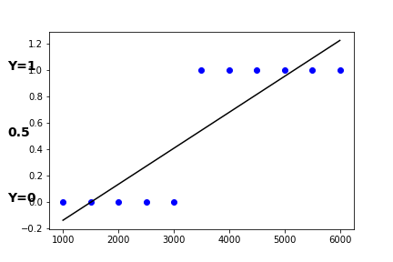

# Binary Classification and Logistic Regression

Binary Classification as its name implies, classifies input data to one of 2 hypothesis. Naturally, the 2 binary hypotheses are assigned with a binary indices,  either 0 or 1. So decisions such as whether a tumor is malignant or not, will a customer purchase an item or not, require a Binary Classification. In the context of machine learning. Binary Classification belongs to the Supervised Machine Learning category. Just to note, previous posts where about Regression Supervised Learning,which also belongs to the same  machine learning category, but fits prediction of continous values, such as price, anounts, periods, etc, while the Binary Classifier decides between 2 descrete decisions. BTW, one of the next posts will present the extension of Binary Classification to Multi-Class Classification.
y differ 
The Supervise Learning Outlines diagram (Figure 1) is similar to the one presented presented in the context of Regression Machine Learning. They differ only in  the prediction model,  and subsequently in the nature of the output.
In this We'll present the Logistic Regression prediction model, which fits Binary Classification. We'll start by showing that a continous prediction models such as the Linear Prediction model don't fit. After that, we will show how to calculate the predictor's coefficients with the Gradient Descent algorithm.

#### Figure 1: Supervise Learning Outlines

So let's start! 

## An introduction to the Logistic Regression

To illustrate Binary Classification let's take a simple example: It is required to predict the if a customer will buy a product, based on her income. (A good prediction indeed can't base on inome only. Still, the simplified example eases the graphical illustration. Anyway, the model and solution will support mult-deatured input data)

To set the predictor, we first need to have a training data sequence, with labeled customers' income data. Figure 2 presents such data, collected from 11 customers. Each data point is labeled by either Y=1, if the  customer did purchase, or Y=0, if he did not purchase. (The assignment of 0 or 1 to the hypothesises is arbitrary, though it makes more sense to assign a 1 to the positive hypothesis.

#### Figure 2: Labled Data: customers' income, labeld by Y=1/0 if customer did buy/did not buy

Now it is needed to train a predictor with this data. But which model should we train? Will the Linear Prediction model, which we already deployed for Regression Prediction fit? Let's examine that!. Figure 3 illustrates a linear line which fits the data point. Will it fit? 

#### Figure 3: Linear Prediction Mode: Will it fit binary classifcation?

If we set the decision boundary to 0.5, it seems to give correct results. Take a look at Figure 4:  An income of 3000 maps to 0.4, i.e. Y=0. An income of 3500 maps to 0.5 i.e. Y=1.  Linear prediction seems like a good predictor if threshold is set to 0.5. Is that a correct conclusion? ****it's not correct!**** Figure 5 proves that.

#### Figure 4: Linear Prediction for Binary Classification with thresholds

Adding more data points, as presented by Figure 5, changes the line predictor's results: Now the predictor maps a customer with an income of 5000 to a point on the line which is below the 0.5 threshold. Obviously, the linear prediction won't work for Binary Classification. Another different prediction model is needed. Let me introduce the Logistic Regression Model..

#### Figure 6: Linear Prediction for Binary Classification with thresholds - Problem!

## Logistic Regression Model

The Logistic Regression is a model which predicts the ****probability**** of the hypothesises. The model is based on the sigmoid function, which is presented in Eq. 1 and sketched in Figure 6.

#### Eq. 1: Sigmoid Function

$$\sigma(z)=\frac{1}{1+e^{-z}}$$

#### Figure 6: Sigmoid Function

#### Sigmoid Properties:

##### $$\sigma(z)_{z \to  -{\infty}} \to 0$$

##### $$\sigma(z)_{z \to  {\infty}} \to 1$$

##### $$\sigma(z)_{z=0}=0.5$$

For Logistic Regression predictor, z argument is replaced by a linear combination of the input dataset x, as shown by Eq. 2:

#### Eq. 2: 
$$z=b+wx$$, 

Plugging  Eq. 3 into Eq 1, results in the Logistic Regression  expression, which is the probability of y=1, given the input vector x and the coefficent set {w,b}.

#### Eq. 4: Logistic Regression Formula

$$p(y=1| x,w,b) = \sigma(b+w^Tx) = \frac{1}{1+e^{^{-(b+w^Tx)}}}$$

Obviously the dependent probability of y=0 is:

#### Eq. 5: Probability of y=0 Regression Formula

$$p(y=0| x,w,b) = 1-p(y=1| x,w,b) = 1- \frac{1}{1+e^{^{-(b+w^Tx)}}}$$

Examining the probailities at the limits and in the middle, we can note that:

$$p(y=1|b+w^Tx \to -{\infty}) \to 0$$

$$p(y=1|b+w^Tx \to {\infty}) \to 1$$

$$p(y=1|b+w^Tx =0 ) = 0.5$$

$$p(y=0|b+w^Tx \to -{\infty}) \to 0$$

$$p(y=0|b+w^Tx \to {\infty}) \to 1$$

$$p(y=0|b+w^Tx =0 ) = 0.5$$

 
 
Next paragraphs we will show how to calculate the Logistic Regression coefficients.

## Finding Logistic Regression Coefficents

In previous posts on Linear Predictor, 2 solutions for for finding the predictor's coefficents were presented:
1. The analytical solution
2. Gradient descent, based on minimizing the Cost function.

Since the predictor's equation is not linear, as it is for the Linear predictor, (reminder: \\(Y=XW+\epsilon\\)), but instead, the predictor's equation is non-linear, where X and W are exponential coefficents, there is no simple analitical solution.
Gradient Descent over a Cost function does work, as we will show soon. Remember that in order to guaranty convergence in a non-local minima, the cost function should be convex. (Remeber what convex is? find explaination here + figure 7 illustrate the idea)

#### Figure 7: CONVEX AND NON CONVEX FUNCTIONS

A function is convex if the line between 2 points on the graph are alays above the values of the points between those 2 points

#### Logistic Regression Cost Function

Recalling the cost function used for Linear Refression, the selection of the square error expression as the Cost function might have seemed to be the best and straight forward choice. The square error expression for Logistic Regression is shown in Eq. 6. It is not a convex function, so we are prevented from taking the Square Error expression as our cost function.

#### Eq. 6: square error expression for Logistic Regression

$$SE = \frac{1}{m}\sum_{i=1}^{m}\frac{1}{2}(\hat{y}^i-y^i)^2=\frac{1}{m}\sum_{i=1}^{m}\frac{1}{2}(\frac{1}{1+e^{^{-(b+w^Tx^i)}}}-y^i)^2$$

Instead, the Loss function used is presented in Eq. 7. The detailed development of this expression is presented in the appendix. Note that ***Loss*** function is calculated for a single instance of training data, while Cost is an average of m Loss entries. The superscript i of the loss entries, indicates the index in the traing data sequence. The `log` operator is in natural logarithm. 

Eq. 7a assigns expressions for y=0 and y=1. Eq. 7b combines both equations. Figure 8 illustrate a Loss function, presenting both y=0 and y=1 parts. The behavior of the Loss function is self explained, so I'll not add more on that. The overall Cost function is the sum the m training examples Loss functions, as shown in Eq. 8.  

#### Eq. 7ba: Loss function used for Logistic Regression
$$\begin{cases}
L(b,w)= -log(\hat{y}^i) & \text{ if } y^i=1\\\\\\
L(b,w)= -log(1-\hat{y}^i) & \text{ if } y^i=0
\end{cases}$$

Or expressing it in a single equation:

##### 7b: Loss express in  expressing it in a single equation:

$$L(b,w)=-log(\hat{y}^{(i)})*y^{(i)}$$

$$-log(1-\hat{y}^{(i)})*(1-y^{(i)})$$

Figure 8: Logistic Regression Lost Function

From Eq. 8, we need find the the n+1 coefficients, b and w, whch minimize the cost. Fortunatley, as explained in the Mathematical development section, the Cost function, is concave. This is an important property, otherwise, with local minima poits, it would be harder to find the global minima. But unfortunatley, unlike the Linear Predictor's Cost function, it is not possible to find am analytical solution. Let's have some insight on that:

We need to take the first derivative of the cost function, \\(\frac{\partial }{\partial w_i}J(b,w)\\),  set it to 0 and solve. The derivative formula of Eq. 8 is derived just a few lines ahead, and the result is:

$$\frac{\partial }{\partial w_i}J(b,w)=\frac{1}{m}\sum_{i=1}^{m}(\sigma(b+w^Tx^{(i)}) -y^{(i)})x_i^{(i)}$$

Plugging in:

$$\sigma(b+w^Tx^{(i)}) =  \frac{1}{1+e^{b+wTx^{(i)}}}$$

We get:

$$\frac{\partial }{\partial w_i}J(b,w)=\frac{1}{m}\sum_{i=1}^{m} (\frac{1}{1+e^{b+wTx^{(i)}}} -y^{(i)})x^{(i)}$$

We have a sum of m none linear functions, for which there is no analytical solution, with the exception of special cases with 2 observations, as explained in the paper by Stan Lipovetsky https://www.tandfonline.com/doi/abs/10.1080/02664763.2014.932760.

Instead, we can use a mone alanlytical solution, such as the ****Gradient Descent****. 

Gradient Descent was already explained to the details, and illustrated with the Linear Predictor. So here we can jump directly to implement the solution for Logistic Regression..

Here's the  Gradient Descent operator set on cost function J(b,w), for the free coeffcient {b} and the other linear coefficients {w_j}

#### Eq. 9:  Gradient Descent

#### Eq. 9 a:
$$b:=b-\alpha \frac{\partial J(b,w)}{\partial b}$$

#### Eq. 9b:
$$w_j:=w_j-\alpha \frac{\partial J(b,w)}{\partial w_j}$$
For all {b}, {w_j} j=1...n calculate:

Eq. 9a and 9b for all n coefficents should be repeated iteratively repeated until all {b} and all \\({w_j}\\) converge. The convergence point, is the point where all derivatives are 0, i.e. the minima point. 

The development of the partial derivative \\(\frac{\partial L(b,w)}{\partial w_i}\\), is detailed in the appendix below. The result is presented in Eq 10.

#### Eq 10 a: Cost Function Partial Derivative
$$\frac{\partial }{\partial w_i}J(b,w)=\frac{1}{m}\sum_{i=1}^{m}(\hat{y}^{(i)} -y^{(i)})x^{(i)}$$

Pluging $$\hat{y}^{(i)}=\sigma(b+w^Tx^{(i)})$$ into Eq. 10a gives:

#### Eq 10 b: Cost Function Partial Derivative:
$$\frac{\partial }{\partial w_i}J(b,w)=\frac{1}{m}\sum_{i=1}^{m}(\sigma(b+w^Tx^{(i)}) -y^{(i)})x_i^{(i)}$$

Now we are ready to the itterative calculation of \\(w_i, i=1-n\\) and \\(b\\) with Gradient Descent.

Here's the Gradient algorithm procedure:

1. Initialize all n+1 unknow coefficients with an initial value.
2. repeat untill converged: 
   \\ $$b = b - \alpha \frac{1}{m}\sum_{i=1}^{m}(\sigma(b+w^Tx^{(i)}) -y^{(i)})$$
   and for i=1 to n:
   $$w_i = w_i-\alpha \frac{1}{m}\sum_{i=1}^{m}(\sigma(b+w^Tx^{(i)}) -y^{(i)})x_i^{(i)}$$
  

## Appendix A: Detailed Development of Logistic Regression Cost Function

For convinience, let's re-write the Logistic Regression formulas 

#### Eq. 6: Logistic Regression Formula

#### 6a Logistic Regression Formula for y=1

$$p(y=1| x, w,b) = \hat{y}=\sigma(b+w^Tx) = \frac{1}{1+e^{^{-(b+w^Tx)}}}$$

#### 6b Logistic Regression Formula for y=0

$$p(y=0| x, w,b) = 1 - p(y=1| x, w,b) = 1-\hat{y}$$

Consequently, we can combine 6a and 6b to have an expression for \\(y\varepsilon [0,1]\\):

#### Eq. 7: Combined Logistic Regression Formula

$$p(y|x.b,w) =  \hat{y}^y(1- \hat{y})^{y-1} = \sigma(b+w^Tx) = \frac{1}{1+e^{^{-(b+w^Tx)}}}^y (1-\frac{1}{1+e^{^{-(b+w^Tx)}}})^(y-1)$$

It is easy to see that Eq. 7 is maximized if the prediction is correct, i.e. in case \\(\hat{y}\\)=1 and y=1, or in case \\(\hat{y}\\)=0 and y=0. 

In our scenario, the Training data set consists of m such data points {\hat{y}^i, y^i} i=1:m. The optimal predictor would be the one which maximizes the likelihhod og the Training data set's predictions, ie:

sequence equals the multiplication of the m So. the best predictor whold be the one which we have m data points, each have m data points, so we are looking for the set of parameters {b,w} which maximize all the obewe have the Training data set, which is a set of such observations. The challenge is to find the set of parameters 

We would like to find the If we could find the  the a good predictor, than we had a better chance So now the challenge is to find the parameters (b. w) with which the value of 

To find the 
For Logistic regression, instead of defining a the cost function, and then finding the set of parameters which minimize the cost, as was demonstrated for Linear Regression,  - which would not be convex, we will find the parameters which maximze the likelihood function

The likelihood function calculates the probability of the observed data. Maximum Likelihood refers to the optimization which finds the parameters which maximize the likelihood function, as shown in Eq. 8.

#### Eq. 8: Likelihood Function
$$L(b, w| y, x) = (p(Y| X, w,b) = 
\prod_{i=1}^{m}p(y^i|x^i, b,w)= 
\prod_{i=1}^{m}(\hat{y}^{(i)})^{y^{(i)}}(1-\hat{y}^{(i)})^{1-y^{(i)}}$$

So we are looking for the set of parameters {b,w} which mazimize the likelihhod function. Equivalently to that, we can look instead for the set of parameters {b,w} which minimize the negative of likelihhod function. We will go on the minimization option, which is consistent with the Cost minimization paradigm. 

Eq. 8 is not concave. Note that the non-concave charectaristic is common to the exponential family, which are only logarithmically concave. 
With that in mind, and considering that logarithms are strictly increasing functions, maximizing the log of the likelihood is equivalent to maximizing the likelihood. Not only that, but taking the log makes things much more covinient, as the multiplication are converted to a sum. 
So Here we take the natural log of Eq. 8 likelihood equation.

#### Eq. 9: Log Likelihood Function

$$logL(b,w|y,x)=\sum_{i=1}^{m}logp(y_i|x_i, b,w)$$

Pluging Eq. 7 into Eq 9, and following the common convention of denoting the log-likelihood with a lowercase l, we get: 

#### Eq. 10: Log Likelihood Function

$$l(b,w|y,x)=\sum_{i=1}^{m}logp(y_i|x_i, b,w)=\sum_{i=1}^{m}log( h_{b,w}(x_i)^y_i(1- h_{b,w}(x_i))^{y_i-1})$$

Consider the Logarithm power rule:

#### Eq. 11: Logarithm power rule:

$$log(x^ y) = y log(x)$$

Plug Eq. 11 into Eq 10 and get:
#### Eq. 12: Log Likelihood Function - Simplified

$$l(b,w|y,x)=\sum_{i=1}^{m}log( h_{b,w}(x_i)^y_i(1- h_{b,w}(x_i))^{y_i-1})=\sum_{i=1}^{m}y_ilogh_{b,w}(x_i)+(y_i-1)log(1-h_{b,w}(x_i))$$

Eq. 12 is the Likelihhod Function. Our optimal parameters set (b, w}, should maximize the Likelihood function, aka the Maximum Likelihood Estimator (MLE).
Equivalently to finding the MLE, is to find the minimal negative of the Likelihood. With the search of a minimum, we keep the same minimization paradigm like we did for the Cost function. So we will add a minus sign to Eq. 12, and call it Cost function - as shown in Eq. 13. Q.E.D.

#### Eq. 13: Cost Function

$$J(b,w) = -l(b,w)=\sum_{i=1}^{m}-y_ilogh_{b,w}(x_i)+(1-y_i)log(1-h_{b,w}(x_i))$$

Q.E.D.

## Appendix B:  Development of Cost Function Partial Derivative

The Cost function's partial derivatives are needed for the Gradient Descent calculation. The derivative equation is presented in Eq. 14, as the sum of Loss function derivatives

#### Eq. 14: Cost Function Derivative
$$\frac{\partial J(b,w)}{\partial w_i} =\sum_{i=1}^{m}\frac{\partial L(b,w)}{\partial w_i}$$

To simplify the equation let's look at the Loss function. It will be easy to sum the Losses later:

#### Eq. 15: Loss Function Derivative
$$\frac{\partial L(b,w)}{\partial w_i} =\frac{\partial (-y_ilog ()_{b,w}(x_i)+(1-y_i)log(1-h_{b,w}(x_i)))}{\partial w_i})$$

Now let's prepare the presentation of the Loss function for applying the derivative chan rule: 

, so that use the derivatives chain rule

\frac{\partial (J(b,w))}{\partial w_i} = \sum_{i=1}^{m}\frac{\partial (L(b,w))}{\partial w_i} . We'll need to use some basic derivatives rules: 

We start with the chain rule
relying on the derivatives chain rule, reconstructing the cost function into 3 equations:
### Eq. 15: Decomposing Cost Function Before Chain Rule Derivation
##### Eq. 15a

$$z=b+w^Tx$$

##### Eq. 15b

$$\sigma(z)=\frac{1}{1+e^{-z}}$$

### Eq. 15 c

$$L(z)= -ylog \sigma(z) + (1-y)log(1- \sigma(z))
$$

Accoringly:

#### Eq. 16: Cost Function Chain Derivatives

$$\frac{\partial }{\partial w_i}L(z)=\frac{\partial }{\partial \sigma(z)}L(z)\cdot\frac{\partial }  {\partial z}\sigma(z)\cdot\frac{\partial }  {\partial w_i}z
$$

Now we can compute each of Eq 16's parts.

To dericate the first derivative in chain, $$\frac{\partial }{\partial \sigma(z)}L(z) $$, remember the natural log derivative:

### Eq 17: Well Known Natural Log Derivative

$$\frac{\partial}{\partial x}log x=\frac{1}{x}$$

Plug that into the first partial derivative element of Eq 16:

### Eq 18: First part of the derivative chain

$$\frac{\partial }{\partial \sigma(z)}L(z)=\frac{\partial }{\partial \sigma(z)}(-y^{(i)}log(\sigma(z)+(1-y^{(i)})log(1-\sigma(z))=-\frac{y^{(i)}}{\sigma(z)}+\frac{1-y^{(i)}}{1-\sigma(z)}$$

For the 2nd part of the derivative chain we'll use the reciprocal derivative rule:

### Eq 19: The reciprocal derivative rule

$$(\frac{1}{f(x)})'=-\frac{f'(x)}{f^2(x)}
$$

Accordingly:

### Eq 19: Second part of the derivative chain

$$\frac{\partial }  {\partial z}\sigma(z)=\frac{\partial }  {\partial z}\frac{1}{1+e^{-z}}=
-\frac{-e^{-z}}{(1+e^{-z})^2}=-\frac{1-(1+e^{-z})}{(1+e^{-z})^2}=-\sigma(z)^2+\sigma(z)=\sigma(z)(1-\sigma(z))$$

### Eq 20: Third part of the derivative chain

$$\frac{\partial }  {\partial w_i}=x_i$$

re-Combining the 3 parts of the chain we get the Loss function for a single example:

### Eq 21:  Recombining the 3 chained derivatives:

$$\frac{\partial }{\partial w_i}L(\hat{y}^{(i)},y^{(i)})=(-\frac{y^{(i)}}{\sigma(z)}+\frac{1-y^{(i)}}{1-\sigma(z)}) \cdot \sigma(z)(1-\sigma(z)) \cdot x^{(i)}=(\sigma(z)-y^{(i)})x^{(i)}$$

Summing the Loss for all m examples, to get the Cost function derivatives:

### Eq 23 a: Partial Derivative of Sum All Examples Losses:
$$\frac{\partial }{\partial w_i}J(b,w)=\frac{1}{m}\sum_{i=1}^{m}(\hat{y}^{(i)} -y^{(i)})x^{(i)}$$

Pluging $$\hat{y}^{(i)}=\sigma(b+w^Tx^{(i)})$$ into Eq. 23, gives:

### Eq 23 b: Partial Derivative of Sum All Examples Losses:
$$\frac{\partial }{\partial w_i}J(b,w)=\frac{1}{m}\sum_{i=1}^{m}(\sigma(b+w^Tx^{(i)}) -y^{(i)})x_i^{(i)}$$

################

We have 

except for some special cases 

Eq. 8 presnets 

#### 

Same as with all Suprevised Learning predictors, the Logistic Regression coefficients are calculated during the Training phase. 
So we need to find the Linear Predictor's set of coefficients b,wj, where j=1:n. 

Question: What would be the criteria for the selection of the coefficients' values? 
Answer: The set of coefficents should minimize a Cost function. which expresses the difference between the modeled value and the actual value.

Rembember the Cost function assigned for tLinear Prediction? ****Remninder**** - It was based on minimizing the error between the real values and the pmodel's predicted values. The error was taken as the Euacliden distance between the 2 points, as shown in Eq. 5.

#### Eq 5: Cost function - Euclidean Distance:

J(b,w) = \frac{1}{m}\sum_{i=1}^{m}\frac{1}{2}(h_{b,w}(x^i)-y^i)^2

 The above was developed in the Linear Prediction and Gradient Descent post, where we had to find the minima of the cost function, and calculate the coefficents at that point, (with the Gardient Descent algorithm). 
 
***Q***: How should the cost function be found?
***A***: It's the point were the first derivative equals 0.

#### Figure 6 a: Non Convex Cost Function

Figure 6 b: A Convex  Function

Jumping to the end of this chapter, Eq. 5 presents the cost function used for Logistic Regression. Let's examine its charectaristics. Next chapter details the derivation ofEq. 5.

### Eq. 5: Cost function used for Logistic Regression
#### 5a

$$Cost(h_{b,w}(x^i,y^i))=\left\{\begin{matrix}
-log (h_{b,w}(x^i,y^i)) \; if\; y=1\\
-log (1-h_{b,w}(x^i,y^i))\; if \;y=0
\end{matrix}\right.
$$

Or expressing it in a single equation:

####5b
$$Cost(h_{b,w}(x^i), y^i)=[y^ilog(h_{(b,w)}(x^i))+(1-y^i)log(1-h_{(b,w)}(x^i))]$$

The index $$i$$ relates to the $$i^{th}$$ example out of m training examples.
Let's examine the cost function optinal outputs, at the 4 'extreme' points:

If hypothesis is y=1 and also predicted probability p(y=1|x) is 1 (i.e. the probability of y=1 given x is 1), then the cost is 0. ($$Note that log(1)=0$$).
If hypothesis is y=0 and also predicted probability p(y=1|x) is 0,ithen the cost is 0. ($$log(0)=1$$).

If candidate hypothesis is y=1 but prediction probability p(y=1|x) is 0, then the cost is $$\infty $$. ($$-log(0)=\infty $$).
If candidate hypothesis is y=0 and prediction probability p(y=1|x) is 1, then the cost is $$\infty $$. ($$log(0)=1$$).

Figure 7: Logistic Regression Cost Function

The overall cost function is the sum the m training examples cost functions:

### Eq. 6: Logistic Regression overall Cost Function

$$
J(b,w)=\frac{1}{m}\sum_{i=1}^{m}L(\hat{y}^{(i)}, y^{(i)})=\\
-\frac{1}{m}\sum_{i=1}^{m}[y^ilog(\hat{y}^{(i)})+(1-y^{(i)})log(1-\hat{y}^{(i)})]$$

Where L(x) denotes the Loss function of a single example.

Next chapter details the development of Eq. 5. Surely recommended, but can be skipped. Chapter which follow it, presents the Gradient Descent solution for Logistic Regression.

## Mathematical Development of Cost Function

This section presents the mathematical development the Logistic Regression cost function formula.

For convinience, let's re-write the Logistic Regression formulas for 

### Eq. 6: Logistic Regression Formula

#### 6a Logistic Regression Formula for y=1

$$p(y=1| x, w,b) = \hat(y)=\sigma(b+w^Tx) = \frac{1}{1+e^{^{-(b+w^Tx)}}}$$

#### 6b Logistic Regression Formula for y=0

$$p(y=0| x, w,b) = 1 - p(y=1| x, w,b) = 1-\hat{y}$$

Consequently, we can combine 6a and 6b to have an expression for $$y\varepsilon [0,1]$$:

### Eq. 7: Combined Logistic Regression Formula

$$p(y|x.b,w) =  \hat{y}^y(1- \hat{y})^{y-1}$$

Now we take Eq 7, to find the likelihhod of, the output of m training example. It equeals to the multiplication of probabilities $$p(y_i|b,w,x_i)$$ of all i, i=1:m. The Likelihhod is a function of the parameters b,w, for a given outcome y and the input variable x.

### Eq. 8: Likelihood Function
$$L(b, w| y, x) = (p(Y| X, w,b) = 
\prod_{i=1}^{m}p(y_i|x_i, b,w)= 
\prod_{i=1}^{m}(\hat{y}^{(i)})^{y^{(i)}}(1-\hat{y}^{(i)})^{1-y^{(i)}}$$

Eq. 8 is not concave, i.e. not convex. Note that the non-concave charectaristic is common to the exponential family, which are only logarithmically concave. 
With that in mind, and considering that logarithms are strictly increasing functions, maximizing the log of the likelihood is equivalent to maximizing the likelihood. Not only that, but taking the log makes things much more covinient, as the multiplication are converted to a sum. So Here we take the natural log of Eq. 8 likelihood equation.

### Eq. 9: Log Likelihood Function

$$logL(b,w|y,x)=\sum_{i=1}^{m}logp(y_i|x_i, b,w)$$

Pluging Eq. 7 into Eq 9 + following the common convention of denoting the log-likelihood with a lowercase l, we get: 

### Eq. 10: Log Likelihood Function

$$l(b,w|y,x)=\sum_{i=1}^{m}logp(y_i|x_i, b,w)=\sum_{i=1}^{m}log( h_{b,w}(x_i)^y_i(1- h_{b,w}(x_i))^{y_i-1})$$

Consider the Logarithm power rule:
### Eq. 11: Logarithm power rule:

$$log(x^ y) = y log(x)$$

Plug Eq. 11 into Eq 10 and get:
### Eq. 12: Log Likelihood Function - Simplified

$$l(b,w|y,x)=\sum_{i=1}^{m}log( h_{b,w}(x_i)^y_i(1- h_{b,w}(x_i))^{y_i-1})=\sum_{i=1}^{m}y_ilogh_{b,w}(x_i)+(y_i-1)log(1-h_{b,w}(x_i))$$

Eq. 12 is the Likelihhod Function, according wich we can find the maximun likelihood, in the effort to find optimal set of coefficients. BUT - instead of maximizing the likelihhod, to we can speak of minimozing the cost, where the cost is the likelihhod's negative:

### Eq. 13: Cost Function

J(b,w) = -l(b,w)=\sum_{i=1}^{m}-y_ilogh_{b,w}(x_i)+(1-y_i)log(1-h_{b,w}(x_i))

Q.E.D.

### Gradient Descent

Eq. 14 shows Gradient Descent operator set on cost function J(b,w), solving for the free coeffcient {b} and the other linear coefficients {w_j}

### Eq. 14: Gradient Descent For J(w,b)

Repeat till convergence:

#### Eq. 14a:

$$b:=b-\alpha \frac{\partial J(b,w)}{\partial b}$$

#### Eq. 14b:
For all {b}, {w_j} j=1...n calculate:

$$w_j:=w_j-\alpha \frac{\partial J(b,w)}{\partial w_j}$$

Explaination for the Gradient Decent Process :
The above equations should be repeated iteratively, calculating a new set of {b,w_j} at each iteration. This iterative process should contiue until all {b} and {w_j} converge. The convergence point, is the point where all derivatives are 0, i.e. the minima point. 

Now we are ready to the itterative calculation of $$w_i, i=1-n$$ and $$b$$ with Gradient Descent.

Here's the Gradient algorithm procedure:

1. Initialize all n unknow coefficients with an arbitrary value. Let's set it to 0: 
$$w_i_{i=1-n}=0, b=0$$
  do ntill converged: 
   \\ $$b = b - \alpha \frac{1}{m}\sum_{i=1}^{m}(\sigma(b+w^Tx^{(i)}) -y^{(i)})$$
   \\ $$for i=1 to n:$$
   \\ $w_i = w_i-\alpha \frac{1}{m}\sum_{i=1}^{m}(\sigma(b+w^Tx^{(i)}) -y^{(i)})x_i^{(i)}$$
  
   
  
  

;

RONEN TILL HERE!!!!!!!!!!

To simplify the derivation, we'll base on the derivatives chain rule. Before getting to that, let's prepare arrange the cost function:

We denote:
x=b+wx
and h

Eq. 8:

$$\frac{\partial f(y)}{\partial x}=\frac{\partial f(y)}{\partial y}\frac{\partial y}{\partial x}$$

$$

og the .
Cost(

Is is given in Eq. 5.

to find a minima with Gradient Descent, 

Having the prediction function, we need to calculate its coefficients. 

Similarily to Linear Regression, we will determine a cost function, whi

Logostic Regression is currently one of the most commom prediction model algorithm used by Machine Learning algorithms for binary classification. In case you're not familiar with prediction models, and how to solve for their coefficients, or even in case you have no clue about what prediction am I talking, I suggest you read my post on that before. Not mandatory though. If the term "Binary Classification" needs clarifications, I'd start with my Intro to Machine Learning. Not mandatory though.

In any case, to start with, I posted here again the Supervised Machine Learning blog diagram.

#### Figure 1: Supervised Machine Learning blog diagram

As Figure 1 shows, the predictor sits in the heart of the system. The perdictor's coeficients are calculated during the Training phase, then ready to use in the Testing and Normal Data phases.

This post explains the Logistic Regression model, and the developemnt of the model's parameters' solution. We'll walk top to bottom - begin with an illustration of a classification problem, then present the Logistic Regression predictor model, and eventually show how to find its coefficients, with the good-old Descent Regression algorithm.

Here's the (commonly used) binary classification example: It is needed to predict whether a tumor is benign or maligent, based on its size. 

multi class

we need to predict if a customer will buy Iphone as his next phone, based on the next smartphone of a customer , which already owns a smatphone,  will buy another iphone after 2 years, based on whether he owned an iphone before or not. We'll see that normally a 
. This example is not realy realistic, but we'll use it to start with binary prediction based on a single feature. So, suppose we need to predict if a customer, which already owns a smatphone,  will buy an iphoe, based on whether he owned an iphone before or not. Suppose  that if he owned one 

