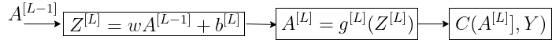

# Back Propogation

## Introduction

This is the third in series of 3 deep learning intro posts:
1. Introduction to Deep Learning which introduces the Deep Learning technology background, and presents network's building blocks and terms.
2. Forward Propogation, which presents the mathematical equations of the prediction path.
3. Backward Propogation which presents the mathematical equations for network's coefficents calculation, done during the training phase.

This post presents in details the development for the set of equations used to find the network's optimized set of coefficents. These are the equations used during the Training stage, aka Fitting. The algorithms used are Gradient Descent and Back Propogation.
The post egins with a short recaps for Feed Forward process, Cost Functions and Gradient Descent. After that, we will dive into the develpoment of Back Propogation equations.

## Feed Forward Recap

In this section we recap Feed Forward equations, which are needed as a background for the current Back Propogation topic. Figure 1, which is re-posted here, presents journey of the input data through the L network's layers, in that example L=5, untill the predicted value \\(hat{y}\\) is generated. Each layer consists of 2 cascaded operators, the first calculates the sum of the weighted input and the bias, and the second is a non linear activation function. Eq. 1 presents the above 2 functions expressed for any layer l.

### Figure 1: Feed Forward Flow

### Eq. 1: Feed Forwarding Equations Layer l
#### Eq. 1a: Feed Forwarding Equations - Weighted input
 $$
 \bar{Z}^{[l]}=\bar{w}^{[l]}\bar{A}^{[l-1]}+\bar{b}^{[l]}
 $$
 
#### Eq. 1b: Feed Forwarding Equations - activation

$$A^{[l]}=
g^{[l]}(Z^{[l]})$$

Recap ends here. Let's proceed - we will return to the above equations.

## Cost Function Recap

Given the input-output set (x,y) and the prediction result \\(\hat{y}\\), a cost function measures the difference between the true values and the model's prediction results. The optimized set of parameters we search for, is the one that minimizes a cost function.

We already met 3 types of Cost functions as shown in Eq. 2:

### Eq. 2: Cost Functions
#### Eq. 2a: MSE (Mean Squared Error) Cost Function

\\(C(w,b)=\frac{1}{m}\sum_{j=1}^{m}\left \| y-\hat{y} \right \|^2\\)

#### Eq. 2b: MAE (Mean Absolute Error) Cost Function

\\(C(w,b)=\frac{1}{m}\sum_{j=1}^{m}\left | y-\hat{y} \right |\\)

#### Eq. 2c: Cross Entropy Cost Function - Used for Logistic Regression

\\(C(b,w) =-\frac{1}{m}\sum_{i=1}^{m}[y_i^{(i)}log(\hat{y}^{(i)})+(1-y^{(i)})log(1-\hat{y}^{(i)})]\\)

**Just a side note to prevent confusion between Loss and Cost functions** - **Loss** Function measures the difference between true value (y), and the model's prediction results (\\(\hat{y}\\)), while **Cost** function is the average over a batch of m Losses, e.g.  avarage over the entire training sequence of over a partial batch of it.

## Gradient Descent Recap

With a selected cost function at hand, we will use the Gradient Descent algorithm to find the optimized set of parameters. 

If you're not familiar with Gradient Descent, it is suggested you read the posts on Gradient descent before continueing.

The Gradient Descet equations are presented by Eq. 3, Where the superscript [l], l=[1,L], denotes the layer, and \\(\alpha\\) is the learning rate.

### Eq. 3: Gradient Descent Recursive Equations
#### Eq. 3a: Weight Recursive Equation
$$
w^{[l]}=w^{[l]}-\alpha\frac{\partial C}{\partial w^{[l]}}
$$
#### Eq. 3b: Bias Recursive Equation

$$
b^{[l]}=b^{[l]}-\alpha\frac{\partial C}{\partial b^{[l]}}
$$

Where 1<=l<=L

As shown by Eq. 3, to solve the recursive equations, Cost function's derivatives with respect to all layers' coeffcients are needed. 

Note that besides Gradient Descent, there are other optional optimizing algorithms, such are the itsa commonly used variants Stochastic Gradient Descent and ADAM. we will cover those algorithms in an exclusive post.

## Back Propogation Algorithm Preface

In this section, we start the journey of finding the optimized network's parameters. 

Our objective is to find the partial derivatives of the Cost function with respect to all layer's coefficients, i.e. find \\(\frac{\partial C}{\partial w^{[l]}}\\) and \\(\frac{\partial C}{\partial b^{[l]}}\\) for all  1<=l<=L. To acomplish that, we will use the derivative chain rule, while propogating backwards through the network's layers, starting from the output layer, towards the input layer.
Eventually, we will develope 4 equations, which will fit all layers, one after the other, while propogating back from output to input.

Note: The equations developemnt in this post are for a batch of m training examples, aka 'vectorized equations'. You may find Back Propogation resources which present the equations for a single input data example. The latter equations are involved with less matrices and more vectors instead, which makes them simpler. However, the training is actually calculated for a batch of m examples, which is a more computationally efficient.

We start with eamination of the outputlayer, i.e. layer L, and then generalize the resultant equations to all layers.

### Layer L Calculation

Figure 2 illustrates the Feed Forward in the output layer. This illustration is similar to the output layer of Figure 1, except it now illustrate vectorized components, with m columns of input data. The figure depicts output layer's Feed Forward computational chained 3 equations.

### Figure 2: Vectorized Feed Forward Output Layer

Following Figure 2's equations chain, using the derivatives chain rule, we get the following 4 derivatives equations Eq. 4a-Eq.4d. Note that Eq. 4b and Eq. 4c are bassically the equations we are after! We now just need to generalize the eqauations to all layers, and, translate the derivatives to a more detailed form.

 ### Eq. 4: Cost Derivatives in output layer - chain rule.

#### Eq. 4a: Cost Derivative with respect to Z - Commonly denoted by \\(\delta\\)

\\(\delta^{[L]}=\frac{\mathrm{d} C}{\mathrm{d} Z^{[L]}}=\frac{\mathrm{d} C}{\mathrm{d} A^{[L]}} \cdot \frac{\mathrm{d} A^{[L]}}{\mathrm{d} Z^{[L]}}\\)
 
#### Eq. 4b: Derivative with respect to weights

\\(\frac{\mathrm{d} C}{\mathrm{d} w^{[L]}}=\delta^{[L]} \cdot  \frac{\mathrm{d} Z^{[L]}}{\mathrm{d} w^{[L]}}\\)

#### Eq. 4c: Derivative with respect to Bias
 
\\(\frac{\mathrm{d} C}{\mathrm{d} b^{[L]}}=\delta^{[L]} \cdot  \frac{\mathrm{d} Z^{[L]}}{\mathrm{d} b^{[L]}}\\)

#### Eq. 4d: Prepare for Back Propogate

\\(\frac{\mathrm{d} C}{\mathrm{d} A^{[L-1]}}=\frac{\mathrm{d}  Z^{[L]}}{\mathrm{d} w^{[L]}}\delta^{[L]}\\)

A note before we continue the work of derivation. 

Eq. 5a presents the cost function, expressing the output of the last activation in terms of the networks weight matrices and activations. (The bias coefficients are ommitted for the sake of simplicity).
Eq. 5b is the Cost's gradient expression with respect to the input data. Note that the matrices are transposed and the order of multiplication is reversed. That explains the transposed matrix in the coming expressions.

 ### Eq. 5: Cost Function and Cost Gradient
 
 #### Eq. 5a: Cost Function with respect to \\(A^{[0]}\\)
\\(C(y,A^{[L]})=g^{[L]}(w^{[L]}g^{[L-1]}(w^{[L-1]}g^{[L-2]}(......g^{[1]}(w^{[1]}A^{[0]}))))
\\)

 #### Eq. 5a: Gradient of Cost Function with respect to \\(A^{[0]}\\)

\\(\nabla _{A^{[0]}}C=W^{[1]T} g^{'[1]}.....W^{[L-1]T} g^{'[L-1]}W^{[L]T} g^{'[L]}\nabla _{A^{[L]}}C
\\)

Let's simplify Eq. 4, and have it better presented.

Derivate Eq. 1a with respect to \\( w^{[L]}\\) and get:

### Eq. 6: 

\\(\frac{\mathrm{d} Z^{[L]}}{\mathrm{d w^{[L]}}}=A^{[L-1]}\\)

Derivate Eq. 1a with respect to b^{[L]} and get:

### Eq. 7: 
\\(\frac{\mathrm{d} Z^{[L]}}{\mathrm{d b^{[L]}}}=\begin{bmatrix}
1\\\\\\ 
1\\\\\\ 
.\\\\\\ 
.\\\\\\
1\\\\
\end{bmatrix}\\)

The derivative result is an all 1s m x 1 column. Multiplying a matrix by this column, is equivalent to row axis summationm - find that few equations below.

Derivate Eq. 1a with respect to A^{[L-1]} and get:
### Eq. 8:

\\(\frac{\mathrm{d} Z^{[L]}}{\mathrm{d A^{[L-1]}}}=W^{[L]}\\)

Denote the activation derivative by \\(g^{'[L]}\\)

### Eq. 9:

\\(g^{'[L]}=\frac{\mathrm{d} A^{[L]}}{\mathrm{d} Z^{[L]}}\\\).

Where g() is the activation function.

(We will detail the derivative of the various activation functions in a following post).

Plug Eq. 6  Eq. 9 into Eq. 4, to have a clearer set of equations:

### Eq. 10: Back Propogation Equations - Layer L

#### Eq. 10a: 
 \\(\delta^{[L]}=\frac{\mathrm{d} C}{\mathrm{d}{A^{[L]}}} \odot g^{'[L]}\\)
 
 Where \\(\odot\\) denotes element wise multiplication.
 
### Eq. 10b: 
 \\(\frac{\mathrm{d} C}{\mathrm{d} w^{[L]}}=\frac{1}{m}{A^{[L-1]T}}\delta^{[L]}\\)
 
 To get normalized results, independent of number of examples m, the integration of m examples requires a scaling down by m.

### Eq. 10c: 
 \\(\frac{\mathrm{d} C}{\mathrm{d} b^{[L]}}=\frac{1}{m}np.sum(\delta^{[L]},axis=0,keepdims=True)
\\)

Multiplication of by an all 1s vector sums each row's m entries. To get normalized results, independent of number of examples m, it is followed by a scaling down by m.

### Eq. 10d:

\\(\frac{\mathrm{d} C}{\mathrm{d} A^{[L-1]}}=W^{[L]T}\delta^{[L]}\\)

Note that:
Eq. 10a is just a pre-computation which prepares \\(\delta^{[L]}\\) for the other equations.
Eq. 10b and Eq. 10c are the ones which produce the required derivatives for this layer.
Eq. 10d prepares the input needed by L-1, the next layer in the back propogation process

**Mission acomplished for layer L: Qirg Eq. 10a-Eq. 10c we can find the required derivatives!**

Looking at the symetry of Eq. 1, it's easy to see that Eq. 10 is valid for any l. So let's re-write the equations again, substituting L by l, where 1<=1<=L

### Eq. 11: Back Propogation Equations - Layer l
#### Eq. 11a: 
> \\(\mathbf{\delta^{[l]}=\frac{\mathrm{d} C}{\mathrm{d}{A^{[l]}}} \odot g^{'[l]}}\\)
 
### Eq. 11b: 
> \\(\mathbf{\frac{\mathrm{d} C}{\mathrm{d} w^{[l]}}=\frac{1}{m}{A^{[l-1]T}}\delta^{[l]}}\\)
 
 To get normalized results, independent of number of examples m, the integration of m examples requires a scaling down by m.

### Eq. 11c: 
> \\(\mathbf{\frac{\mathrm{d} C}{\mathrm{d} b^{[l]}}=\frac{1}{m}np.sum(\delta^{[l]},axis=0,keepdims=True})
\\)

### Eq. 11d:

\\(\mathbf{\frac{\mathrm{d} C}{\mathrm{d} A^{[l-1]}}=W^{[l]T}\delta^{[l]}}\\)

