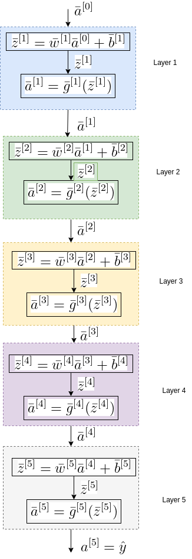

# Back Propogation

## Introduction

This is the third in series of 3 deep learning intro posts:
1. Introduction to Deep Learning which introduces the Deep Learning technology background, and presents network's building blocks and terms.
2. Forward Propogation, which presents the mathematical equations of the prediction path.
3. Backward Propogation which presents the mathematical equations for network's coefficents calculation, done during the training phase.

The previous post of this serious was about the network's Feed Forward, which is executed in the Prediction mode. During that mode, the network's coefficients are static, while the input data changes. The Training mode, aka Fitting mode, is different: The of input data examples, aka Training data is sent constantly, while the network's coefficients are modified till their values converge to an optimal value.
the network coefficients are changing in an optimizing algorithm.

## Feed Forward Recap

In this section we recap Feed Forward equations, which are needed as a background for the current Back Propogation topic. Figure 1, which is re-posted here, presents journey of the input data through the L network's layers, in that example L=5, untill the predicted value \\(hat{y}\\) is generated. Each layer consists of 2 cascaded operators, the first calculates the sum of the weighted input and the bias, and the second is a non linear activation function. Eq. 1 presents the above 2 functions expressed for any layer l.

### Figure 1: Feed Forward Flow

### Eq. 1: Feed Forwarding Equations Layer l
#### Eq. 1a: Feed Forwarding Equations - Weighted input
 $$
 \bar{Z}^{[l]}=\bar{w}^{[l]}\bar{A}^{[l-1]}+\bar{b}^{[l]}
 $$
 
#### Eq. 1b: Feed Forwarding Equations - activation

$$A^{[l]}=
g^{[l]}(Z^{[l]})$$

Recap ends here. Let's proceed - we will return to the above equations.

## Cost Function and Gradeint Descent

In this section, we start the journey of finding the optimized network's parameters. 

Given the input-output set (x,y) and the prediction result \\(\hat{y}\\), a cost function measures the difference between the true values and the model's prediction results. The optimized set of parameters we search for, is the one that minimizes a cost function.

We already met 3 types of Cost functions as shown in Eq. 2:

### Eq. 2: Cost Functions
#### Eq. 2a: MSE (Mean Squared Error) Cost Function

\\(C(w,b)=\frac{1}{2m}\sum_{j=1}^{m}\left \| y-\hat{y} \right \|^2\\)

#### Eq. 2b: MAE (Mean Absolute Error) Cost Function

\\(C(w,b)=\frac{1}{2m}\sum_{j=1}^{m}\left | y-\hat{y} \right |^2\\)

#### Eq. 2c: Cross Entropy Cost Function - Used for Logistic Regression

\\(C(b,w) =-\sum_{i=1}^{m}[y_i^{(i)}log(\hat{y}^{(i)})+(1-y^{(i)})log(1-\hat{y}^{(i)})]\\)

**Just a side note to prevent confusion between Loss and Cost functions** - **Loss** Function measures the difference between true value (y), and the model's prediction results (\\(\hat{y}\\)), while **Cost** function is the average over a batch of m Losses, e.g.  avarage over the entire training sequence of over a partial batch of it.

With a selected cost function at hand, we will use the Gradient Descent algorithm to find the optimized set of parameters. 
Note that besides Gradient Descent, there are other optional optimizing algorithms, such are the itsa commonly used variants Stochastic Gradient Descent and ADAM. we will cover those algorithms in an exclusive post.

If you're not familiar with Gradient Descent, it is suggested you read the posts on Gradient descent before continueing.

The Gradient Descet equations are presented by Eq. 3, Where the superscript [l], l=[1,L], denotes the layer, and \\(\alpha\\) is the learning rate.

### Eq. 3: Gradient Descent Recursive Equations
#### Eq. 3a: Weight Recursive Equation
$$
w^{[l]}=w^{[l]}-\alpha\frac{\partial C}{\partial w^{[l]}}
$$
#### Eq. 3b: Bias Recursive Equation

$$
b^{[l]}=b^{[l]}-\alpha\frac{\partial C}{\partial b^{[l]}}
$$

Where 1<=l<=L

As shown by Eq. 3, to solve the recursive equations, Cost function's derivatives with respect to all layers' coeffcients are needed. 

How can \\(\frac{\partial C}{\partial w^{[l]}}\\) and \\(\frac{\partial C}{\partial b^{[l]}}\\) be calculated for all  1<=l<=L? Let's continue!

## Back Propogation Algorithm

As stated at last paragraph of previous section, we need to find the partial derivatives of the Cost function with respect to all layer's coefficients. To acomplish that, we will use the derivative chain rule, while propogating backwards through all the layers, starting with the output layer L, striding 1 layer back till reasching layer 1.

The rest of this section details and explains the Back Propogation in details.
We start with the output Layer L, which has some nuance wrt all other layers. After that, the process while striding through the layers will be a routine.

### Layer L Calculation

Here we need to find \\(\frac{\mathrm{d} C}{\mathrm{d} w^{[L]}}\\) and \\(\frac{\mathrm{d} C}{\mathrm{d} b^{[L]}}\\). 
Let's start:

Following Eq. 1b:

\\(\frac{\mathrm{d} A^{[L]}{\mathrm{d} Z^{[L]}} = g^{[L]}\\)

Following Eq. 1a, 

\\(\frac{\mathrm{d} Z^{[L]}{\mathrm{d} W^{[L]}} = w^{[L]}\\)

and:

\\(\frac{\mathrm{d} Z^{[L]}{\mathrm{d} b^{[L]}} = 1\\)

According to the above, using the derivative chain rule we get:

 ### Eq. 5: Cost Derivatives with respect to layer L parameters

 ### Eq. 5a: Cost Derivatives with respect to weights
\\(\frac{\mathrm C}{\mathrm w^{[L]}}=\frac{\mathrm C}{\mathrm a^{[L]}}* \frac{\mathrm a^{[L]}}{\mathrm z^{[L]}}* \frac{\mathrm z^{[L]}}{\mathrm w^{[L]}}\\)

 ### Eq. 5b: Cost Derivatives with respect to bias

\\(\frac{\mathrm C}{\mathrm b^{[L]}}=\frac{\mathrml C}{\mathrm a^{[L]}}* \frac{\mathrm a^{[L]}}{\mathrm z^{[L]}}* \frac{\mathrm z^{[L]}}{\mathrm b^{[L]}}\\)

Both Eq. 5a and Eq. 5b consist of a chain of 3 partial derivatives:
1. \\(\frac{\partial C}{\partial a^{[L]}}\\) - This derivative depends on selected Cost function. Find 3 of the most common cost functions are listed in Eq. 2. Find detailed derivatives equation for commonly used Cost functions in appendix.
2. \\(\frac{\partial a^{[L]}}{\partial z^{[L]}}\\) - This derivative depends on activation function. Find detailed derivatives equation for commonly used activation function in appendix.
3. \\(\frac{\partial z^{[L]}}{\partial w^{[L]}}\\) - Pluging in Eq. 4a gives: \\(\frac{\partial z^{[L]}}{\partial w^{[L]}}\\)=\\(\frac{\bar{w}^{[L]}\bar{a}^{[L-1]}+\bar{b}^{[L]}}{\partial w^{[L]}}= \bar{a}^{[L-1]}\\)
4. \\(\frac{\partial z^{[L]}}{\partial b^{[L]}}\\) - Pluging in Eq. 4b gives: \\(\frac{\partial z^{[L]}}{\partial b^{[L]}}\\)=\\(\frac{\bar{w}^{[L]}\bar{a}^{[L-1]}+\bar{b}^{[L]}}{\partial \bar{b^{[L]}}}=1\\)

Following that, the expressions for Cost derivatives for layer L are now:

### Eq. 6: Cost Function Derivative for Layer L
#### Eq. 6a: Cost Function Derivative with respect to weights

\\(\frac{\partial C}{\partial w^{[L]}}=\frac{\partial C}{\partial a^{[L]}} * g^{'[L]} * \bar{a}^{[L-1]}\\)

#### Eq. 6b: Cost Function Derivative with respect to bias
\\(\frac{\partial C}{\partial b^{[L]}}=\frac{\partial C}{\partial a^{[L]}}*g^{'[L]}\\)

Let's continue the stepping backwards to Layer L-1, keeping up with the derivative chain rules:

\\(\frac{\partial C}{\partial a^{[L-1]}}=\frac{\partial C}{\partial z^{[L]}} * \frac{\partial z^{[L]}}{\partial a^{[L-1]}}\\) 

Derivating Eq. 4a with respect to \\(a^{[L-1]}\\) :

 \\(\frac{\partial z^{[L]}}{\partial a^{[L-1]}} = \bar{w}^{[L]}\\)

### Eq. 5: Cost Derivatives for l=L-1

\\(\frac{\partial C}{\partial w^{[L]}}=\frac{\partial C}{\partial a^{[L]}}* \frac{\partial a^{[L]}}{\partial z^{[L]}}* \frac{\partial z^{[L]}}{\partial w^{[L]}}\\)

Let's examine layer L equations - look at Figure 2 (extracted from Figure 1).

To do that, we will use the derivative chain rule. 

denoted by l=L:

We need to find 

The cost function is Since  \\(\hat{y}=a^{[L]}\\) - see that in the last section of F_gure 1, _ \\(C(y,\hat{y})\\) is a function of \\(\hat{y})\\) i

Eq. 1 presents a cost function general expression. It is denoted as a function of the network's coefficients w,b, which are the variable parameters, and g-the activation function, x - input data, and y-the expected output, which are given constants.

### Eq. 1: Cost Function

J(w,b,g,x,y) 

