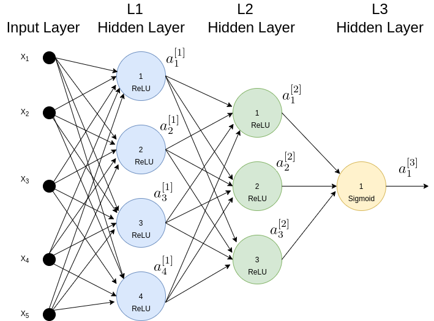

# Back Propogation Example
In this post we will run a network Training (aka Fitting) example, based on the Back Propogation algorithm explained in the previous post.

The example will run a single Back Propogation cycle, to produce 2 outputs: \\(\frac{\mathrm{d} C}{\mathrm{d}{b^{[l]}}}\\) and \\(\frac{\mathrm{d} C}{\mathrm{d}{w^{[l]}}}\\) for 1<l<L.

## Example Details:

The network is depicted In Figure 1.

### Figure 1: The Network

### Input data set:
The input data x, consists of m examples, where m=3. (Note that the examples are stacked in columns).

\\(A^{[0]}=\begin{bmatrix}
a_1^{[0]{(1)}}& a_1^{[0]{(2)}} & a_1^{[0]{(3)}} \\\\\\
a_2^{[0]{(1)}}& a_2^{[0]{(2)}} & a_2^{[0]{(3)}} \\\\\\
a_3^{[0]{(1)}}& a_3^{[0]{(2)}} & a_3^{[0]{(3)}}
\end{bmatrix}\\)

\\(dim(A^{[0]})=n^{[0]} \cdot m\\)

### Initial Paramerters

Here are the weights and bias of the 3 layers:

#### Weights layer 1:

\\(w^{[1]}=\begin{bmatrix}
w_{11}^{[1]} & w_{21}^{[1]} & w_{31}^{[1]}\\\\\\
w_{12}^{[1]} & w_{22}^{[1]} & w_{32}^{[1]}\\\\\\
w_{13}^{[1]} & w_{23}^{[1]} & w_{33}^{[1]}\\\\\\
w_{14}^{[1]} & w_{24}^{[1]} & w_{34}^{[1]}
\end{bmatrix}\\)

\\(dim(w^{[1]})=n^{[1]} \cdot n^{[0]}\\)

#### Bias layer 1:

\\(b^{[1]}=\begin{bmatrix}
b_{1}^{[1]}\\\\\\
b_{2}^{[1]}\\\\\\
b_{3}^{[1]}\\\\\\
b_{4}^{[1]}
\end{bmatrix}\\)

\\(dim(b^{[1]})=n^{[1]}\\)

#### Weights layer 2:

\\(w^{[2]}=\begin{bmatrix}
w_{11}^{[2]} & w_{21}^{[2]} & w_{31}^{[2]} & w_{41}^{[2]}\\\\\\
w_{12}^{[2]} & w_{22}^{[2]} & w_{32}^{[2]} & w_{42}^{[2]}\\\\\\
w_{13}^{[2]} & w_{23}^{[2]} & w_{33}^{[2]} & w_{43}^{[2]}
\end{bmatrix}\\)

\\(dim(w^{[2]})=n^{[2]} \cdot n^{[1]}\\)

#### Bias layer 2:

\\(b^{[2]}=\begin{bmatrix}
b_{1}^{[2]}\\\\\\ 
w_{2}^{[2]}\\\\\\
w_{3}^{[2]} 
\end{bmatrix}\\)

\\(dim(b^{[2]})=n^{[2]}\\)

#### Weights layer 3:

\\(w^{[3]}=\begin{bmatrix}
w_{11}^{[3]} & w_{21}^{[3]} & w_{31}^{[3]}
\end{bmatrix}\\)

\\(dim(w^{[3]})=n^{[3]} \cdot n^{[2]}\\)

#### Bias layer 3:

\\(b^{[2]}=\begin{bmatrix}
b_{1}^{[3]}
\end{bmatrix}\\)

\\(dim(b^{[3]})=n^{[3]}\\)

## Feed Forward:

### Feed Forward L1:

\\(Z^{[1]}=w^{[1]} \cdot A^{[0]} + b^{[1]}= \begin{bmatrix}
w_{11}^{[1]} & w_{21}^{[1]} & w_{31}^{[1]}\\\\\\
w_{12}^{[1]} & w_{22}^{[1]} & w_{32}^{[1]}\\\\\\
w_{13}^{[1]} & w_{23}^{[1]} & w_{33}^{[1]}\\\\\\
w_{14}^{[1]} & w_{24}^{[1]} & w_{34}^{[1]}
\end{bmatrix} \cdot 
\begin{bmatrix}
a_1^{[0]{(1)}}& a_1^{[0]{(2)}} & a_1^{[0]{(3)}} \\\\\\
a_2^{[0]{(1)}}& a_2^{[0]{(2)}} & a_2^{[0]{(3)}} \\\\\\
a_3^{[0]{(1)}}& a_3^{[0]{(2)}} & a_3^{[0]{(3)}}
\end{bmatrix} + 
\begin{bmatrix}
b_{1}^{[1]}\\\\\\
b_{2}^{[1]}\\\\\\
b_{3}^{[1]}\\\\\\
b_{4}^{[1]}
\end{bmatrix}=
\begin{bmatrix}
z_{11}^{[1]} & z_{12}^{[1]} & z_{13}^{[1]}\\\\\\
z_{21}^{[1]} & z_{22}^{[1]} & z_{23}^{[1]}\\\\\\
z_{31}^{[1]} & z_{32}^{[1]} & z_{33}^{[1]}\\\\\\
z_{41}^{[1]} & z_{42}^{[1]} & z_{43}^{[1]}
\end{bmatrix}
\\)

\\(dim(Z^{[1]})=n^{[1]} \cdot m\\)

Note that \\(b^{[1]}\\) is broadcasted across all columns for the above addition.

\\(A^{[1]}=\begin{bmatrix}
g(z_{11}^{[1]}) & g(z_{12}^{[1]}) & g(z_{13}^{[1]})\\\\\\
g(z_{21}^{[1]}) & g(z_{22}^{[1]}) & g(z_{23}^{[1]})\\\\\\
g(z_{31}^{[1]})& g(z_{32}^{[1]}) & g(z_{33}^{[1]})\\\\\\
g(z_{41}^{[1]}) & g(z_{42}^{[1]}) & g(z_{43}^{[1]})
\end{bmatrix}\\)

\\(dim(A^{[1]})=n^{[1]} \cdot m\\)

### Feed Forward L2:

\\(Z^{[2]}=w^{[2]} \cdot A^{[1]} + b^{[2]}= \begin{bmatrix}
w_{11}^{[2]} & w_{21}^{[2]} & w_{31}^{[2]} & w_{41}^{[2]}\\\\\\
w_{12}^{[2]} & w_{22}^{[2]} & w_{32}^{[2]} & w_{42}^{[2]}\\\\\\
w_{13}^{[2]} & w_{23}^{[2]} & w_{33}^{[2]} & w_{43}^{[2]}

\end{bmatrix} \cdot 
\begin{bmatrix}
a_1^{[1]{(1)}}& a_1^{[1]{(2)}} & a_1^{[1]{(3)}} \\\\\\
a_2^{[1]{(1)}}& a_2^{[1]{(2)}} & a_2^{[1]{(3)}} \\\\\\
a_3^{[1]{(1)}}& a_3^{[1]{(2)}} & a_3^{[1]{(3)}} \\\\\\
a_4^{[1]{(1)}}& a_4^{[1]{(2)}} & a_4^{[1]{(3)}}

\end{bmatrix} + 
\begin{bmatrix}
b_{1}^{[2]}\\\\\\
b_{2}^{[2]}\\\\\\
b_{3}^{[2]}

\end{bmatrix}=
\begin{bmatrix}
z_{11}^{[2]} & z_{12}^{[2]} & z_{13}^{[2]}\\\\\\
z_{21}^{[2]} & z_{22}^{[2]} & z_{23}^{[2]}\\\\\\
z_{31}^{[2]} & z_{32}^{[2]} & z_{33}^{[2]}
\end{bmatrix}
\\)

\\(dim(Z^{[2]})=n^{[2]} \cdot m\\)

\\(A^{[2]}=\begin{bmatrix}
g(z_{11}^{[2]}) & g(z_{12}^{[2]}) & g(z_{13}^{[2]})\\\\\\
g(z_{21}^{[2]}) & g(z_{22}^{[2]}) & g(z_{23}^{[2]})\\\\\\
g(z_{31}^{[2]})& g(z_{32}^{[2]}) & g(z_{33}^{[2]})
\end{bmatrix}\\)

\\(dim(A^{[2]})=n^{[2]} \cdot m\\)

### Feed Forward L3:

\\(Z^{[3]}=w^{[3]} \cdot A^{[2]} + b^{[3]}= \begin{bmatrix}
w_{11}^{[3]} & w_{21}^{[3]} & w_{31}^{[3]}
\end{bmatrix} \cdot
\begin{bmatrix}
a_1^{[2]{(1)}}& a_1^{[2]{(2)}} & a_1^{[2]{(3)}} \\\\\\
a_2^{[2]{(1)}}& a_2^{[2]{(2)}} & a_2^{[2]{(3)}} \\\\\\
a_3^{[2]{(1)}}& a_3^{[2]{(2)}} & a_3^{[2]{(3)}}
\end{bmatrix} + 
\begin{bmatrix}
b_{1}^{[3]}
\end{bmatrix}=
\begin{bmatrix}
z_{11}^{[3]} & z_{12}^{[3]} & z_{13}^{[3]}
\end{bmatrix}
\\)

\\(dim(Z^{[3]})=n^{[3]} \cdot m\\)

\\(A^{[3]}=\begin{bmatrix}
g(z_{11}^{[3]}) & g(z_{12}^{[3]}) & g(z_{13}^{[3]})
\end{bmatrix} = \begin{bmatrix}
a_{1}^{[3](1)} & a_{1}^{[3](2)} & a_1^{[3]}(3))
\end{bmatrix}\\)

## Back Propogation:

### Back Propogation L3:

Derivative of a cost function with a Sigmoid activation is:

\\(\frac{\mathrm{d} C}{\mathrm{d} \sigma(z)}=-\frac{y}{\sigma(z)}+\frac{1-y}{1-\sigma(z)}\\)

where \\(\sigma(z)\\) is the Sigmoid's output, and y is the expected output i.e. training data label. In our notation, the vectorized activation output is denoted by \\(A^{[3]}\\), plugung it in to the derivation expression we get:

\\(\begin{bmatrix}\frac{y ^{(1)}}{a_{1}^{[3](1)}} + \frac{1-y ^{(1)}}{1-a_{1}^{[3](1)}} &  
\frac{y ^{(2)}}{a_{1}^{[3](2)}} + \frac{1-y ^{(2)}}{1-a_{1}^{[3](2)}} & \frac{y ^{(3)}}{a_{1}^{[3](3)}} +\frac{1-y ^{(3)}}{1-a_{1}^{[3](3)}}\end{bmatrix}\\)

