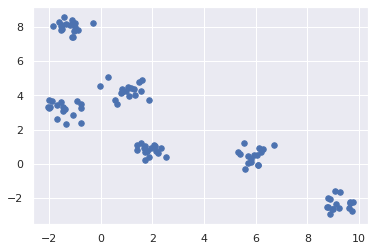

## This is my first 

#This is my first 
This is my first post on machine learning and deep learning., which can be considered an intro, and will be followed by posts which will consist of both theory and implementation topics. 
Should I start with a definition of 'Machine Learning'? Maybe define how 'Deep Learning' is defined with regard to it? I'll take the risk and sum it in a single short sentence:  Machine Learning, (or I’d prefer to speak of Machine Learning Algorithms), are computer algorithms which improve automatically through reference from data.

To better explain the meaning of that, and emphasize the difference between Machine Learning Algorithms and conventional algorithms, let me show an example:
Let’s consider a typical image recognition problem: 
we need to classify a picture to one of the 2 classes: "cat" or "not a cat".
To solve such a problem, using a conventional, non-machine learning algorithm solution, one would probably implement dedicated and complicated computer vision algorithms, which would try to parse the body parts, in the effort to extract cat characterizing features within. 

Figure 1: This is a cat!

Take a look at that cute cat: the algorithm needs to detect charectarizing features such as the ears, eyes, whiskers, etc. Not an easy job at all! It requires complicated parsing and detection algorithms, support so many potential perspectives, poses, colors, scales, and just name it... Now, let's suppose the algorithm is able determine a cat, when he sees one. But, what about a picture of 'not a cat', but certain features are so close - take a look at this puppy!

Figure 2: Not a cat!

Indeed complicated, and indeed the performance of conventional computer vision algorithms for such tasks, in terms of false detections and miss detections, were not considered satisfactory enough. 

Machine Learning algorithms on the other hand, led to a breakthrough in such detection, recognition and generally speaking classification tasks, and in plenty othere problems, just ot list some: text recognition, voice recognition, customers targeting, chess playing, etc.

 Machine Learning algorithms, tackels this problems with a totally different approach. Rather than using sophisticated computer vision specific algorithms, the machine learning way to determine whether a picture is of a cat or not, is sketched in the 2 figures below.

Figure 1: Machine Learning Model

Figure 3: Machine Learning system's outlines

The idea is to have 2 phases of operations:
1. Training
2. Noraml Data

During the Training phase, the input data set consists of 'labled data'. That means, each element of the data set is labeled with the expected output. For example, in the cat detection algorithm, the training data set would consist of many pictures, each labeld as 'Cat' or 'Not a Cat".
Accordingly, Traning phase goal is to determine the coefficients for the selected prediction model function:
$$h(x)$$. 
To do that, it normally needs a large training set, where each element of that dataset is a labeled input data. At this point, it may all sound vage: How does that "magic" prediction function look like? what coefficients are we tailking about? In a nutshell, the predictor out put is $$\hat{y}$$, which estimates $${y}$$. To illustrate that with an example, then $$\hat{y}$$ is the 'a cat' or 'not a cat' decision made bythe predictor, which tryies to predict $${y}$$, which is the correct "cat", "no cat" decision.
We'll delve to the details in posts which follow. This is an introductory post.

Having the predictor, we can move to the normal data phase, at which the system is ready to predict the expected output for unlabeled input data:
$$\hat{y}=h(x))$$

And here's another 'technical detail': between the "Training" phase and the "Normal Data" phase, there's the "Testing" phase, at which the system performance is evaluated, and accordingly, it should be decided if it is acceptable or requires more training or any type of a modification.  See Figure 4.
We'll ofcourse review the various performance criteria, and how should that be done.

Figure 4: Machine Learning - The 3 phases

Now with the ML concept presented, still vagely though, before concluding the intro, we should crystalizee it a bit more:
The 3 phase model presented, relates to one type MAchine Learning algorithms, named "Supervised Learning". Supervised Learning is currently considered the mostly implemented ML algorithm type. 

The 3 types of ML algorithms currently considered are:
1. Supervised Learning
2. Unsupervised Learning
3. Reinforcement Learning

Here's an introductory to each of the 3 types.

Supervised Learning - This is the type presented by Figures 1 and 2, also used as an example to ML with the 'cat' 'no cat' classification problem. As noted above, it is currently the most common and practically used ML type. Named 'Supervised', it requires a supervision intervention to prepare the training labeled data. Data labeling can be a tedious task in the better case, or an impossible mission when a large scale of data is needed for the training. BTW, how can we tell if a larger set of data is required? We'll cover that one later.
Anyway, the 2 common Supervised Learning types of problem are:
1. Classification
2. Regression

In Classification problems, according to input, the problem is to decide which of the output classes should be selected between a descret (=finite) set of classes, e.g. "cat" or "not a cat", which is a binary classification problem, or a multi classification problem e.g. 'cat', 'dog', 'wolf' or 'elephant'.
In Regression problems, according to input, the problem is to determine the output value, which now is not descrete but continous. e.g., based on various features, such as address, floor, area, and number of bedrooms, predict the price of a flat.

Unsupervised Learning
Unsupervised learning is mostly about finding hidden information inside the data. Point is,in contrust to Supervised Learning, the data is not labeled so the type of "hidden information" sought after, is not apriori known, but discovered from the data . Common Unsupervised Learning applications are:
Clustering - grouping the input in clusters according to common charectaristics found, e.g. color, shape, biochemical structure, probabily distribution, etc, as illustrated in Figure 4. Note that clusters presented in Figure 4 are of 2 dimensions, because it is preactically easier to present graphically, (can present 3 dimensions at the most), though in many cases clusters will have  more dimentsions. (Was asked about the meanings of probabily distribution, so here's an example: Task is signal-noise decomposition, where signal is a sinusoid and noise has white spectral probability density. Clustering will decompose the noise-signal).

Figure 4: Clusters (2D)

Reinforcement Learning - Unblike Supervised learning, which is based on labeled data, or unsupervsed learning, which is finds hidden data patterens,RL is based on a markovian process
tries to maximaize a reward rather than find hidden patterns or structures in the data

he algorithm.

(From RL book 1.1)

unsupervised learning which typically is about finding structure hidden in collections of unlabeled data. Though RL too does not rely on examples of correct behavior, RL tries to maximaize a reward rather than find hidden patterns or structures in the data)

it is required to relate the data to one element in a closed set of decisionsthe required decision is to 

TILL HERE!!!

TILL HERE RONEN!!!!

model presents 2 sources of data: Training Data and Normal Data. The process starts with the training data, which is a set of labeled data, where the label determines the expected output (or decision in the cat/no cat example).

much poorer to the - performance of such algorithms were much poorer than the results of current machine learning algorithms.

On the other hand, a machine learning algorithm model which fit this problem, would be executed in 2 phases:
Training phase - at this stage, the algorithm calculates a set of weight coefficients w, which maximize the likelihood of a stochastic predictor: $$p_{w}(y|x)$$

The prediction phase - at this stage the predicted decision $$y\hat{}$$ is calculated using the predictor calculated during the training phase.

Figure 1 below illustrates the machine learning algorithm operations described above.
Note that in most actual cases, the machine learning algorithm will pass through 3 phases, where a ‘test’ phase is normally added between the training and the read data phases, as illustrated in Figure 2. During the test phase, the error between the predicted result $$y\hat{}$$ and the expected by label y, will be used to decide if the predictor is valid or needs refinements.

More details on the prediction method, how it is calculated, how it works, the 3 phases, etc - in posts which will follow.

Figure 1: Machine learning algorithm 

Figure 2: 3 phases of Machine learning algorithm

So far we tried we illustrated a machine learning algorithm with the cat image recognition task. That task belongs to one category of ML, named Supervised learning. 

Currently the 3 major machine learning categories are:
Supervised learning - currently the most commonly used category
Unsupervised learning
Reinforcement learning.

Let’s briefly describe those 3 categories. We will delve into things in later dedicated posts.

Supervised learning - As can be seen in figures 1 and 2, supervised learning consists of a learning phase with labeled data, just as illustrated with the cat recognition case discussed above.  The reason for naming it ‘supervised’ was the fact that it should be labeled (e.g. as a ‘cat’ or ‘not a cat’) by a knowledgeable supervisor. Data is labeled during phase data too.

The 2 common types of supervised categories are:
Classification
Regression

Classification is the problem of assigning the input data to one of the system’s classes, e.g. the binary classification: ‘a cat’ or ‘not a cat.
Here’s another example of a classification for a supervised machine learning: predict whether a person will buy the newest iphone. - See table 1 below. 

Table 1: Iphone purchase prediction - Binary classification, with structured data

$$x_{1}$$ 
Annual Income ($)
$$x_{2}$$ 
Zip code
$$x_{3}$$ 
House ownership
$$y$$
 Will he buy the newest iphone? 
21200
32321
yes
yes
135000
54322
no
no
243000
43243
yes
yes
320000
63422
yes
no

Each input in table 2 consists of 3 features. The training set consists of 4 labeled examples.

, the input x has 3 features: Annual Income, zip code, and house owning. According to those 3 features {$$x_{1} x_{2} x_{3}$$}, class $$y\hat{}$$ should be predicted, in this case it’s a binary classification - Will the customer buy a new iphone or not. Note that the input data, the ‘features’ can be arranged in a table. This type of data is known as ‘structured’ as opposed to unstructured data, e.g. image input of the previous example.

In Regression supervised learning, the predicted result is not a discrete class, but a continuous value. Table 2 demonstrate a supervised regression machine learning: Predict house prices based on 3 features

Table 3:  House price prediction - regression supervised learning

Number of bedrooms
$$x_{2}$$
Zip code
$$x_{3}$$
floor
$$y$$
Price $
4
32321
2
17900
2
54322
3
21000
2$$x_{1}$$
43243
4
25000
3
63422
1
26000

Note - it is obvious that these 3 features are not enough to predict prices of houses. More features are needed, otherwise, we will see underfitting of results. Overfitting and underfitting will be discussed in future posts.

Next table sums up the 3 supervised learning test cases presented above:

Test Case
Classification Category
Type of data
Prediction type
 Price Prediction
supervised
structured
regression
 Image Recognition
supervised
unstructured
classification
Purchase Prediction
supervised
structured
Binary classification

 Unsupervised Learning

Unlike Supervised Learning, unsupervised learning is used for clustering, and dimensionality reduction  of the data to groups with similar characteristics the machine determines, e.g. similar color of particles in molecular images, similar biochemical structure in viruses or similar probability distribution, which can be used to detect a signal consists noise.  Unlike conventional computer programs, which need to cluster according to apriori known features, now the underlying patterns are discovered by the algorithm.

Figure 3: Clustering

Unlike Supervised learning, as implicit by its name, no labeled training data is needed. This is significant where labeling a large data becomes a complicated task, not to say too complicated when a large scale of training set is required.

How many clusters should the algorithm create? There are some approaches:
Fix number or k clusters
Variable number - find best clustering according to a criteria function.

Let’s see a clustering example, using k-means, one of the most common clustering algorithms, yet one of the simplest. Her k, the number of clusters is assumed apriori. The algorithm searches for the centers of each of the k clusters. Each point of the dataset should be associated to the nearest cluster’s center aka centroid. 

The objective is to minimize the squared error distance function:
$$J=\sum_{j=1}^{k}\sum_{i=1}^{n}\left \|x_{i}-c_{j} \right \|$$

Where J is the cost function, which is the sum of distances between each set point to its related centroid.

So here’s the algorithm:

Randomly select k cluster centers, denoted as $$c_{j}$$. (a popular way to do it -randomly select k data points from the data sets)
Calculate distance between each data point and all cluster centers
Assign each data point to the cluster which distance to its center is minimal
Recalculate cluster centers with:
$$c_{i}=\frac{1}{n}\sum_{j-1}^{n}x_i$$
Recalculate distance between each data point and all cluster centers
Assign the each data point to the cluster which distance to its center is minimal
If no datapoint was reassigned to another cluster, stop. Otherwise, repeat from step 6

---

unsupervised learning categorical data vs continuous

Wiki:
https://en.wikipedia.org/wiki/Unsupervised_learning

 by maximizing some objective function or minimising some loss function. 

whereas supervised learning intends to infer a conditional probability distribution 
{\textstyle p_{X}(x\,|\,y)}
 conditioned on the label 
{\textstyle y}
 of input data; unsupervised learning intends to infer an a priori probability distribution 
{\textstyle p_{X}(x)}

,  images according to shape, colors or any other clustering characteristic the machine determines. 

(From RL book 1.1)

Unlike Supervised Learning, In Unsupervised Learning, aim of prediction is not to classify data to pre-determined hypothesis or forecast a value according to features, but to determine outcomes based of analysis of the data, e.g. clustering images according to shape, colors or any other clustering characteristic the machine determines. 

. 

  Reinforcement learning.

Reinforcement learning is used to make decisions sequentially, when input depends on the state of the previous output. Learning is based on 3 concepts: state, action and reward/punishment, as illustrated in the figure below

Finite markovian model

Reinforcement learning is a closed loop problem at which the action influences its next input.The action does not influence the next reward, but also the next state, which again, in a closed loop form, influences on the next action.

The reward is a numerical value, a scalar, 
Given those, the question is: which actions should a software agent take. The agent’s goal should be to get a maximal amount of rewards, without being told which action to take.  Unlike supervised learning which learns from a training set of labeled examples, each identify an hypothesis to which the situation belongs, in RL, the agent reacts to situations which don't belong to a training set, which is  impractical to obtain for all interactive situations which agent has to act. RL is also different from unsupervised learning which typically is about finding structure hidden in collections of unlabeled data. Though RL too does not rely on examples of correct behavior, RL tries to maximaize a reward rather than find hidden patterns or structures in the data)

( the best action to take given the current state. )

Here are examples:

(from book: A mobile robot decides whether it should enter a new room in search of trash to collect, or start his way back to its charging station. Decision is based on current charge level and of how quickly could it find the charger in the padt

 whenin some senses similar to supervised classification, but decisions are made sequentially.

An Introduction to Reinforcement Learning, Sutton and Barto, 1998

From : https://medium.com/analytics-steps/defining-predictive-modeling-in-machine-learning-887c23b7a278

1. Parametric Model
Assumptions are the crucial part of any data model, it not only makes the model easy also improves predictions, so the algorithms that consider assumptions and make the function simple are known as parametric ML algorithms, and a learning model that compiles data with different parameters of a predetermined size, independent to number of training variables, is termed as parametric model.
2. Non-parametric Model
ML algorithms that enable to make strong assumptions in terms of the mapping function are called non-parametric Ml algorithms and without worth assumptions, ML algorithms are available to pick up any functional form training data. Non-parametric models are a good fit for the huge amount of data with no previous knowledge.

