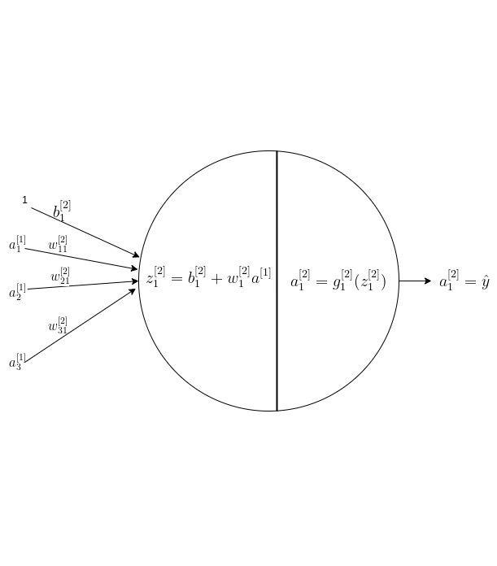

# Introduction to Deep Learning

This is the first in series of 3 deep learning intro posts:
1. Introduction to Deep Learning which introduces the Deep Learning technology background, and presents network's building blocks and terms.
2. Introduction to Forward Propogation, which presents the mathematical equations of the prediction path.
3. Introduction to Backward Propogation which presents the mathematical equations for network's coefficents calculation, done during the training phase.

## Introdcution

To begin with speaking about Deep Learning, I have to recommend of the book named "Deep Learning Adaptive Computation and Machine Learning" by 
goodfellow, Bengio and Courville, which is my reader book. DLAC&ML reviews briefly the history of deep learning technology and research, which dates long ago, already in the 1940s, though the names and popularity of this field had changed through the years. Deep Learning is quite a recent name. One of its anccestors is the Artificial Neural Networks (ANNs) which research tried to model the biological brain. The modern term Deep Learning has less pretension to mimic the brain or understand its operation, but is still inspired by neurosience and the brain like model of many simple computational elements interacting together, using a single algorithm, to create an intelligent unit which solves many kinds of different problems. We will see in this post that the Deep Learning network AKA Neural Network, is based on many instances of a simple elements named Neuron. The Neuron implements a simple non-linear algorithm - either a sigmoid, or n hyperbolic tangent or in the most commonnly in current implementation, using RelU (Rectified Linear Unit) algorithm.

## Neural Networks

Figure 1 depicts a Neural Network. Input Data is on the left side. The data is forwarded through the network's layers up to the Output-Layer. The network's elements call Neurons are simple computational elements, as depicted in Figure 2.

### Figure 1: Neural Network

Following Figure 1, here below are some commonly used terms:

- **Layers**: The Neural Network is arranged in layers. The network presented in Figure 2 has 5 layers - marked L1-L5. Each layer consists of 4,4,4,2 and 1 neurons respectively.
- **Desnse Layers**: Fully connected layers. The neural networks are densely connected.
- **Input Layer**: A layer with input exposed to outside of the network. Input Layer is conventionally not counted in the layers count.
- **Hidden Layer**: A Layer which has no external input or output. In Figure 1, L1-L4 are Hidden layers.
- **Output Layer**: A layer with output exposed to outside of the network. L5 in Figure 2.
- **Deep Neural Network**: A neural network with 'many layers'. There is no definite minimal number of layers for that, though 3 hidden layers used to be regarded "Deep".

By examining Figure 2, let's drill into the structure and elements which constitute the Neural Networks.
Figure 2 depicts a Nueral Network with less layers and neurons then in Figure 2, to make it more easy to present it with more details. It is followed by corresponding explaination and notaitions.

### Figure 2: Neural Network - A More Detailed Scheme

Some explaination and notations:
- **Meanings of indices**: \\(b_{1}^[2]\\) has a Superscript and a Subscript. The bracketed Superscript correspobds to the Layer index, the Subscript index corresponds to Neuron's index within the layer.
- **weights**: The weights multiply the layer's data input at the Neuron's input. Example: \\(w_{21}^[2]\\) is the weight for the input from Neuron 1 Layer 1, to  Neuron 2 layer 2. 
- **bias**: Bias multiplies a constant 1 and then summed up together with all weighted inputs. Example: \\(b_2^{[1]}\\) is the bias input of Neuron 2 Layer 1.
- **activations**: The activation function is the Neuron's non-linear function denoted by g() and its output denoted by a. Example:  \\(a_2^{[1]}=g_2^{1}(z^{1})\\) is the activation of Neuron 2 Layer 1. 

Now that the Neuron's interconnections are introduced, let's drill into the Neuron's.

## The Neuron 

Figure 3 presents a Neuron. 

### Figure 3: Neuron

Following the scheme left to right, then we see the following:
1. n-features input data
2. n weights which mutiply the input data, and a bias multiplies 1.
3. A cascade of 2 operators (inside the cirdcle):
  - A linear summation operator which accumulates the weighted data and the bias.
  - A non linear operator (activation).
4. The Neuron output is the activation.

Now that we're familiar with the Neuron, Figure 4 illustrates the parameters' indices assignemnt conventions, by focusing on Neuron 2 from layer to of Figure 2. 
Following the scheme left to right, the reader can verify that the indices are according to the conventional index scheme/

### Figure 4: Focus on Neuron 1 Layer 2 (See Figure 2)

## Activation Functions

The previous section presented the Neuron, with its non-linear activation function g(z). But g(z) was not introduced. To complete the introduction on network's building blocks, 4 commonly used activations are presented here below:
1. Sigmoid
2. 
 
Maybe here's the right place to comment about how essential the non-linear activations are: In the absence of a non-linear activation functions, the Neural Network would be a cascade of linear functions, which could be replaced by a single Neurone with a linear function. There could be no benefit over a single Neurone.  

### Sigmoid

### Eq. 1: Sigmoid Function 

$$\sigma{x}=\frac{1}{1+e^{-x}}}$$

Sigmoid was introduced in the Logistic Regression post. With a decision threshold at 0.5, a range of [0,1], and a steep slope, Sigmoid is suitable a a binary decision function. and indeed it's very commonly used for binary classification.
Still, the sigmoid values flatens as at higher values of z. This the "Vanishing Gradient" problem, with which optimization algorithms such as Gradient Descent will not merge or merge very slowly. 

### Figure 5: Sigmoid

### tanh

### Eq. 2: Hyporbolic Tangent (tanh)

$$
tanh(x)=\frac{e^x-e^{-x}}{e^{x}+e^{-x}}
$$

It's easy to see, by multiplying numerator, as shown in Eq 3. and denominator by \\(e^{-x}\\), that tanh is a scaled sigmoid. It is also depicted in Figure 6 that  tanh is a scaled sigmoid, centered around 0 instead of 0.5 with values [-1,1]..

### Eq. 3: tanh Function is a scaled sigmoid

$$tanh(x)=\frac{e^x-e^{-x}}{e^{x}+e^{-x}}*\frac{e^{-x}}{e^{-x}}= \frac{2}{1+e^{-2x}}-1=2\sigma(2x)-1$$

Tanh usually works better than Sigmoid for hidden layers. Actually, sigmoid is rarely used for hidden layers, but only for output layers, where the output is expected to be 0 or 1.

### Figure 6: tanh

### Relu

### Eq. 4: Relu - Rectified Linear Unit

relu(x)=max(0,x)

Relu solves the "Vanishing Gradient" problem. Derivative is 1 for the positive value. The derivative at x=0 is not defined, but that's not an issue and can be set to either 0 or 1. Relu implementation is simpler and cheaper computation wise then the other activation functions. is commonly used, actually it's in most cases the default activation function. 
Problem with Relu is the 0 gradient for negative values, so all units with negative value will slow down learning. Still, not considered a critical issues, as about half og the hidden unit are still expected to have values greater than 0.
Leaky Relu solves the 0 gradient issue anyway.

### Figure 7: RelU

### 

### Figure 8: Leaky RelU

### Eq. 5: Leaky Relu

leaky_relu(x)= max ? x: 0.01*x

Leaky Relue adds a slope to the negative values, preventing the 0 gradient issue. The slope he is set to 0.01.

