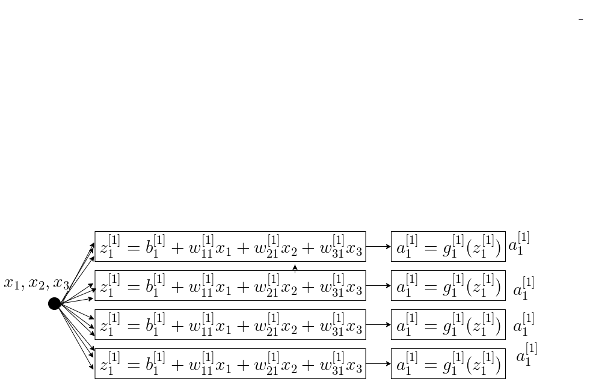

# Forward Propogation

## Introduction

This is the second in series of 3 deep learning intro posts:
1. Introduction to Deep Learning which introduces the Deep Learning technology background, and presents network's building blocks and terms.
2. Forward Propogation, which presents the mathematical equations of the prediction path.
3. Backward Propogation which presents the mathematical equations for network's coefficents calculation, done during the training phase.

Forward Propogation is about the forwarding of the input data through the network. This is the network's prediction path. In this section we will introduce the development of the Feed Forward equations. 

Figure 1 illustrates a Neural Network. The data is forwarded through 15 densely interconnected Neurons. Each Neuron is structured as depicted on Figure 2. Figure 3 illustrates the same Neuron but different form where the data input is arranged as a vector, and the 2 cascaded operators are arranged in 2 blocks.
 
 
 ### Figure 1: Neural Network
 

### Figure 2: A Neuron

 ### Neoron Cascaded operators L1
 

 ### Neoron Cascaded operators L2
 

 
 ### Neoron Cascaded operators L3
 

 ### Neoron Cascaded operators L4
 

 ### Neoron Cascaded operators L5
 

 
We aim to present the prediction equations which maps the input vector data \\(\bar{x}\\) to the prediction value \\(\hat{y}\\). In the effort to keep equations simple and compact, we use matrix format, calculating each layer's Neuron's equations together.

So, the forwarding 
 
 
 
 operates a quite simple In previous post t
 

 ### Feed Forward Equations For a Single Layer

As shown in figure 1, the Feed Forward equation of a single neuron is given by Eq. 1a -b

### Eq. 1a
$$z=b+w^Tx$$

### Eq. 1b
$$a=g(z)$$

We need a more compact matrix expression, not just for a single neuron, but to all layer's neurons together. This expression is presneted in Eq. 2a-b

### Eq. 2a: Weighted input of Layer l, l=1:L
$$
z^{[l]}=w^{[l]}a^{[l-1]}+b^{[l]}
$$

### Eq. 2b: Activation of Layer l, l=1:L
$$
a^{[1]}=g^{[l]}(z^{[l]})
$$

The variables of Eq. 2a and Eq. 2b are all matrix and vectors. Let's illustrate those equations with the 3 layers of Figure 2.

 

### Eq. 7a1: Layer 1 Weighted input

Layer 1 is different from all other layers in the input data set which is the dataset x and not the activation of the previous layer. But if we represent the input data vector \\(\begin{bmatrix}
x_1 \\\\\\
x_2
\end{bmatrix}\\) by \\(\begin{bmatrix}
a_1^{[0]} \\\\\\
a_2^{[0]}
\end{bmatrix}\\), the generalized expression can fir for this layer too:

$$\begin{bmatrix}
z_1^{[1]} \\\\\\\\ 
z_2^{[1]} \\\\\\\\ 
z_3^{[1]}
\end{bmatrix}=
\begin{bmatrix}
w_{11}^{[1]}  & w_{21}^{[1]} \\\\\\ 
w_{12}^{[1]}  & w_{22}^{[1]} \\\\\\ 
w_{13}^{[1]}  & w_{13}^{[1]} 
\end{bmatrix} \begin{bmatrix}
a_1^{[0]}  \\\\\\ 
a_2^{[0]}
\end{bmatrix}+\begin{bmatrix}
b_1^{[1]} \\\\\\ 
b_2^{[1]} \\\\\\ 
b_3^{[1]} 
\end{bmatrix}
$$

### Eq. 7b: Layer 1 activation

$$\begin{bmatrix}
a_1^{[1]} \\\\\\\\ 
a_2^{[1]} \\\\\\\\ 
a_3^{[1]}
\end{bmatrix}=\begin{bmatrix}
g_1^{[1]}(z_1^{[1]}) \\\\\\\\ 
g_2^{[1]}(z_2^{[1]}) \\\\\\\\ 
g_3^{[1]}(z_3^{[1]})
\end{bmatrix}$$

### Eq. 8: Layer 2 Weighted input

$$
\begin{bmatrix}
z_1^{[2]} \\\\\\\\ 
z_2^{[2]}
\end{bmatrix}=
\begin{bmatrix}
w_{11}^{[2]}  & w_{21}^{[2]} & w_{31}^{[2]} \\\\\\ 
w_{12}^{[2]}  & w_{22}^{[2]} & w_{32}^{[2]}
\end{bmatrix} \begin{bmatrix}
a_1^{[1]} \\\\\\ 
a_2^{[1]}
\end{bmatrix}+\begin{bmatrix}
b_1^{[2]} \\\\\\ 
b_2^{[2]} \\\\\\ 
\end{bmatrix}
$$

### Eq. 10: Layer 2 activation i
$$
\begin{bmatrix}
a_1^{[2]} \\\\\\
a_2^{[2]} 
\end{bmatrix}=
\begin{bmatrix}
g_{1}^{[2]} (z_1^{[2]}) \\\\\\ 
g_{2}^{[2]}(z_2^{[2]})
\end{bmatrix}
$$

The last layer has a single Neuron, so obviously the equations are:

### Eq. 8: Layer 3 Weighted input

$$
z_1^{[3]}=
\begin{bmatrix}
w_{11}^{[3]}  & w_{21}^{[3]}
\end{bmatrix} \begin{bmatrix}
a_1^{[2]} \\\\\\
a_2^{[2]}
\end{bmatrix}+b_1^{[3]}
$$

### Eq. 8: Layer 3 activatiob

$$
a_1^{[3]}=
g^{[3]}(z_1^{[3]})
$$

## Matrix Dimensions
