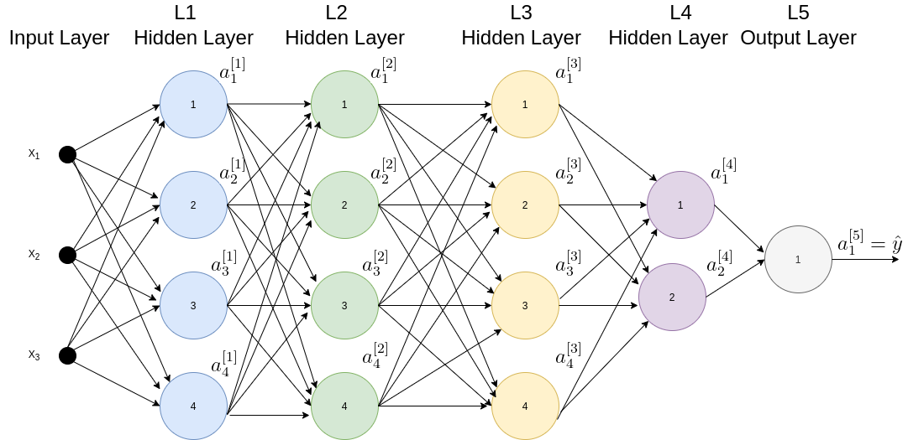
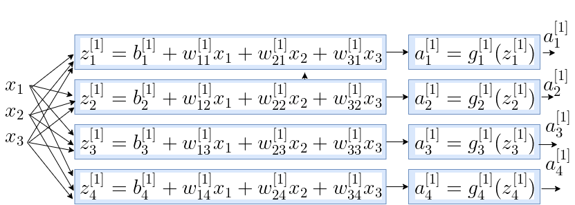
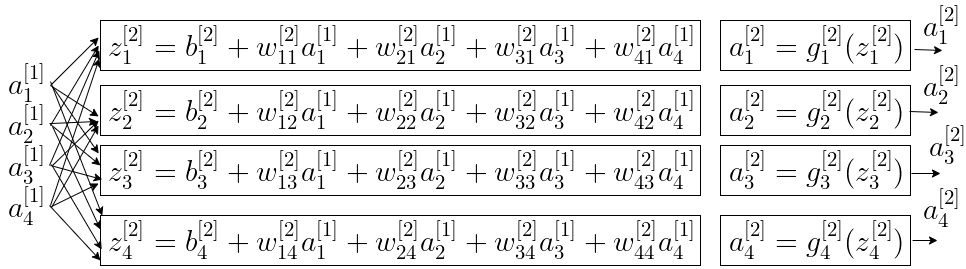
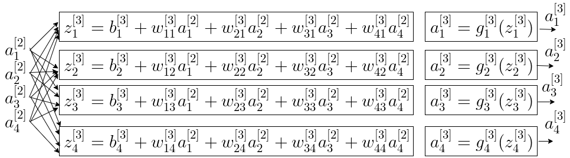
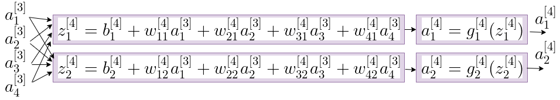
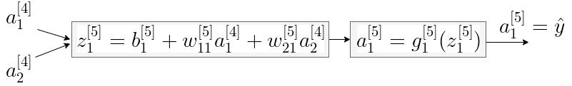

# Forward Propogation

## Introduction

This is the second in series of 3 deep learning intro posts:
1. Introduction to Deep Learning which introduces the Deep Learning technology background, and presents network's building blocks and terms.
2. Forward Propogation, which presents the mathematical equations of the prediction path.
3. Backward Propogation which presents the mathematical equations for network's coefficents calculation, done during the training phase.

In this post we will examine the forwarding equations of the input data through the network. This is the network's prediction data path, at which the network's weights are static, and only the input data changes. As an oposite to Forward Propogation which calculates the prediction value based on the input data, the Backwards Propogation process calcuates the network's weights. The latter is presented in the next post.

## Network Schemes 

Figure 1 illustrates a Neural Network. The data is forwarded through 15 densely interconnected Neurons. 

The forwarding propogation journey is executed in a layer by layer order, so neurons of layer l calculate their activation output, which is the input data of layer (l+1). 
Throughut this post we will present the forwarding equations based on Figure 1 as an example network.
 
 
 ### Figure 1: Neural Network
 

## Forwarding Propogation with Scalar Equations

Based on the network exapmple of Figure 1, this section presents the forwarding equations of each of the 5 layers, where the input of layer l is the output of layer l-1, for l=2-5. 
Note that the subscripts and superscript conventions are as the following:
- Superscript index in square brackets: Layer index
- Subscript index: Neuron index within the layer
- 2 Subscripts (used for weights indexing): First index is the source Neuron index, and second index is of the destination Neuron.

The goal of this detailed description is to give a detailed forwarding example, with a detailed notations of all the parameters involved and their assigned indices.

So here are the 5 layers equations, listed within the cascaded neurons' sketches:

 ### Layer 1 Forwarding  Equations
 

 ### Layer 2 Forwarding  Equations
 

 
 ### Layer 3 Forwarding  Equations

 ### Layer 4 Forwarding  Equations
 

 ### Layer 5 Forwarding  Equations
 

 
 
 ## Forwarding Propogation with Vector (Matrix) Equations
 
 
The previous section presented the detailed forwaring equations in a scalar form. Goal was to give a detailed example of all the operators and parameters. This section lists the vectorized forwarding equations corresponding to Figure 1, the 5 layers example network. The equations are equivalent to those presented in the previous section, but now in the more computationally efficient and also presentationally compact vectorized form. After specifing the vectorized equations for all 5 layers, the generalized layer forwarding equations are specified.
Note there is no single matrix equation which solves the entire network, but a vectorized seperated equations each layer, as presented next.
Figure 2 presents the vectorized forwarding flow, specifing the vectorized operation at each layer. Following it are the vectorized equation which are a breakdown of the vectorized equations. The input to the first layer, denoted by the vector \\(\bar{x}\\) so far, is now denoted by \\(\bar{a}^{[0]}\\), so that layer 1 notations are similar to all other layers.
 
  
 

### Eq. 1-a: Layer 1 Weighted input

\\(\begin{bmatrix}
z_1^{[1]} \\\\\\ 
z_2^{[1]} \\\\\\ 
z_3^{[1]}  \\\\\\ 
z_4^{[1]}
\end{bmatrix}=
\begin{bmatrix}
w_{11}^{[1]}  & w_{21}^{[1]} & w_{31}^{[1]} \\\\\\ 
w_{12}^{[1]}  & w_{22}^{[1]} & w_{32}^{[1]} \\\\\\ 
w_{13}^{[1]}  & w_{23}^{[1]} & w_{33}^{[1]} \\\\\\ 
w_{14}^{[1]}  & w_{24}^{[1]} & w_{34}^{[1]}
\end{bmatrix} \begin{bmatrix}
a_1^{[0]}  \\\\\\ 
a_2^{[0]} \\\\\\
a_3^{[0]}
\end{bmatrix}+\begin{bmatrix}
b_1^{[1]} \\\\\\ 
b_2^{[1]} \\\\\\ 
b_3^{[1]} \\\\\\ 
b_4^{[1]} 
\end{bmatrix}
\\)

### Eq. 1-b: Layer 1 activation

\\(\begin{bmatrix}
a_1^{[1]} \\\\\\ 
a_2^{[1]} \\\\\\ 
a_3^{[1]} \\\\\\ 
a_4^{[1]}
\end{bmatrix}=\begin{bmatrix}
g_1^{[1]}(z_1^{[1]}) \\\\\\ 
g_2^{[1]}(z_2^{[1]}) \\\\\\ 
g_3^{[1]}(z_3^{[1]}) \\\\\\ 
g_4^{[1]}(z_4^{[1]})
\end{bmatrix}\\)

### Eq. 2-a: Layer 2 Weighted input

\\(\begin{bmatrix}
z_1^{[2]} \\\\\\ 
z_2^{[2]} \\\\\\
z_3^{[2]} \\\\\\ 
z_4^{[2]}
\end{bmatrix}=
\begin{bmatrix}
w_{11}^{[2]}  & w_{21}^{[2]} & w_{31}^{[2]} & w_{41}^{[2]}\\\\\\
w_{12}^{[2]}  & w_{22}^{[2]} & w_{32}^{[2]} & w_{42}^{[2]}\\\\\\ 
w_{13}^{[2]}  & w_{23}^{[2]} & w_{33}^{[2]} & w_{43}^{[2]}\\\\\\ 
w_{14}^{[2]}  & w_{24}^{[2]} & w_{34}^{[2]} & w_{44}^{[2]}
\end{bmatrix} \begin{bmatrix}
a_1^{[1]}  \\\\\\ 
a_2^{[1]} \\\\\\
a_3^{[1]} \\\\\\
a_3^{[1]}
\end{bmatrix}+\begin{bmatrix}
b_1^{[2]} \\\\\\ 
b_2^{[2]} \\\\\\ 
b_3^{[2]} \\\\\\ 
b_4^{[2]} 
\end{bmatrix}\\)

### Eq. 2-b: Layer 2 activation

\\(\begin{bmatrix}
a_1^{[2]} \\\\\\ 
a_2^{[2]} \\\\\\ 
a_3^{[2]} \\\\\\ 
a_4^{[2]}
\end{bmatrix}=\begin{bmatrix}
g_1^{[2]}(z_1^{[2]}) \\\\\\ 
g_2^{[2]}(z_2^{[2]}) \\\\\\ 
g_3^{[2]}(z_3^{[2]}) \\\\\\ 
g_4^{[2]}(z_4^{[2]})
\end{bmatrix}\\)

### Eq. 3-a: Layer 3 Weighted input

\\(\begin{bmatrix}
z_1^{[3]} \\\\\\ 
z_2^{[3]} \\\\\\ 
z_3^{[3]}  \\\\\\ 
z_4^{[3]}
\end{bmatrix}=
\begin{bmatrix}
w_{11}^{[3]}  & w_{21}^{[3]} & w_{31}^{[3]} & w_{41}^{[3]}\\\\\\ 
w_{12}^{[3]}  & w_{22}^{[3]} & w_{32}^{[3]} & w_{42}^{[3]}\\\\\\ 
w_{13}^{[3]}  & w_{23}^{[3]} & w_{33}^{[3]} & w_{43}^{[3]}\\\\\\ 
w_{14}^{[3]}  & w_{24}^{[3]} & w_{34}^{[3]} & w_{44}^{[3]}
\end{bmatrix} \begin{bmatrix}
a_1^{[2]}  \\\\\\ 
a_2^{[2]} \\\\\\
a_3^{[2]} \\\\\\
a_3^{[2]}
\end{bmatrix}+\begin{bmatrix}
b_1^{[3]} \\\\\\ 
b_2^{[3]} \\\\\\ 
b_3^{[3]} \\\\\\ 
b_4^{[3]} 
\end{bmatrix}\\)

### Eq. 3-b: Layer 3 activation

\\(\begin{bmatrix}
a_1^{[3]} \\\\\\ 
a_2^{[3]} \\\\\\ 
a_3^{[3]} \\\\\\ 
a_4^{[3]}
\end{bmatrix}=\begin{bmatrix}
g_1^{[3]}(z_1^{[4]}) \\\\\\ 
g_2^{[3]}(z_2^{[4]}) \\\\\\ 
g_3^{[3]}(z_3^{[4]}) \\\\\\ 
g_4^{[3]}(z_4^{[4]})
\end{bmatrix}\\)

### Eq. 4-a: Layer 4 Weighted input

\\(\begin{bmatrix}
z_1^{[4]} \\\\\\ 
z_2^{[4]} \\\\\\ 
\end{bmatrix}=
\begin{bmatrix}
w_{11}^{[4]}  & w_{21}^{[1]} & w_{31}^{[1]} & w_{41}^{[1]} \\\\\\ 
w_{12}^{[4]}  & w_{22}^{[1]} & w_{32}^{[1]} & w_{42}^{[1]}
\end{bmatrix} \begin{bmatrix}
a_1^{[3]}  \\\\\\ 
a_2^{[3]} \\\\\\
a_3^{[3]} \\\\\\
a_3^{[3]}
\end{bmatrix}+\begin{bmatrix}
b_1^{[4]} \\\\\\ 
b_2^{[4]}
\end{bmatrix}\\)

### Eq. 4-b: Layer 4 activation

\\(\begin{bmatrix}
a_1^{[4]} \\\\\\ 
a_2^{[4]} \\\\\\ 
\end{bmatrix}=\begin{bmatrix}
g_1^{[4]}(z_1^{[4]}) \\\\\\ 
g_2^{[4]}(z_2^{[4]}) \\\\\\ 
g_3^{[4]}(z_3^{[4]}) \\\\\\ 
g_4^{[4]}(z_4^{[4]})
\end{bmatrix}\\)

### Eq. 5-a: Layer 5 Weighted input

\\(z_1^{[5]}=
\begin{bmatrix}
w_{11}^{[5]}  & w_{21}^{[5]}
\end{bmatrix} \begin{bmatrix}
a_1^{[4]} \\\\\\
a_2^{[4]}
\end{bmatrix}+b_1^{[5]}\\)

### Eq. 5-b: Layer 5 activation

\\(a_1^{[5]}=
g^{[5]}(z_1^{[5]})\\)

