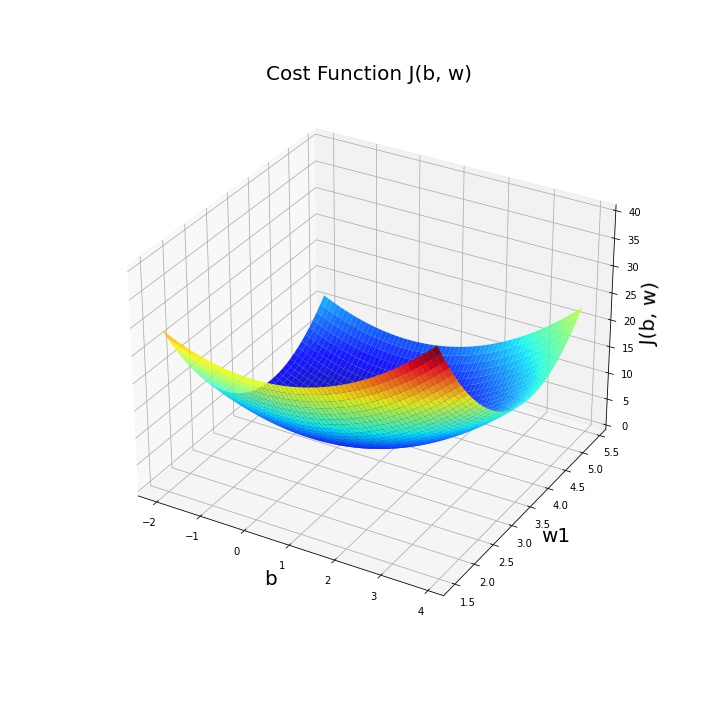

## Linear Prediction Using  Gradient Descent

### Introduction

The previous post introduced Linear Prediction model for Regression Supervised Machine Learning. It is recommended to read it first, in case you're not familiar with it. Along with that, the previous post presented the Analytical Solution for calculating the predictor's coefficents. The analytical solution is fairly simple and straight forward, except that it requires an nxn matrix inversion, where n is the dimension of the input data vector, or in other words, the number of input data features. Normally, the solution is feasible, unless the number of features is very big, say >1000, but anyway dependes on the computation cost and availability.
Here we will present an alternative solution, the Gradient Descent, which is a simple and common iterative solution. Gradient Descent is widely used  for solving for the Logistic Regression predictor's predictor, for which the analytical solution doesn't fit. Logistic Regression will be presented in a next post.

### Outlines of this post

We start by defining a ***cost function***, which determines the mean squared error between the real expected system's output, and the prediction model's related value.
Then, the Cost Function's partial derivatives, with regard to each predictore's coeffcient are calculated. With those derivatives, we will be able to find the coefficients, as will be detailed later in this doc.
So let's start!

### Cost Function

The Linear Prediction model is listed in Eq. 1

#### Eq. 1: Linear Prediction Model

$$
y=\hat{y}^{(i)}+\epsilon^{(i)}=b+\sum_{j=1}^{2}w_j{x}^{(i)}_j+\epsilon^{(i)}
$$

The cost function, denoted by **\\(J(w,b)\\)** is chosen to be the sum of squared euclidiean distances, aka squared errors,  between the predicted data points and data real points, as denoted by Eq. 2.

#### Eq. 2: Cost function -Squared Errors

$$J(w,b)=\frac{1}{m}\sum_{i=1}^{m}(\hat{y}^i-y^i)^2$$

Figure 1 illustrates graphically the euclidiean distance between the actual value y, and it's corresponding model predicted value \\(d=\hat{y}-y \\).

Note that the \\(frac{1}{m} \\) factor is just a normalizing factor, but has no significance. 

#### Figure 1: Approximation Distance

BTW, optionally other cost functions could be chosen, e.g. the absolute difference between coordinates, see Eq. 3.

#### Eq. 3: Cost function using absolute coordinates differences

$$J(w,b)=\frac{1}{m}\sum_{i=1}^{m}\left | \hat{y}^i-y^i \right |$$

Cost expression expressed in Eq. 2, is very commonly used. It is dependent on squared distances, thus increases more as error grows, and it is convex, which is sigificant when the extreme point is searched for, as we'll see soon.

BTW, a function is convex if any line between 2 points on the function's graph is above the graph between those 2 points, as shown in Figure 2. Obviously, a quadric function is convex.

#### Figure 2: Convex and Non Convex functions

So the cost function expressed by Eq. 2 is convex. Number of variables are n+1, so to plot it, n+1 dimensions are needed. Accordingly, we can plot it for n=1. as expressed by Eq. 4.

#### Eq. 4: Cost function, n=1

$$J(w,b)=\frac{1}{m}\sum_{i=1}^{m}(b^i+w_1x^i-y^i)^2$$

#### Figure 3:  Plot illustration of  $$J(b,w)$$,  n=1:

We are looking for the predictor's coefficents which minimize the cost function. The cost function is minimal just at the point where the first derivative is 0. 
Gradient Descent algorithm will do the job! Here's the algorithm's formula:

#### Eq. 5: Gradient Descent
a:  Gradient Descent with gradient to the \\(w_j\\) direction:
$$\\w_j:=w_j-\alpha \frac{\partial J(b,w) }{\partial w_j}$$

b. Gradient Descent with gradient to the {b} direction:
$$\\b:=b-\alpha \frac{\partial J(b,w) }{\partial b}$$

Eq. 13 describes an iterative algorithm, which should run in paralel for all the n+1 variables, i.e. b and  \\(w_j\\) j=1:n.

Before we formulate the algorithm procedure, plugging Eq. 6 into Eq. 2, resultant in Eq.7,  it's easy to get the partial derivatives, as shown in Eq. 8

Eq. 6
$$
\hat{y}^{(i)}=b+\sum_{j=1}^{n}w_j{x}^{(i)}_j
$$

Eq. 7
$$
J(w,b)=\frac{1}{m}\sum_{i=1}^{m}(b+\sum_{j=1}^{n}w_j{x}^{(i)}_j-y^{(i)})^2
$$

Eq. 8a
$$
\frac{\partial J(w,b))}{\partial b}
= \frac{1}{m}\sum_{i=1}^{m}(\hat{y}^{(i)}-y^{(i)})
$$

Eq. 8b
$$\frac{\partial J(w,b))}{\partial w_j} = \frac{1}{m}\sum_{i=1}^{m}(\hat{y}^{(i)}-y^{(i)})*x^{(i)}
$$

TILL HERE!!!!! ronen
Here'd the algorithm's procedure: 
1. Select arbitrary initial values for the calculated values. we can set all to 0: b=0, all wj=0.
2. Calculate  Iteration 1 done!
3. Substitute new values in Eq. 13, and repeat to produce new {b} and {w_1}
4. Repeat step 3 until convergence, i.e. whenn iteration result wrt to previous iteration is below threshold: if $$abs(w_1[k]-w_1[k-]) < \Delta, stop$$

The algorithm steps in the opposite direction of the gradient until convergence, as the gradient, multiplied by a constant $$\alpha$$ is decremented from previous value.

but we can plot it only for The convex plot of Figure 1 illustrates a 1D variable. The maximal number of dimensions we can illustrate in a  while Eq. 2 has n+1 variables, which is impossible to show in a graph. We can present up 2 variables, as illustrated in Figure 3. which corresponds for n=1. Eq. 4 is same as Eq. 1, with n=1.

Eq. 1 relates to an input data set with n features \\(x_j\\)) j=1:n. To illustr. 

The 

we need to find the cost function's derivatives 

#### Eq. 2: Line Approximation

$$ \hat{y} ={ b}+w_1{x}$$

Figure 1, illustrates the line approximity: We are looking for the line offset $$b$$ and slope $$w_1$$ which optimize the approximation of the line to the dara point. To make that optimization, we will define a cost function which expresses the distance between the model and the points it aims to model, and chose the coefficients which minimize that cost.

#### Figure 3: Line Approximation 

The cost, denoted by $$J(w,b)$$ is presented in Eq. 3, where the cost function is chosen to be the sum of squared euclidiean distances between the line and data points, aka squared errors. 

#### Eq. 4: Cost function -Squared Errors

$$J(w,b)=\frac{1}{m}\sum_{i=1}^{m}(\hat{y}^i-y^i)^2$$

Figure 4 illustrates graphically the euclidiean distance between approximate and actual value $$d=\hat{y}-y$$.

#### Figure 5: Approximation Distance

BTW, optionally other cost functions could be chosen, e.g.minimizing the absolute difference between coordinates, see Eq. 5.

#### Eq. 5: Cost function using absolute coordinates differences

$$J(w,b)=\frac{1}{m}\sum_{i=1}^{m}\left | \hat{y}^i-y^i \right |$$

Cost expression as in Eq. 5, is dependent on squared distances, thus increases more as error grows, and is commonly used.

Let's substutute  \hat{y}^i by b^i+w_1x^i in Eq. 4, and get Eq. 6:

#### Eq. 6: Cost function for line approximation

$$J(w,b)=\frac{1}{m}\sum_{i=1}^{m}(b^i+w_1x^i-y^i)^2$$

Plotting Eq 6, which is a quadric equation, will result in a surface, such as  illustrated in figure 7:

#### Figure 7:  Plot illustration of  $$J(b,w)$$:

#### Question: 
Which are the coefficients {b, w1} which minimize Eq.6? 
#### Answer: 
Take a look at Figure 7! The cost function minimum is at the bottom of the curve. We need {b, w1} which correspond to this point.

and solve for b and w1.

Here:

#### Eq. 7: Cost function derivative wrt b

$$\\\frac{\partial J(b,w)}{\partial  b}=\\\frac{\partial(\frac{1}{2m}\sum_{i=1}^{m}(b+w_1x^i-y^i)^2)}{\partial b}=$$

$$\\\frac{1}{2m}*\sum_{i=1}^{m}\frac{\partial(b+w_1x^i-y^i)^2}{\partial b}=$$

$$\\\frac{1}{m}\sum_{i=1}^{m}(b+w_1x^i-y^i)= \\\mathbf{\frac{1}{m}\sum_{i=1}^{m}(\hat(y^i)-y^i)}$$

#### Eq. 8:  Cost function derivative wrt w1

$$\\\frac{\partial J(b,w)}{\partial w1}=\\\frac{\partial(\frac{1}{2m}\sum_{i=1}^{m}(b+w_1x^i-y^i)^2)}{\partial  w1}=$$

$$\\\frac{1}{2m}*\sum_{i=1}^{m}\frac{\partial(b+w_1x^i-y^i)^2}{\partial  w1}=$$

$$\\\frac{1}{m}\sum_{i=1}^{m}(b+w_1x^i-y^i)*x^i=\\\mathbf{\frac{1}{m}\sum_{i=1}^{m}(\hat(y^i)-y^i)*x^i}$$

As mentioned before, we are interested in the minima where derivatives are 0s. Here are our 2 equations:

#### Eq. 9:  Cost Function Partial Derivatives

a:

$$0 = \frac{1}{m}\sum_{i=1}^{m}(\hat(y^i)-y^i)$$

b:

$$0 = \frac{1}{m}\sum_{i=1}^{m}(\hat(y^i)-y^i)*x^i$$

#### Question: 
How should Eq 9 and in our specific case , Eq. 10 should be solved for b and w1?
#### Answer: 
We can consider of 2 optional solutions:
1. Analytical Solution
2. An iterative numerical solution - Gradient Descent

#### Analytical Solution 
The analytical solution is straightforward solution: It is required to solve n+1 linear equations for n+1 unknown parameters. 
Let's demonstrate the the sIn our example where n=1, we have 2 equations, Eq. 10 a and b, with 2 unknown parameters to find: $$b$$ and $$w_1$$.

Let's demonstrate the solution  for n=1:
We take Eq. 9a, subsitute the line equation. Consider that $$x^i$$ and $$y^i$$ are constants - $$x^i$$ is ith training input data, while $$y^i$$ is the correspondig label.
So Eq. 9a, after rearranging the constants reduces to:

#### Eq. 10a:
$$\\A*b + B*w_1 = C$$
Where A and B are known constants.
Similariliy Eq. 9b can be reduced to:
#### Eq. 10b:
$$\\D*b + E*w_1 = E$$

Let's rewrite it in a matrix format:

#### Eq. 11:
$$\\\begin{bmatrix}
\mathbf{} A& B\\ 
D & E
\end{bmatrix}\begin{bmatrix}
b\\w_1 
\end{bmatrix}=\begin{bmatrix}
C\\E
\end{bmatrix}$$

Let's solve this. For convinience let's denote:
#### Eq. 12:

$$M=\begin{bmatrix}
\mathbf{} A& B\\ 
D & E
\end{bmatrix}$$

Substitute Eq. 12 into Eq. 11:

#### Eq. 13:

$$M\begin{bmatrix}
b\\w_1 
\end{bmatrix}=\begin{bmatrix}
C\\ E
\end{bmatrix}$$

Solve it for $$\begin{bmatrix}
b\\w_1 
\end{bmatrix}$$:

$$\begin{bmatrix}
b\\w_1 
\end{bmatrix}=(M^TM)^{-1}M^T\begin{bmatrix}
C\\E
\end{bmatrix}$$

And that's it, quite a simple solution. We needed to inverse a 2*2 matrix for solution, which is not much. Why only 2*2? Because number of features where n=1. But what if we had much more features, say n=1000, or more? In that case inverse could be too complicated.
That's where the other solution comes in - the Gradient Descent solution.

#### Gradient Descent Solution

Gradient Descent is an iterative algorithm for finding a local minimum. Eq. 13 presents the Gradient Descent formula for our example's cost function J(b, w1)

#### Eq. 13: Gradient Descent
a:  Gradient Descent with gradient to the {w_2} direction:
$$\\w_1:=w_1-\alpha \frac{\partial J(b,w_1) }{\partial w_1}$$

b. Gradient Descent with gradient to the {b} direction:
$$\\b:=b-\alpha \frac{\partial J(b,w_1) }{\partial b}$$

#### How is Eq 13 calculated?
Here are the algorithm's cooking recipe: 
1. Select arbitrary initial values for the calculated values. Here let's say: w_1=TEMP_W, b=TEMP_b.
2. Substiture TEMP_W and TEMP_b in 13 a and b. Now new w_1 and b are calculated. Iteration 1 done!
3. Substitute new values in Eq. 13, and repeat to produce new {b} and {w_1}
4. Repeat step 3 until convergence, i.e. whenn iteration result wrt to previous iteration is below threshold: if $$abs(w_1[k]-w_1[k-]) < \Delta, stop$$

The algorithm steps in the opposite direction of the gradient until convergence, as the gradient, multiplied by a constant $$\alpha$$ is decremented from previous value.
The algorithm converges at the minima, where all partial derivatives are 0.

Let's illustrate the algorithm to make it intuitively clear:

Figure 8 illustrates the iterative process and its convergence: 
Figure 8.a shows the first iteration, which starts with an aribtrary selected value of $$w_1$$ , $w_1[0]=1 in our example. The gradient is quite steep here.
Figure 8.b shows 4 iterations, still far from convergence, but gradient are less steep.
Figure 8.c shows 14 iterations, which converge as expected at $$\alpha \frac{\partial J(b,w1) }{\partial b}=0$$.

#### Figure 8: Gradient Descent: Gradient of a single parameter

a. After One Iteration

b. After Four Iterations

c. After Fourteen Iterationss

Let's talk about $$/alpha$$, the step size.

Looking at Figure 8, it looks like the smaller the step size $$/alpha$$ is, the slower convergence goes. And also vice versa - one might assume that the larger $$/alpha$$ is, the fastest it will converge. Wrong assumption!
A too large step-size may result with oscilations. Look at Figure 9.

Figre 9: Gradient Descent Oscilation

Conclusion - step size should be carefully selected, and may be needed to tune during caluclations.

We have reviwed the 2 methods to solve for the estimator's coefficients: The Analytic Solution method and Gradient Descent.The Analytic Solutoin involves inverting a matrix of size n+1*n+1 where n equal number of features. The Gradient Descent requires selection of step size $$//alpha$$, and migh, in some cases, converge to a local minima, rather to the global.

So, we're done with this post, which discussed Linear Regression, from problem (house prices) to solution. 
Next we'll discuss Logistic Regression, which is the currently most popular predictionmodel used.

a  where it is needed to solve  in our example of line approximation. Look at Eq 10

the point where $$J(b,w)$$ is minimal
To find the cTo minima of the cost function, is the point where derivative of order one is zero. 

dimensions, the cost function equals to the sum of squared distances between the example points labels, aka training data points, to the approximated values  $$en the example points labels, aka training data points, to the approximated values  $$$$ the example points labels, aka training data points, to the approximated values  $$values  $$$$lues  $$\hat{y^i}.$$

So, we're done with this post, which discussed Linear Regression, from problem (house prices) to solution. 
Next we'll discuss Logistic Regression, which is the currently most popular predictionmodel used.
================================

This can be plot using a 2 dimensions lgraph. Here’s such a graph:

Let’s plot 
 The n=1

 model, illustrated in the figure below.

So, the training data set consists of m labeled examples, each denoted as $$x^{i}, i=1 to m$$ is the input data and it is labeled by $$y^{i} $$, the corresponding label, is the expected decision of the predictor.$$(x^{i}, y^{i})$$, where $$x^{i}, i=1 to m$$ is the input data and it is labeled by $$y^{i} $$, the corresponding label, is the expected decision of the predictor.

So, for simplicity, we start with a 1D set of input points X, and can present it on a 2D graph, as shown in figure 3.

Figure 3: Linear Approximation

Looking at Figure 3, we can see that a linear approximation fits the training examples points well.
The line equation is $$^{\hat{y}}=wx+b$$, so now we need to calculate w and b that give the best approximation. We do that by defining a cost function J(w,b). Then we find w and b which minimize the cost function.
 We chose it to be the some of the squared errors:

$$J(w,b)=\frac{1}{m}\sum_{i=1}^{m}(\hat{y}^i-y^i)^2$$

Aim is to find w and b, such that minimize the cost function:
$$$$\\ \min_{w,b}J(w,b)$$

$$J(w,b)$$ is a 2 quadric function of 2 parameters. The 2D Graph below illustrates the surface defined by an equation of this type:

To find the best line equation, we should select a cost function, which minimizing 

Figure 1 describes the  Supervised Learning system, be it a regression or classification prediction.

Figure 1: Supervised Learning

The system runs in 3 stages, as presented in Figure 2.
Training - At which the predictor coefficient are calculated
Testing - At which the predictor performance is evaluated,
Prediction - The predictor calculates output Y based on input X

Figure 2: Supervised Learning - 3 stages

Here we will delve to the calculation of predictor’s coefficient. The analytical solution is straight forward and easy, but with a large number of features, it may be computationally too heavy to inverse huge matrixes.
Gradient Descent is a very common algorithm used, low computation complication on one hand, but sensitive to selection of $$/alpha$$ and may have issues such as local minima convergence on the other hand.

So, we're done with this post, which discussed Linear Regression, from problem (house prices) to solution. 
Next we'll discuss Logistic Regression, which is the currently most popular predictionmodel used.

