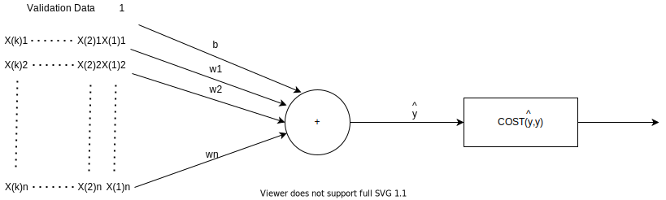

## Recap - Supervised Machine Learning

Supervised Machine Learning can be splitted into 2 main branches: Classification and Regression. In Classification, the data is grouped into a descrete set of classes, e.g. classify a picture to one of [cat, dog, lion], or decide if to buy or not to buy a stock. In Regression, the output is a continious value, e.g. predict a trip time, a weight of a baby, a price of a house, etc.

The supervised model, runs through 3 phases,as depicted in Figure 1, a-c. 

Figure 1 presents a system with n-dimensional input (AKA n features), denoted by\\(x_1-x_n\\), and the predictor's corresponding n+1 coefficients, denoted by \\(b\\) - the bias coefficient, and \\(w_1-w_n\\). 

Here's a brief description of the 3 phases:

***Training Phase*** - During the Training phase, the predictor's coefficients are calculated by the model fitter, as depicted by Figure 1-a. The Training data consists of m examples, denoted by superscripts 1-m. The fitter calculates the predictor's coefficents. The common way to do it is by a cost function minimization: That cost function expresses the error between the ground truth label value \\(y\\) and the predictor model value \\(\hat{y}\\), and the an optimization algorithm searches for the coefficents with which the minimum cost is achieved. The otimization algorithm is activated iteratively with a fixed set of labeled examples while the weights vary after each iteration.
Alternatively, in case of a Linear Predictor, it is possible to analytically find a the coefficients. And indeed, this post presnets the analytical model fitting. The optimizer model fitting, using the Gradient Descent optimization algorithm, is presented in a post which follows.

***Validation Phase*** - When fitting is done, having the predictor's coefficients, the predictor's performance is validated, as depicted in Figure 1-b. Unlike Training phase, during this phase, the weights are fixed, and the input data varies - k input labeled examples, which were not included in the Training data set. The resultant output is validated using a cost function. In case results are not satisfactory, the Training phase should be revisited. As noted, the validation's k labeled examples input data set should not be a part of the training dataset, otherwise, problems such as overfitting would might notbe observed. We will detail overfitting and underfitting phenomenas in one of the next posts.

***Normal Data Phase*** - During the Data phase, the system predicts the output for the input data, using the fitted model.

This post is part of an intro to Regression Supervised Machine Learning. It presents the Linear Prediction model for solving Reression problems, and the Analytical Solution for determining the predictor's coefficents.

### Figure 1: Supervise Learning Model

### Figure 1-a: Training Phase.  
****The Training input Dataset consists of m labeled examples, each of n features.****

### Figure 1-b: Linear Model, Validation Phase
****The Validation input Dataset consists of k labeled examples, each of n features.****

The predictions \\(\hat{y}=b+\sum_{j=1}^{n}w_jx_j\\) are validated by checking the cost function.

### Figure 1-c: Linear ModelNormal, Data Phase
****The Normal Data input Dataset consists n features.****

\\(\hat{y}=b+\sum_{j=1}^{n}w_jx_j \\)

## Linear Prediction

The first step towards solving the problem, should be the selection of the prediction model. This post presents the **Linear Predictor** aka **Linear Regression**

At the name Linear Predictor implies, the predicted output is modeled by a linear combination of the input dataset, as shown in Eq. 1. 
According to our notations, \\(\hat{y}\\) represents the the estimated value of  \\(y\\), \\({x_j}\\) represent the input data set, where j=1:n, and  \\({b, w_j}\\), i=1:n are the predictor's coeffcients. The estimation residual, AKA error is denoted by e. 

### Eq. 1: Linear Prediction 

$$y = \hat{y} + e = b+\sum_{j=1}^{n}w_jx_j +e $$

Where b stands for bias, and w for weight.

Let's return to our homes prices prediction example, but for our convinience, simplify it for now, reduce the number of input features to n=1. This reduction will simplify the comutation illustration and graphical presentation of the problem, but we will not use generality and develope thesolution for any n.

With that in mind, watch Table 1, which holds a set of 5 example data points, each relates to an appartment which is charectarized by its floor, and  labeled by its price. Based on those examples, we should set a model which will predict apartments price, given its floor. (Obviously the floor  by itself is not sufficient for a valid apartment price prediction, but still, we take that for the sake of example's simplicity, but without losing generality - we will show the solution for any n. Besides the too-small number of features,the number of examples, m=5, is obviously too small for a good prediction, but again, it's all for the sake of the example's simplicity.

### Table 1:  Apartments price prediction - single feature

|Floor    |Price (M $)|
|:--------|:----------|
|0        | 0.4       |
|1        | 0.7       |
|2        | 1.1       |
|3        | 1.4       |
|4        | 1.65      |        

For Table 1's single feature data, the predictor equation of Eq. 1, reduces to the equation specified in Eq 2A. Pluging the Table 1's data to Eq. 2a, results in Eq. 2b.

### Eq. 2a: Linear Prediction with n=1 

$$y = \hat{y} + e=b+w_1x_1 + e$$

Inserting table 1's data to Eq. 2a gives the following set of equations:

### Eq. 2b:
$$b+w_1*0+\epsilon^{(1)}=0.4
$$

$$
b+w_1*1+\epsilon^{(2)}=0.7
$$

$$
b+w_1*2+\epsilon^{(3)}=1.1
$$

$$
b+w_1*3+\epsilon^{(4)}=1.4
$$

$$
b+w_1*4+\epsilon^{(5)}=1.65
$$

From the above equations the coefficients \\(b,w_1\\) can be found. We will get to solving the equations later in this post.

Figure 2 presents a graph of Table 1's 5 data points, along with a line regression estimator graph.  

### Figure 2: Linear Prediction - 1D

According to the graph sketched in Figure 2, the linear model indeed seems to fit in as an estimator for the data points. To prove a validitiy of a model though,  one needs much more than 5 example data points. Needles to repeat here on the reasons for our seletion.

Have not yet explained how the fitting line was calculated, butlet's examine a higher order estimator, with n=2. So accordingly, Let's have now 2 features - floor number and number of bedrooms, as shown in Table 2.

### Table 2:  Apartments price prediction, with n=2

|Floor|Bedrooms | Price (M $)|
|:----|:--------|:-----------|
| 0   | 5       | 1.5        |
| 1   | 4       | 0.5        |
| 2   | 5       | 1          |
| 3   | 6       | 1.2        |
| 4   | 6       | 1.5        |
| 5   | 4       | 0.5        |
| 6   | 5       | 0.6        |
| 7   | 3       | 0.9        |
| 8   | 4       | 0.7        |
| 9   | 3       | 0.7        |
| 10  | 5       | 1.3        |

Still now, these 2 features are not enough for a valid prediction of apartments pricess, nor is the number of the example points. But that doesn't matter at this point. Anyway, with n<=2, it is still possible to present the datapoints and the predictor graphically, as shown in Figure 3.
Figure 3 presents the listed above dataset examples, (see x marker points), and based on those points, it presents a linear predictor points, which where  calculated with the predictor expression of Eq. 3, which is same as Eq. 1, but with n=2.

As before,  i=1:m, where m=11 is the number of examples. Nore that the Linear Predictor's calculated \\(\hat{y^{(i)}}\\)  points, are located on the colored presented surface of Fig 2.

### Eq. 3:

$$
y^{(i)}=\hat{y}^{(i)}+\epsilon^{(i)}=b+\sum_{j=1}^{2}w_j{x}^{(i)}_j+\epsilon^{(i)}
$$

Let's plug table 2's data to Eq. 3, replacing \\(y^{(i)}\\) and \\(x^{(i)}\\) by the actual data observations, and get following set of equations:

$$b+w{_1}*0+w{_2}*5+\epsilon^{(1)}=1.5$$
$$b+w{_1}*1+w{_2}*4+\epsilon^{(2)}=0.5$$
$$b+w{_1}*2+w{_2}*5+\epsilon^{(3)}=1.0$$
$$b+w{_1}*3+w{_2}*6+\epsilon^{(4)}=1.2$$
$$b+w{_1}*4+w{_2}*6+\epsilon^{(5)}=1.5$$
$$b+w{_1}*5+w{_2}*4+\epsilon^{(6)}=0.5$$
$$b+w{_1}*6+w{_2}*5+\epsilon^{(7)}=0.6$$
$$b+w{_1}*7+w{_2}*3+\epsilon^{(8)}=0.9$$
$$b+w{_1}*8+w{_2}*4+\epsilon^{(9)}=0.7$$
$$b+w{_1}*9+w{_2}*3+\epsilon^{(10)}=0.7$$
$$b+w{_1}*10+w{_2}*5+\epsilon^{(11)}=1.3$$

From the above 11 equations, it is possible to calculate the coefficients \\( {b,w_1, w_2} \\). We will get to solving the equations in the next paragraph of this post.

### Figure 3: Linear Prediction - 2D

## Model Fitting - Predictor's Coeffcients Calculation

As already stated above, the common way for model fitting, i.e. finding the predictor's coeffcients, is by a cost function minimization, e.g. by the Gradient Descent algorithm. This will be reviewed in a post which follows.  This post presnets the analytical model fitting. This chapter presents the mathematical equation development of this solution. The solution is illustrated by Figure 4. 

### Figure 4: Fitting by Analitical Operation

So, we start the equation development by re-writing Eq. 1 in a matrix form, as shown in Eq. 3.  x and y are presented in Eq. 4a and Eq. 4b respectively. The unknown vector w is presented by Eq. 4c. Eq.5 is the result of plugging Eq. 4a-Eq. 4c to Eq. 3.

### Eq. 3: Predictor Equation in a Matrix Form

$$
Y=XW+\epsilon
$$

### Eq. 4a: Training data set - x matrix
x matrix holds the m input set examples, where each inpt set consists of n features

$$x=\begin{bmatrix}
1 & x_1^{(1)} & x_2^{(1)} & x_3^{(1)} & . & . & x_n^{(1)}\\\\\
1 & x_1^{(2)} & x_2^{(2)} & x_3^{(2)} & . & . & x_n^{(2)}\\\\\
.& .& .& .& \\\\\
.& .& .& .& \\\\\
.& .& .& .& \\\\\
1 & x_1^{(m)} & x_2^{(m)} & x_3^{(m)} & . & . & x_n^{(m)} 
\end{bmatrix}$$

### Eq. 4b: Training data set - y vector

y vector holds the m training examples observed output, AKA labels

$$y=\begin{bmatrix}
y^{(1)}
\\\\
y^{(2)}
\\\\
.
\\\\
.
\\\\
.
\\\\
y^{(m)}
\end{bmatrix}$$

### Eq. 4c: Fitter's Output - w vector

w vector is the unknown coefficients vector we aim to find. The first entry of the vector is b, the bias entry.

$$b=\begin{bmatrix}
b\\\\\ 
w_1\\\\\
.\\\\
.\\\\\
. \\\\\
w_n
\end{bmatrix}$$

### Eq. 5: Linear Regression Predictor Model Equation

$$\begin{bmatrix}
y^{(1)}
\\\\
y^{(2)}
\\\\
.
\\\\
.
\\\\
.
\\\\
y^{(m)}
\end{bmatrix}= \begin{bmatrix}
1 & x_1^{(1)} & x_2^{(1)} & x_3^{(1)} & . & . & x_n^{(1)}\\\\\
1 & x_1^{(2)} & x_2^{(2)} & x_3^{(2)} & . & . & x_n^{(2)}\\\\\
.& .& .& .& \\\\\
.& .& .& .& \\\\\
.& .& .& .& \\\\\
1 & x_1^{(m)} & x_2^{(m)} & x_3^{(m)} & . & . & x_n^{(m)} 
\end{bmatrix} \begin{bmatrix}
b\\\\\ 
w_1\\\\\
.\\\\
.\\\\\
. \\\\\
w_n
\end{bmatrix}+\begin{bmatrix}
\epsilon^{(1)}\\\\ 
\epsilon^{(2)}\\\\  
.\\\\\
.\\\\ 
. \\\\\ 
\epsilon^{(n)}
\end{bmatrix}
$$

Eq. 5 is listed here to clarify the all Eq. 3 components. Having that, let's solve Eq. 3, but first lets drop the prediction error from the equation, as this error exists, but we consider it as random independent additive noise.

### Eq. 6: Predictor Equation (error omitted)

$$
Y=XW
$$

Now let's do some basic well-known Linear Algebra gimnastics:

Matrix X dimensions are mXn, where m >> n, i.e. m, the number of examples, should be be much greater than n, the input's dimensions. 
Accordingly, considering X is not square, it is not invertible. Still, if X is Full Rank, i.e. it's columns are linear independent, then \\(X^TX\\) is invertible.
So multiply each side of Eq. 6 by  \\(X^T\\):

### Eq. 7: Solving Linear Equation - Step 1

$$
X^TY=X^TXW
$$

Multiply each side of Eq. 7 by \\((X^TX)^{-1}\\) :

### Eq. 8: Solving Linear Equation - Step 2

$$
(X^TX)^{-1}X^TY=(X^TX)^{-1}X^TXW
$$

Since   \\((X^TX)^{-1}X^TX\\)=I   Eq. 8 reduces to:

### Eq. 9: Solving Linear Equation - Result

$$
\mathbf{(X^TX)^{-1}X^TY=W}
$$

#### And that's it! We have the solution for the predictor's coefficents.

To sum up the solution, we 
Sample some training data and run it through the network to make predictions.
Measure the loss between the predictions and the true values.
Finally, adjust the weights in a direction that makes the loss smaller.

## Illustrating the Solution by Calculating the 1D Predictor

Let's illustrate Eq. 8 on the 1D predictor listed above. Let's plug Eq.2 into the components of Eq. 9, as shown in Eq. 10.

### Eq. 10a: Example's Training data set - x matrix

$$ X=
\begin{bmatrix}
1 & 0\\\ 
 1 & 1\\\\
 1 & 2\\\\
 1 & 3\\\\
 1 &4
\end{bmatrix}$$

### Eq. 10b: Example's Training data set - y vector

$$Y=\begin{bmatrix}
0.4\\\ 
0.7\\\\
1.1\\\\\
1.4\\\\\
1.65
\end{bmatrix}$$

### Eq. 10c: Example's Fitter's Output - w vector

$$
w=\begin{bmatrix}
b\\\\\
w_1
\end{bmatrix}
$$

### Eq. 11: Solving Linear Equation - Step 1

$$
X^TY=\begin{bmatrix}
0 &1&2&3&4 \\\\\
1&1&1&1&1
\end{bmatrix}
\begin{bmatrix}
0.4\\\ 
0.7\\\\
1.1\\\\\
1.4\\\\\
1.65
\end{bmatrix}=
\begin{bmatrix}
5.25  \\\ 
13.7 
\end{bmatrix}
$$

### Eq. 12: Solving Linear Equation - Step 2

$$
X^TX
=\begin{bmatrix}
0 &1&2&3&4 \\\\\
1&1&1&1&1
\end{bmatrix}

\begin{bmatrix}
1 & 0\\\ 
 1 & 1\\\\
 1 & 2\\\\
 1 & 3\\\\
 1 &4
 \end{bmatrix}=
\begin{bmatrix}
5 &10 \\\ 
10 & 30
\end{bmatrix}
$$

### Eq. 13: Solving Linear Equation - Recap Linear Algebra

Inverse of a 2X2 matrix is given by:

$$
\begin{bmatrix}
a &b \\\\\
c & d
\end{bmatrix}^{-1}=\frac{1}{\begin{vmatrix}
d & -b \\\\\
-c & a
\end{vmatrix}}*\begin{bmatrix}
d &-b \\\\\
-c & a
\end{bmatrix}
$$

The denominator is a determinant:

$$\begin{vmatrix}
d & -b \\\\\ 
-c & a
\end{vmatrix} = da-bc$$

Combine Eq. 13 and Eq. 12: 

### Eq. 14: Solving Linear Equation - Step 3

$$
(X^TX)^{-1}=\begin{bmatrix}
0.6 &-0.2 \\\\\\
-0.2 & 0.1
\end{bmatrix}
$$

We have now all the building block to complete the calculation:

### Eq. 14: Solving Linear Equation - Last Step/ Solution

$$
w=\begin{bmatrix}
b\\\\\
w_1
\end{bmatrix}=(X^TX)^{-1}(X^TY)=
\begin{bmatrix}
0.6 &-0.2 \\\\\\
-0.2 & 0.1
\end{bmatrix}
\begin{bmatrix}
5.25\\\\\
13.7
\end{bmatrix}=
\begin{bmatrix}
0.41\\\\\
0.32
\end{bmatrix}
$$

The predictor's coefficients are \\(b=0.41\\) and \\(w_1=0.32\\), which define the regression line:
***\\(\hat{y}=0.41+0.32x\\)***. 

The line predictor sketched in Figure 1.

***To conclude***, Eq. 9 provides the analytical solution, which determines the prediction's coefficients \\W=( b, w_j...w_n \\), based on the set of labeled data \\( X=({x_i}^{(2)}...{x_n}^{(i)}), Y=y^{(i)} \\) where i is the example's index, running from 1 to m.

Here's Eq. 9 again:
$$
(X^TX)^{-1}X^TY=W 
$$
where
$$
W = \begin{bmatrix}
b\\\\\
w_1\\\\\
w_2\\\\\
.\\\\\
.\\\\\
w_n
\end{bmatrix}
$$

The drawbacks of the analyical solution is the need to inverse natrix \\(X^TX\\), which dimension are (n+1)*(n+1). So when the number of features is large, say overa few hundrerds or so, depending available computation power, the analytical solution might be too expensive. Alternatively, the solution may be calculated using Gradient Descent,  an optimized iterative solution. Next post introduces the Gradient Descent algorithm, and illustrates calculation Linear Predictor's coefficents.

