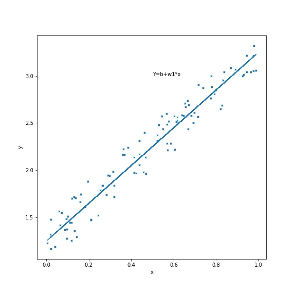
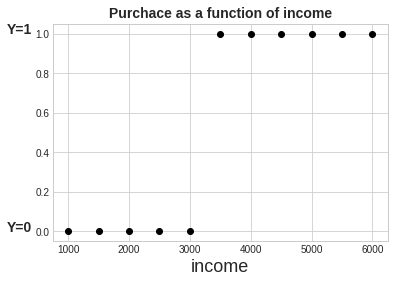
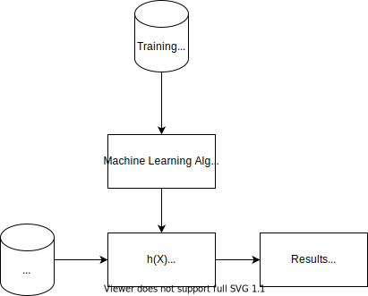

# Classification and Logistic Regression

This post is about Supervised Classification problems, at which it is needed to predict a descret value, e.g. predict if a customer will buy the product or not, or predict whether a tumor is benign or maligen. This is unlike Supervised Regression estimation problem we've seen before, such as the prediction of a house price, which is a continouse value.

So, let's see simplified 2D graphical presentations of both prediction types:

Supervised Regression estimation, was presented before. LEt's recall the Line Estimator for such a continous problem:

Figure 1: Line Estimator:

Now let's consider the classification sceanrio of whether a customer will or will not buy a product, based on his income. Here Y=0 denotes the negative state, i.e. customer will not buy, while Y=1 denotes the positive state. Note that the assignment of Y=0 and Y=1 could be vise versa, but still it is more perceptually convinient this way.

So take a look at Figure 2:
Figure 2:  Binary Classification - Purchace as a function of income

Can linear Prediction model this data? Look at Figure 3.

Figure 3: Linear Prediction for Binary Classification

Figure 3 illustrates linear prediction for binary classification. Obviously, a linear line can't predict those [0,1] points. So another prediction model is needed.

j

Logostic Regression is currently one of the most commom prediction model algorithm used by Machine Learning algorithms for binary classification. In case you're not familiar with prediction models, and how to solve for their coefficients, or even in case you have no clue about what prediction am I talking, I suggest you read my post on that before. Not mandatory though. If the term "Binary Classification" needs clarifications, I'd start with my Intro to Machine Learning. Not mandatory though.

In any case, to start with, I posted here again the Supervised Machine Learning blog diagram.

#### Figure 1: Supervised Machine Learning blog diagram

As Figure 1 shows, the predictor sits in the heart of the system. The perdictor's coeficients are calculated during the Training phase, then ready to use in the Testing and Normal Data phases.

This post explains the Logistic Regression model, and the developemnt of the model's parameters' solution. We'll walk top to bottom - begin with an illustration of a classification problem, then present the Logistic Regression predictor model, and eventually show how to find its coefficients, with the good-old Descent Regression algorithm.

Here's the (commonly used) binary classification example: It is needed to predict whether a tumor is benign or maligent, based on its size. 

multi class

we need to predict if a customer will buy Iphone as his next phone, based on the next smartphone of a customer , which already owns a smatphone,  will buy another iphone after 2 years, based on whether he owned an iphone before or not. We'll see that normally a 
. This example is not realy realistic, but we'll use it to start with binary prediction based on a single feature. So, suppose we need to predict if a customer, which already owns a smatphone,  will buy an iphoe, based on whether he owned an iphone before or not. Suppose  that if he owned one 

