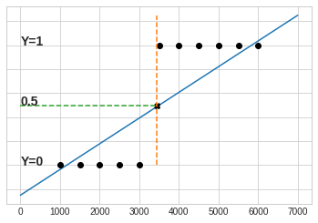
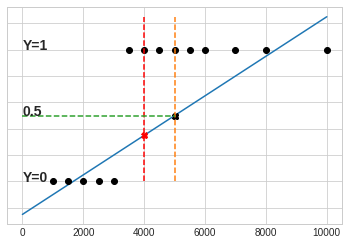
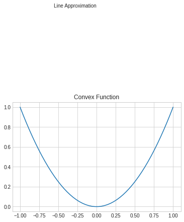

# Binary Classification and Logistic Regression

This post is about Binary Classification in the context of Supervised Machine Learning Algorithms. In Binary classification, the algorithm needs to select between 2 hypothesis, for a given set of input features. For example: Will a customer will buy the product or not, based on a set of input features which consists of his income, address, occupaition, previous purchaces and so on. So the 2 classes here are: Will purcease and Will not purchace. In the formulas that follow, those 2 classes are denoted as 1 and 0. Which of the 2 classes should take the 1 and which the 0? Bassically, it doesn't matter, but the convention is to assign the 1 to the 'positive' hypothesis and the 0 to the negative hypothesis.

Just note that the focus now is on a Binary Classification, but based on that, we will extend to multi classes. In a post which follows.

So, Question: how will the algorithm work? Answer: It works according to the Supervised Learning algorithm. Let's recap briefly: Figure 1 presents the block diagram of  describe such a system - (re-posting the same diagram for convinience):

Figure 1: Supervise Learning Outlines

Following Figure 1, we are now concentrating on setting a Prediction Model, which makes the classification decision for the inpuut features X. The model's coefficients are calculated during the Training phase, and later, during the normal data phase, do the classification.

Done with the introduction, the rest of the post will present the following:
1. Present the selection of Logistic Regression as the predictor for Binary Classification.
2. Present the usage of Gradient Decent to find the Logistic Regression coefficients

To start with, we will use a reduced features order Binary Classification sceanrio, i.e.: Predict if a customer will buy a new product based on his income. Such a prediction maybe does not make sense practicdally, but the reduced features dimensions to 1, makes it easier to present it graphically.
So now, Figure 2 presents the purchase perdiction based on income only.

Figure 2:  Binary Classification - Purchace prediction based on income

The data set presented in Figure 2, hold the labeled training data, i.e. the each income feature point is labeled with its related purchase decisoin taken. We would need a prediction model that can fir these points. According to our paradigm, after fitting the model to the training data, it should fir the normal unlabeled data that comes after. (Though after training, the model's performance should be tested before accepted to be used for real data).

So which model can we take? We previously reviewed the linear prediction model, used for predicting Regression data. Will it fit here too?  Let's see. Figure 3 

examines Linear Prediction for Binary Classification.

Figure 3 presents a line which is assumed to model the data points. Examine the model: According to it, a income of 3000, which was labeld with a 0, will now be mapped to ~0.4. and the income of 3500 now maps to 0.5. Can this model create valid predictions? Figure 4 presnets the decision boundary - any point on the line, from 0.5 and up will be classified as 1, and the rest as 0. One might tend to think that this model is valid - but that is not correct. Justtake another set of training points, as presented by Figure 5, keep the thershold on 0.5, and now, only income from 5000 and up is mapped to 1. And if we had taken more points, obviously the treshhold would move more. 

Figure 4: Linear Prediction for Binary Classification with thresholds

But the above graphical presentaions may be missleading. If we had more points, as presented by Figure 5, then we could realize that now the line predicts values < 0.5 for points which value 1s 1.

Figure 5: Linear Prediction for Binary Classification with thresholds - Problem!

Obviously, the classification is not a linear function, another different prediction model is needed - The Logistic Regression Model.

## Logistic Regression Model

The Logistic Regression is currently the most common predictor model used for binary classification. The model is based on the sigmoid function presented in Eq. 1. 

Eq. 1: Sigmoid Function

$$g(z)=\frac{1}{1+e^{^{-z}}}$$

The sigmoid function's values are in the range [0,1], as shown in Figure 5

Figure 5: Sigmoid Function

The Logistic Regression predictor is based on Eq. 1, substiuted z by $$b+wx$$, swhere $$x$$ is the system's input AKA features, and {b,w} are the predictor's coefficients.

Eq. 2: Logistic Regression Formula

$$h(b+w^Tx)=\frac{1}{1+e^{^{-(b+w^Tx)}}}$$

Let's clarify an important aspect of the estimated value: Unlike the Supervised Regression prediction, the interpretation of $$h(b+w^Tx)$$ is not an estimation of $$y$$, denoted by $$/hat(y)$$ as before, but the probability of the y=1 hypothesis, which can be represented by $$p(y=1|x,b,w). The probability is > 0.5 for z>0,  and naturally < 0.5 for z < 0. So, for input value x, if p(y=1|x,b,w) = h(|x,b,w) > 0.5, the classiication decision that should be taken is 1, with a probability p(y=1|x,b,w). This probability tends ro 1, as z >> 0, and tends to 0, as z << 0.

#### Logistic Regression Cost Function
Eq. 2 determines the prediction function. It's a function of the input features x, and coefficients b and w.
So, in order to be able to estimate the probability of y=1 for a given input x, as expressed by Eq. 2, we need to calculate the coefficients {b, w} as expressed in Eq. 3

Eq. 3: Logistic Regrerssion Coefficients

$$ z = b + w_1x_1+w_2x_2+....w_nx_n $$

So which is the best set of parameters {b, w}? Or in other words, which {b, w} make the best predictor? To determine this, we need to detemine the best predictor's characterizations. Let's do it, by determining a cost function, which expresses the diffeerence between predicted values and actual values, and find the coefficinets which minimize this difference.
But wow should that be done? Reminder: (As done in Supervised Regression): During the Training phase, we take m examples, each of a labeld data: $$(x^i, y^i)$$. 
If we would take the same cost function as in Supervised Regression, then it would be this:

Eq 4: Proposed Cost function - Euclidean Distance:

J(b,w) = \frac{1}{m}\sum_{i=1}^{m}\frac{1}{2}(h_{b,w}(x^i)-y^i)^2

And now, we need to find {b, w} at the minimum. Problem is - this function s not convex, as shown in Figure 6, i.e. it has many local minimas. When using Gradient Descent to find the minima of such a function, it may find a local minima but not the global one. So, we need a convex cost function. 

Figure 6: Non Convex Cost Function

Figure 6: A Convex  Function

Eq. 5 presents the cost function used for Logistic Regression

#### Eq. 5: Cost function used for Logistic Regression

$$Cost(h_{b,w}(x^i,y^i))=\left\{\begin{matrix}
-log (h_{b,w}(x^i,y^i)) \; if\; y=1\\
-log (1-h_{b,w}(x^i,y^i))\; if \;y=0
\end{matrix}\right.
$$

The index $$i$$ relates to the $$i^{th}$$ example out of m training examples.
Let's examine the cost function: 
For  unsuccessful predictions:

If candidate hypothesis is y=1 and prediction probability for y=1 is 1, then the cost is 0. ($$log(1)=0$$).
If candidate hypothesis is y=0 and prediction probability for y=1 is 0,ithen the cost is 0. ($$log(0)=1$$).

And for the unsuccessful predictions:

If candidate hypothesis is y=1 and prediction probability for y=1 is 0, then the cost is $$\infty $$. ($$-log(0)=\infty $$).
If candidate hypothesis is y=0 and prediction probability for y=1 is 1,ithen the cost is $$\infty $$. ($$log(0)=1$$).

The cost at the extreme points indeed makes sense. To clarify more, let's plot the cost function.

Figure 7: Logistic Regression Cost Function

The overall cost function is the sum the m training examples cost functions:

#### Eq. 6: Logistic Regression overall Cost Function

$$
J(b,w)=\frac{1}{m}\sum_{i=1}^{m}Cost(h_{b,w}(x^i), y^i)=\\
-\frac{1}{m}\sum_{i=1}^{m}[y^ilog(h_{(b,w)}(x^i))+(1-y^i)log(1-h_{(b,w)}(x^i))]
$$

Where

$$h_{(b,w)}=\frac{1}{1+e^{-(b+w^Tx)}}$$

With the cost function at hand, we need to find the set of coefficients {b,w) which minimizes the cost, or in other words, maximaizes the probability likelihood.

In the linear prediction example, we considered 2 solutions:
1. The "Analytic Solution" at which the cost we took partial derivatives of the Lossfunction per each of the n+1 coefficients. Each derivative was set to 0, so we had n+1 normal equations which could be analytically soved.

2. Gradient Descent

Here solving the normal equations is by far more complex, still, we can use Gradient Descent.

So here's the Gradient Descent formula:

#### Eq. 7: Gradient Descent For J(w,b)
Repeat till convergence:

$$b:=b-\alpha \frac{\partial J(b,w)}{\partial b}$$

For all {b}, {w_j} j=1...n calculate:

$$w_j:=w_j-\alpha \frac{\partial J(b,w)}{\partial w_j}$$

Let's calculate the partial derivative $$\frac{\partial J(b,w)}{\partial b}$$:

$$

og the .
Cost(

Is is given in Eq. 5.

to find a minima with Gradient Descent, 

Having the prediction function, we need to calculate its coefficients. 

Similarily to Linear Regression, we will determine a cost function, whi

Logostic Regression is currently one of the most commom prediction model algorithm used by Machine Learning algorithms for binary classification. In case you're not familiar with prediction models, and how to solve for their coefficients, or even in case you have no clue about what prediction am I talking, I suggest you read my post on that before. Not mandatory though. If the term "Binary Classification" needs clarifications, I'd start with my Intro to Machine Learning. Not mandatory though.

In any case, to start with, I posted here again the Supervised Machine Learning blog diagram.

#### Figure 1: Supervised Machine Learning blog diagram

As Figure 1 shows, the predictor sits in the heart of the system. The perdictor's coeficients are calculated during the Training phase, then ready to use in the Testing and Normal Data phases.

This post explains the Logistic Regression model, and the developemnt of the model's parameters' solution. We'll walk top to bottom - begin with an illustration of a classification problem, then present the Logistic Regression predictor model, and eventually show how to find its coefficients, with the good-old Descent Regression algorithm.

Here's the (commonly used) binary classification example: It is needed to predict whether a tumor is benign or maligent, based on its size. 

multi class

we need to predict if a customer will buy Iphone as his next phone, based on the next smartphone of a customer , which already owns a smatphone,  will buy another iphone after 2 years, based on whether he owned an iphone before or not. We'll see that normally a 
. This example is not realy realistic, but we'll use it to start with binary prediction based on a single feature. So, suppose we need to predict if a customer, which already owns a smatphone,  will buy an iphoe, based on whether he owned an iphone before or not. Suppose  that if he owned one 

