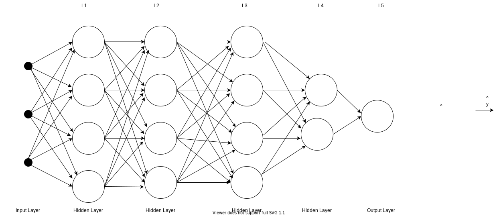
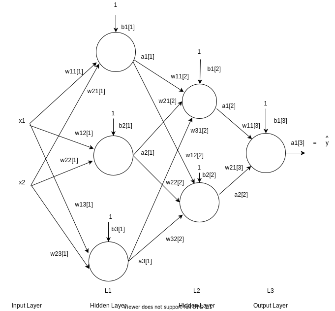
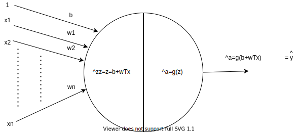
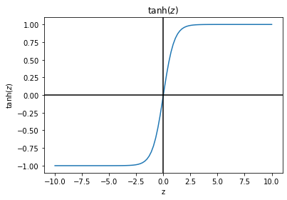
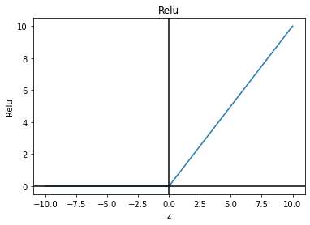
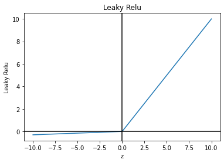

# Deep Learning

## Introdcution

This post introduces Deep Learning, which is a branch of Machine Learning, using similar building blocks but in a denser architecture which can achieves better performance in complicated problems.
Let's show that, by first presneting the architecture which drives Deep Learning - Neural Networks.

## Neural Networks

We start from the already familiar Logistic Regression prediction model, depicted in Figure 1. Does this scheme resembles of a Nueron, at least graphically-wise? With some imagination effort it does, if you see in the data input lines the Neuron's dendrites, by which the Neuron receives input from other cells. The iinterconnections between Neurons, as depicted in Figure 2 may also resemble Neurons. But is there real functional similarity between deep learning's Neutal Networks nd the Human brain's Neural Networks? This is an arguable issue, and we will not get to it in this context.

Anyway, the Neuron structure presented here is the building block of the Neural Network, . Tracing the Forward Propogation path, we observe the n input data set elements \\([x_1-x_n]\\), which are multiplied by n weights \\(w_1-w_n\\) and are then summed, together with the bias input b. That sum is then passed to a non-linear operator called 'activation function', which in our case is the sigmoid operator. The sigmoid output, is denoted by **a**. The weights and bias values are of course determined during the Training phase.

Deep Learning algorithm are driven by a dense network, structured with many such Neurons, as depicted in Figure 2.

### Figure 1: Logistic Regression Data Network

### Figure 2: Neural Network

Following Figure 2, here below are some commonly used terms:

- **Layers**: The Neural Network is arranged in layers. The network presented in Figure 2 has 5 layers - marked L1-L5. Each layer consists of 4,4,4,2 and 1 neurons respectively.
- **Desnse Layers**: Fully connected layers. The Deep learning scheme is based on densely connected neural networks.
- **Input Layer**: A layer with input exposed to outside of the network. It is conventionally not counted in the layers count.
- **Hidden Layer**: Layers which both input and output are  connected to other network's layers - L1-L4 are Hidden layers.
- **Output Layer**: A layer with output exposed to outside of the network -  L5 in Figure 2.
- **Deep Neural Network**: A neural network with 'many layers'. There is no definite minimal number of layers for that, though 3 hidden layers used to be regarded "Deep".

Figure 3 depicts a Nueral Network with less layers and neurons then in Figure 2, to make it more easy to denote detail inside. 
Some explaination and notations:
- **Superscript index in square bracketed**: This is the layer's index. 
- **Subscript index**:  This is the Neuron's index. 
- **weights**: The weights multiply the layer's data input at the Neuron's input. Example: \\(w_{21}^[2]\\) in Figure 3, weights the input coming from the Neuron 1 of Layer 1, to the Neuron 2 of layer 2. 
- **bias**: Bias multiplies a constant 1 and summed up with all weighted inputs. Example: \\(b_2^{[1]}\\) is the bias input of Neuron 2 of Layer 1.
- **activations**: The activation function defines the output of the node, which is denoted by a, stands for activation. Example:  \\(a_2^{[1]}=g_2^{1}(z^{1})\\) is the activation of second Neuron of Layer 1. 

### Figure 3: Neural Network - A More Detailed Scheme

## Activation Functions

Each Neuron's operator consists of 2 parts, as depicted in Figure 1: The sum of wheigthed input with a bias, and a none linear operator. In Figure 1, the none linear operator is a sigmoid. Sigmoid is indeed the activation operator which performs Binary Decisions, used by Logistic Regression. This chapter presents more activation functions used for Deep Learning. 
Maybe here's the time to remark that in the absence of a non-linear activation functions, the Neural Network, which would be cascade of linear functions, could be replaced by a single Neurone with a linear function, so there would be no benefit over a single Neurone. 

The activation function is denoted by g(z). Figure 4 is almost identical to Figure 1, but depicts the Neuron with g(z).

### Figure 4: Neuton with Activation function g(z)

### Sigmoid

### Eq. 1: Sigmoid Function 

$$\sigma{x}=\frac{1}{1+e^{-x}}}$$

Sigmoid was introduced in the Logistic Regression post. With a decision threshold at 0.5, a range of [0,1], and a steep slope, Sigmoid is suitable a a binary decision function. and indeed it's very commonly used for binary classification.
Still, the sigmoid values flatens as at higher values of z. This the "Vanishing Gradient" problem, with which optimization algorithms such as Gradient Descent will not merge or merge very slowly. 

### Figure 5: Sigmoid

### tanh

### Eq. 2: tanh Function

$$
tanh(x)=\frac{e^x-e^{-x}}{e^{x}+e^{-x}}
$$

It's easy to see, by multiplying numerator, as shown in Eq 3. and denominator by \\(e^{-x}\\), that tanh is a scaled sigmoid. It is also depicted in Figure 6 that  tanh is a scaled sigmoid, centered around 0 instead of 0.5 with values [-1,1]..

### Eq. 3: tanh Function is a scaled sigmoid

tanh(x)=\frac{e^x-e^{-x}}{e^{x}+e^{-x}}*\frac{e^{-x}}{e^{-x}}= \frac{2}{1+e^{-2x}}-1=2\sigma(2x)-1$$

Tanh usually works better than Sigmoid for hidden layers. Actually, sigmoid is rarely used for hidden layers, but only for output layers, where the output is expected to be 0 or 1.

### Figure 6: tanh

### Relu

### Eq. 4: Relu - Rectified Linear Unit

relu(x)=max(0,x)

Relu solves the "Vanishing Gradient" problem. Derivative is 1 for the positive value. The derivative at x=0 is not defined, but that's not an issue and can be set to either 0 or 1. Relu implementation is simpler and cheaper computation wise then the other activation functions. is commonly used, actually it's in most cases the default activation function. 
Problem with Relu is the 0 gradient for negative values, so all units with negative value will slow down learning. Still, not considered a critical issues, as about half og the hidden unit are still expected to have values greater than 0.
Leaky Relu solves the 0 gradient issue anyway.

### Figure 7: RelU

### 

### Figure 8: Leaky RelU

### Eq. 5: Leaky Relu

leaky_relu(x)= max ? x: 0.01*x

Leaky Relue adds a slope to the negative values, preventing the 0 gradient issue. The slope he is set to 0.01.

## Forward Propogation

This section describes the Forward Propogation, i.e. equations for determining the of an input transfered through the Neural Network. We'll use the network depicted in Figure 3 to illustrate that.

Let's start with the activation expressions for layer 1's Neurons:

$$
z_1^{[1]}=\begin{bmatrix}
w_{11}^{[1]} && 
w_{21}^{[1]} 
\end{bmatrix}\begin{bmatrix}
x_1 \\ 
x_2 \\ 
\end{bmatrix}+b_1^{[1]}
$$

$$
a_1^{[1]}=g_1^{[1]}(z_1^{[1]})
$$
$$
z_2^{[1]}=\begin{bmatrix}
w_{12}^{[1]} && 
w_{22}^{[1]} 
\end{bmatrix}\begin{bmatrix}
x_1 \\ 
x_2 \\ 
\end{bmatrix}+b_2^{[1]}
$$

$$
a_2^{[1]}=g_2^{[1]}(z_2^{[1]})
$$

$$
z_3^{[1]}=\begin{bmatrix}
w_{13}^{[1]} && 
w_{23}^{[1]} 
\end{bmatrix}\begin{bmatrix}
x_1 \\ 
x_2 \\ 
\end{bmatrix}+b_3^{[1]}
$$

$$
a_3^{[1]}=g_3^{[1]}(z_3^{[1]})
$$

Let's start with the output of a signal Neuron, and take The first Neoron of L1:

Neural Network's output, based on the input and the network parameters.

If there are many layers without an activation function, it is always computing a linear prediction function, no matters how layers the network has.

The case with no activation function is the linear regression - predict a price etc.

and Deep learning is an approach to machine learning characterized by deep stacks of computations. This depth of computation is what has enabled deep learning models to disentangle the kinds of complex and hierarchical patterns found in the most challenging real-world datasets.

Through their power and scalability neural networks have become the defining model of deep learning. Neural networks are composed of neurons, where each neuron individually performs only a simple computation. The power of a neural network comes instead from the complexity of the connections these neurons can form.
