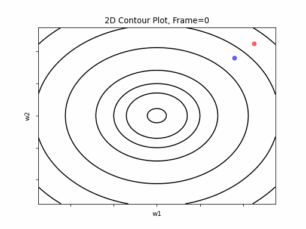
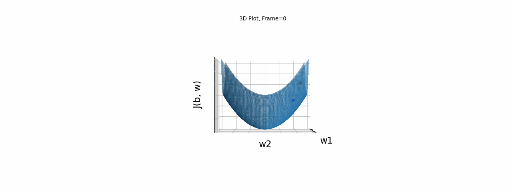
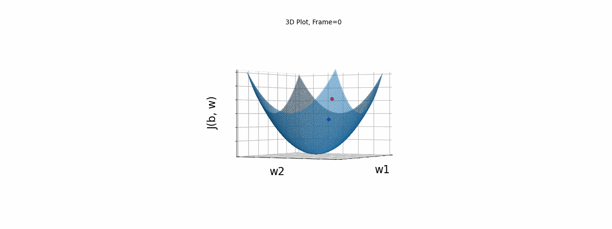
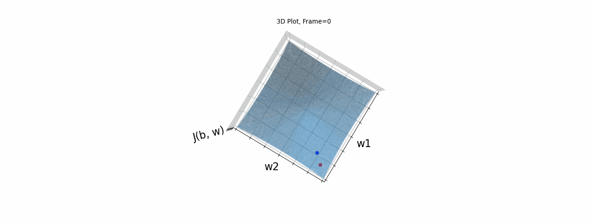
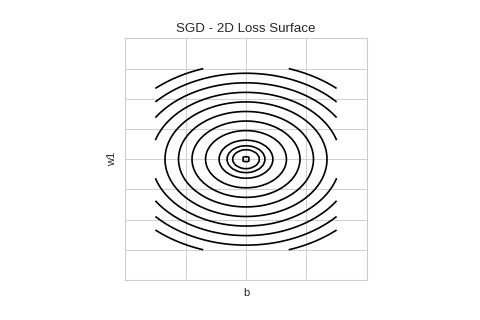

## Introduction

**Gradient Descent** is a recursive algorithm, which finds the minimum of a function. The minimum is located by striding in the oposite direction of the function's gradient, with a step size according to the gradient size, as expressed in Eq. 1.

## Eq. 1: Gradient Descent Equation

\\(X(t) = X(t-1)-\alpha \cdot \bigtriangledown f(X)) \\)
**Where**:
**t** is the iteration index
\\(X = {x_j} j =1:n\\) the n dimensional parameter searched for.
\\(\alpha\\) is constant known as the learning rate.

The recursive algorithm goes as follows:

0. Init \\(X={x_j}\\), j=1:n to an arbitrary value. (A bad values selection may delay convergance. Check if so by trial and error.)
1. Calculate gradient of f(X)
2. Calculate new X(t) using Eq. 1
3. Continue to step 1 if \\(\bigtriangledown f(X) > \epsilon \\)

**Gradient Descent in Deep Neural Networks*** 
In the context Deep Neural Networks (DNNs), Gradient Descent is the most popular optimization algorithm, used to find the optimized set of weight coefficients which minimizes the cost function J, (i.e. a function which expresses the error between the expected DNN output and the model's predicted output). Figure 2 depicts a schematic diagram of DNNs Training phase functionality. 

**Illustrative Examples**

Figure 1 illustrates gradient descent convergence for a single variable function \\(f(x) = (x-w_1)^2\\). In this single variable example, the gradient degenerates to:
\\(x_{t} = x_{t-1}-\alpha \cdot \frac{d}{dx}f(x) \\)

Figure 2 is a contour graph which illustrates gradient descent convergence for a 2 variable function of the type \\(f(x) = a \cdot (x-w_1)^2 + b \cdot (x-w_1)^2\\)

**Figure 2: Gradient Descent - Easy Convergence

Now look at Figure 3, which is similar to figure 1 except that the gradient is stipper in one direction. That leads to some oscilations,but the gradient descent converges eventually.

**Figure 3: Gradient Descent - Slight Oscilations

 
Figure 4 however presents an even stipper gradient in one direction. Now Gradient Descent oscilates in one direction and never converge. 

**Figure 4: Gradient Descent - Oscilations

Some phenomenas/Performance issues Gradient Descent suffers from are:
- Overshooting: As depicted by Figures 3 and 4, high curvutures may lead to overshooting. Overshooting is a result of moving too fast along the gradient direction, while it changes signs. 

- Local Minimun trap: Getting trapped in a local minimum, not reaching the global minima.

- Oscillations: this phenomenon can occure not only when gradient changes significantly in high curvuturs as depicted by Figure 4, but also when no matter the direction it  navigating in a plateau, where gradient is negligible but still may have slight differences which lead to oscliations

Overshooting could be avoided by setting a smaller learning rate, but that would slow the convergence process down for other stable scenarios.
Some of these phenomanas, e.g. overshooting, could be avoided by etting a smaller learning rate. But would have increased convergence time.
This post reviews some of the most popular Gradient Descent variants which aim to answer Gradient Descent issues.

This algorithms reviewd in this post as listed below:

**Momentum**
**Nesterov momentum**
**Adagrad**
**RMSprop**
**Adam**
**Adadelta**
**Adam**
**Adamax**
**FTR**
**NAdam**

## Momentum

A smaller learning rate coefficient at gradient change of sign regions, could improve Gradient Descent's performance in overshoot and oscilation scenarios. In other scenarios, where gradient's direction does not change, a larger learning rate would have increase convergance rate. The Momentum algorithm aims to achieve that by adding another term to the Gradient Descent correction factor, denoted by \\(v\\). Here's the momentum formula:

## Eq. 2: Momentum

## Eq. 2a
\\(v =\beta \cdot v - \alpha \cdot \bigtriangledown_w f(w)\\)
## Eq. 2b
\\(w = w+v\\)

The hyperparameter values are \\(\alpha \epsilon(0,1)\\) and \\(\beta\\) is typically 0.9.
As Eq. 2 shows, the updated value w, is dependent not only on the recent gradient, but also on \\(v\\), an exponentially decaying moving average of past gradients.
So, update step size will be increased if sign of \\(v\\) is same as the current gradient's, and decreased otherwise, i.e. when gradient has changed direction with regard to averaged gradient direction.

The reason for naming it momentum, is the analogy to Newtonian motion model: \\(v(t) = v(t-1) + a \cdot \Delta T,\;Delta T=1\\), where the velocity \\(v\\) at time t, equals to the sum of velocity at \\(t-1)\\ and accelaration term. In Eq 2, the averaged step size is analogous to velocity,while the gradient is analogous to the acceleration. In the Newtonian phisics (mechanics),the momentum is the product of velocity and mass (denoted by m), so assume m=1.

Figure 5 depicts plots of re-running the presented above Gradient Descent scenarios, now with momentum. True for all algorithms - it is not guaranteed that an algorithm considered as improved, will give good or better results for all scenarios. 

### Figure 5.a: Momentum, 'Easy Convergence' scenario 

M point is reached out promptly (10 frames), but overshoots due to momentum slow down convergence. Fastly reaching location of convergence point, 

### Figure 5.a.1: 2D Contour

### Figure 5.a.2: 3D Contour. Camera location: azimuth 0, elevation 0

### Figure 5.a.3: 3D Contour. Camera location: azimuth 0, elevation 0

### Figure 5.a.4: 3D Contour. Camera location: azimuth 30, elevation 90

### Figure 5.b: Momentum on 'Slight Oscilations' scenario 
 point is reached out promptly (10 frames), but overshoots due to momentum slow down convergence. Fastly reaching location of convergence point, 
### Figure 5.b.1: 2D Contour

### Figure 5.a.2: 3D Contour. Camera location: azimuth 0, elevation 0

### Figure 5.a.3: 3D Contour. Camera location: azimuth 0, elevation 0

### Figure 5.a.4: 3D Contour. Camera location: azimuth 30, elevation 90

**Nesterov momentum**

Nesterov momentum algorithm is a variation of the Polyak momentum, but here the momentum calculated differently: rather than \\(\beta(w(t)-w(t-1))\\), it is now \\(\beta(w(t+1)-w(t))\\), i.e. it uses the Gradeint Descent value calculated at (t+1). Accordingly, the new value is calculated in 2 steps:

## Eq. 3: Nesterov momentum
### 3.a
\\(v(t+1)=/beta \cdot v - \alpha \cdot \bigtriangledown f(w+\beta v(t))\\)
### 3.b
\\(w=w+ \beta \cdot v + v(t+1)\\)

Figure 5 depicts plots of re-running the presented above Gradient Descent scenarios, now with momentum. True for all algorithms - it is not guaranteed that an algorithm considered as improved, will give good or better results for all scenarios. 

### Figure 1a: Plain SGD

### Figure 1b: SGD with Momentum

graph is limitted 

## Adagrad
## RMSprop
## Adam
tensorflow
SGD algorithm
SGD with Momentum algorithm
Adagrad algorithm.
Adadelta algorithm.
Adam algorithm.
Adamax algorithm.
FTRL algorithm.
NAdam algorithm.
RMSprop algorithm.

used for finding that set of minimizing coefficents. tech for finding the set of minimizing parameters is Gradient Descent, and function parameters are fitted during training, by minimizing a cost function which determines the error between the expected and predicted values. To most commonly used algorithm for finding the  minimum, is Gradient Descent, and its various variations. This post reviews the various optimization algorithms.

fare traine, is by minimizing a cost functionGradieThe most common method to train a neural network is by using gradient descent (SGD). The way this works is you define a loss function 
that expresses how well your weights & biases allow the network to fit your training data. A higher loss means that the network is bad and makes a lot of errors while a low loss generally means that the network performs well. You can then train your network by adjusting the network parameters in a way that reduces the loss.

coursera:
Mini Batch

Training with batch of all m examples - 1 update (step of gradient descent) after each cycle
Mini Batch - 1000 examples...runs faster for big training set

Referances:
- Deep Learning by Ian Goodfellow, Yoshua Bengio, and Aaron Courville 
