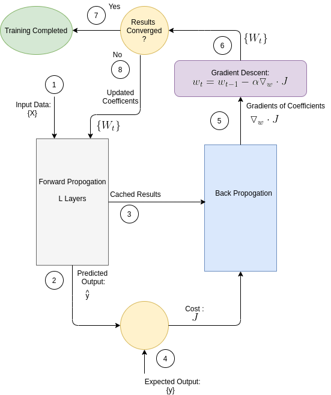
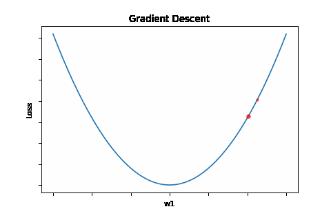
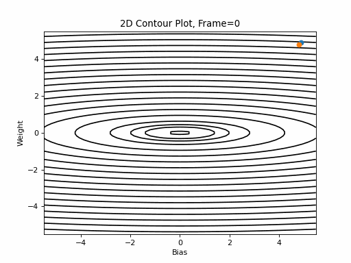
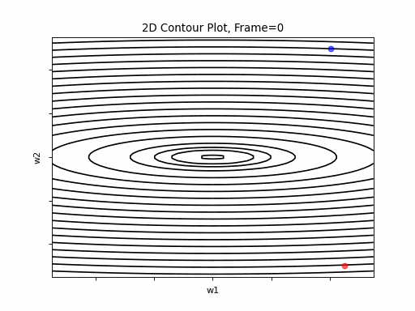

# Introduction

**Gradient Descent** is a recursive algorithm, which finds the minimum of a function. The minimum is located by striding in the oposite direction of the function's gradient, with a step size according to the gradient size, as expressed in Eq. 1.

### Eq. 1: Gradient Descent Equation

\\(X(t) = X(t-1)-\alpha \cdot \bigtriangledown f(X)) \\)
**Where**:
**t** is the iteration index
\\(X = {x_j} j =1:n\\) the n dimensional parameter searched for.
\\(\alpha\\) is constant known as the learning rate.

The recursive algorithm goes as follows:

0. Init \\(X={x_j}\\), j=1:n to an arbitrary value. (A bad values selection may delay convergance. Check if so by trial and error.)
1. Calculate gradient of f(X)
2. Calculate new X(t) using Eq. 1
3. Continue to step 1 if \\(\bigtriangledown f(X) > \epsilon \\)

**Gradient Descent in Deep Neural Networks*** 
In the context Deep Neural Networks (DNNs), Gradient Descent is the most popular optimization algorithm, used to find the optimized set of weight coefficients which minimizes the cost function J, (i.e. a function which expresses the error between the expected DNN output and the model's predicted output). Figure 2 depicts a schematic diagram of DNNs Training phase functionality. 

**Illustrative Examples**

Figure 1 illustrates gradient descent convergence for a single variable function \\(f(x) = (x-w_1)^2\\). In this single variable example, the gradient degenerates to:
\\(x_{t} = x_{t-1}-\alpha \cdot \frac{d}{dx}f(x) \\)

Figure 2 is a contour graph which illustrates gradient descent convergence for a 2 variable function of the type \\(f(x) = a \cdot (x-w_1)^2 + b \cdot (x-w_1)^2\\)

**Figure 2: Gradient Descent - Easy Convergence

Now look at Figure 3, which is similar to Figure 2, except that the gradient is steepper in w2 direction. The resultant step size in the w2 direction at the begining is too large, which leads to some overshoots, but the algorithm converges eventually.

**Figure 3: Gradient Descent - Slight Oscilations

 

Figure 4 however, presents an even steepper gradient in w2 direction. Now we get oscilations in w2 direction, which never converge. 

**Figure 4: Gradient Descent - Oscilations

A smaller learning rate would solve this, make the algorithm smoothly converge. A smaller learning rate would have slowed down convergance in all scenarios. This is a tradeoff. Chosing alpha is one of the chalenges of Gradient Descent, and it normally requires some trial and error iterations to find a suitable value. Overshoot is a one of the Gradient Descent performance issues, between them are:
- ***Overshooting***: As depicted by Figures 3 and 4, high curvutures may lead to overshooting. Overshooting is a result of moving too fast along the gradient direction, while it changes signs. 

- ***Local Minimun trap***: Getting trapped in a local minimum, not reaching the global minima.

- ***Oscillations***: this phenomenon can occure not only when gradient changes significantly in high curvuturs as depicted by Figure 4, but also when no matter the direction it  navigating in a plateau, where gradient is negligible but still may have slight differences which lead to oscliations

This post reviews some of the most popular Gradient Descent variants which aim to answer Gradient Descent issues.

This algorithms reviewd in this post are:

**Momentum**
**Nesterov momentum**
**Adagrad**
**Adadelta**
**RMSprop**
**Adam**
**Adamax**
**FTR**
**NAdam**

The next paragraphs describe the principles of the various Gradient Descent algoritms. Following that are graphical illustrations of these algorithms when applied on a 3 "cost functions" presented above, i.e. "easy convergence, "slightly oscilated" and "oscilated".

# Momentum

The Momentum algorithm update formula, adds another term to the Gradient Descent correction factor. This term, denoted by \\(v \\), corresponds to past gradient, calculated at previopus update iterations.
Here's the momentum formula:

### Eq. 2: Momentum

Eq. 2a

\\( v_t =\beta \cdot v_{t-1} - \alpha \cdot \bigtriangledown_w f(w_{t-1}) \\)

Eq. 2b

\\( w_t = w_{t-1}+v_t \\)

Where:

- Learning rate \\( \alpha \epsilon(0,1) \\) 
- \\( \beta \\) is typically 0.9.
- 
As Eq. 2 shows, the updated value w, is dependent not only on the recent gradient, but also on \\(v\\), an exponentially decaying moving average of past gradients. Accordingly, update step size will be increased if sign of \\( v_t \\) is same as the current gradient's, and decreased otherwise, i.e. when gradient has changed direction with regard to averaged gradient direction. 

This allows a faster move, i.e. larger update step size, when in low gradient zone,in which updates are small but in the same direction, and a slower update in areas where the direction of the update is oscillating.

Just to note:
The reason for naming it momentum, is the analogy to Newtonian motion model: \\(v(t) = v(t-1) + a \cdot \Delta T,\;\Delta T=1\\), where the velocity \\(v_t \\) at time t, equals to the sum of velocity at \\(t-1)\\ an accelaration term . In Eq 2, the averaged step size is analogous to velocity,while the gradient is analogous to the acceleration. In the Newtonian phisics (mechanics),the momentum is the product of velocity and mass (denoted by m), so assume m=1.

**Nesterov momentum**
ref: On the importance of initialization and momentum in deep learning, Proceedings of the 30 th International Conference on Ma-
chine Learning, 2013, Sutskever et al

Nesterov momentum algorithm (aka NAG) is a variation of the momentum algorithm.  but with a slight difference: rather than \\(\beta(w(t)-w(t-1)) \\), it is now \\(\beta(w(t+1)-w(t)) \\), i.e. it uses the Gradeint Descent value calculated at (t+1). Accordingly, the new value is calculated in 2 steps:

### Eq. 3: Nesterov momentum

#### 3.a: \\(v_t=\beta \cdot v_{t-1} - \alpha \cdot \bigtriangledown f(w_{t-1} + \beta \cdot v_{t-1} ) \\)

#### 3.a: 
\\(v_t=\beta \cdot v_{t-1} - \alpha \cdot \bigtriangledown f(w_{t-1} + \beta \cdot v_{t-1} ) \\)

#### 3.b: \\(w_{t}=w_{t-1}+ v_t \\)

# Adagrad

"Adaptive Subgradient Methods for Onlie Learning and Stochastic Optimization, Journal Of Machine Learning Reaserch 12 (2011), Duchi et. al.

Adagrad (Adaptive Gradient) algorithm modifies the value of learning rate, based on past gradients. 

The parameter update expression is:

### Eq. 4: Adagrad

\\(w_{t}=w_{t-1}-\frac{\alpha}{\epsilon + \sqrt{G_{t-1}} \odot g_{t-1}}\\)

Where:
\\(\alpha \\) is the "Global Learning Rate".
\\(g(t)=\bigtriangledown_w J(w_t) \\)

- \\(\odot\\) stands for "elementwise multiplication".

-G_{t} is a diagonal matrix, where the (i,i) element is the square of the ith gradient of f(w), i.e.\\(\bigtriangledown_{w_{i}} f(w)\\)

-\\(G_{t,(i,i)}=\sum_{}^{t} \bigtriangledown_{w_{i}} f(w) \\)

-\\(\epsilon \\) is a small value used to maintain stability, commonly set to \\(10^{-7} \\).

Adagrad gives lower learning rates to parameters with higher gradients, and higher rates, thus faster convergance to smoth pathes. Still, it has 2 drawbacks:
- "Global Learning Rate" value should be selected. 
- Since sum of squared gradients grows increasingly, the the adaptive learning rate coefficient can excessively decrease as training continues.

# AdaDelta

ADADELTA: An Adaptive Learning Rate Method, Zeiler

AdaDelta's idea was derived from AdaGrad, which parameter updating term is (See Eq. 4):

\\(\Delta{w_{t}}=-\frac{\alpha}{\epsilon + \sqrt{G_{t}} \odot g(t)} \\)

Where:

\\(g_t = \bigtriangledown f(w_t) \\)

AdaDelta aims to improve the 2 drawbacks of that updating term: 
1. the continual decay of learning rate. 
2. the need to select a global learning rate.

To improve the first drawback, Avagard's denominator is replaced by root of exponentially decaying average of squared gradients \\(E(g^2) \\), denoted by RMS (Root Mean Square_:

The exponentially decaying average of squared gradients equation is:

\\(E[g^{2}]_t=\\)

\\(\gamma E[g^2]_{t-1}+\\)

\\((1-\gamma)g^2_{t} \\)

Using that we now denote:

\\(RMS[g]_t = \sqrt{E[g^{2}]_t + \epsilon} \\)

where:

\\(\gamma\\) is a constant controlling the decay of the gradients average.

\\(g^2_{t} = g_{t} \odot g_{t} \\) , i.e. an element-wise square. 

\\(\epsilon\\) is a small value used to maintain stability, commonly set to \\(10^{-7} \\). 

To improve the second drawback, i.e. avoid the need to determine a global learning rate, the numerator is taken the RMS of an exponentially decaying average of the past updates:

The exponentially decaying average of the past updates is:

\\(E[\Delta w{^2}]_{t} = \\)

\\(\rho E[\Delta w{^2}]_{t-1}+\\)

\\( (1-\rho) \Delta w_t{^2}\\)

\\( (1-\rho) \Delta w_t{^2}\\)

where:

\\(\rho\\) is a constant controlling the decay of the average.

\\(\Delta w_t_{^2} = Delta w_t \odot Delta w_t \\) , i.e. an element-wise square. 

Using that we now denote:

\\(RMS[\Delta w]_{t}=\sqrt {E[\Delta w{^2}]_{t}}

Note: Algorithm uses RMS[\Delta w]_{t-1} for the calculation of \Delta w_t

Having the numerator and denominator blocks, here the update algorithm:

### Eq. 5: AdaDelta

1. ***for t=1:T do:***
2. \\(g_t = \bigtriangledown f(w_t) \\)
3. \\(\Delta w_t = -frac{RMS[\Delta w]_{t-1}}{RMS[g]_t}\\)
4. \\(w_{t+1} = w_t + (\Delta w_t\\)

# RMSprop

RMSprop was presented in a Coursera course lecture.

RMSprop (RMS Propagation)like AdaDelta, is an improvement of AdaGrad. It aims to solve AdaGrad drwaback regarding the continual decay of learning rate. It does so by replacing the denominator of AdaGrad (Eq. 4), by an exponentially decaying average of squared gradients \\(E(g^2) \\), exactly as done by AdaDelta. Unlike AdaDelta, RMSprop leaves AdaGrad's global learning rate coefficient in place, so the updating formula becomes:

### Eq. 6: RMSprop

\\(w_{t}= w_{t-1}-\\)

\\(\frac{\alpha}{RMS(g^2)_{t-1}}\cdot g_{t-1}\\)

Where:

\\(g_t = \bigtriangledown f(w_t) \\)

and \\(g^2_{t} = g_{t} \odot g_{t} \\) , i.e. an elementwise square. 

Recommended values for the global learning rate \\(\alpha \\) and the decay constant \\(\gamma \\) hyperparameters are 0.001 and 0.9 respectively.

# Adam

ADAM: A METHOD FOR STOCHASTIC OPTIMIZATION, ICLR 2015, Kingma and Ba

Adam (Adaptive Moment Estimation) was designed to combine the advantages of AdaGrad and RmsProp. It incorporates exponential decay moving averages of both past gradients, aka moment (aka first raw moment), denoted by \\(m_t\\) , and of squared gradients, (aka second raw moment or uncentered variance), denoted  \\(v_t \\). Adam also incorporates initialization bias correction, to compensate the moments' bias to zero at early iterations. 
Adam's update step size is bounded, where for common scenarios bound is learning rate coefficient, i.e. \\( \left | Delta w_t  \right | < \alpha\\). 
The step size is also invariant to scaling of the gradient.

Let's see all that.

Here is the moment estimate at time t, calculated as an exponantial decay moving average of past gradients.

##### moment estimate 

\\(m_t=\beta_1 \cdot m_{t-1} + (1-\beta_1) \cdot g_{t} \\)

where:
\\( g_t = \bigtriangledown f(w_t) \\)
\\(\beta_1 \epsilon [0,1) \\) is a hyper parameter which controls the exponential decay rate of the moving average.

Here's the second raw moment estimate at time t, calculated as an exponantial decay moving average of past squared gradients.

##### Second raw moment estimate

\\(v_t=\beta_2 \cdot v_{t-1} + (1-\beta_2) \cdot g_t^2 \\)

\\( g_t = g_t \odot g_t\\) is an elementwise square.
\\(\beta_2 \epsilon \left [0,1 \right ) \\) is a hyper parameter which controls the exponential decay rate of the moving average.

Now let's consider the initialization bias issue and its correction: moving averages \((m_t\)) and \((v_t\)) vectors are initialized to all 0s. That leads Eq.7 and Eq. 8 to bias towards zero, especially in the first iteration steps. To compensate that, Adam sets bias correction to the first and second raw  moments and second raw moment estimates.

##### Bias corrected moment estimate 

\\(\hat{m}_t=\frac{m_t}{1-\beta_1^t} \\)

Where:
-With \\(\beta_1^t\\) we denote \\(\beta_1\\) to the power of t 

-\\( 1-\beta_1^t \\) is small for small values of t, which leads to increasing \\(\hat{v}_t \\) value for initial steps.

##### Bias corrected second raw moment estimate 

\\(\hat{v}_t=\frac{v_t}{1-\beta_2^t} \\)

Where:

-With \\(\beta_2^t\\) we denote \\(\beta_2\\) to the power of t 

-\\(1-\beta_2^t \\) is small for small values of t, which leads to increasing \\(\hat{v}_t \\) value for initial steps.

Finally Adam's update forula is:

### Eq. 7: Adam  

\\(w_{t}= w_{t-1}-\frac{\alpha \cdot \hat{m}_t}{\sqrt(\hat{v}_t)+\epsilon} \\)

Where proposed hyperparameter values are:

\\(\alpha=0.001 \\),\\(\beta_1=0.9 \\),\\(\beta_2=0.999 \\),\\(\epsilon=10^{-8} \\)

#### Inspection of updates bounderies and behavior.

In this section we'll find bounderies for update step size. We will show bounderies for 2 types of scenarios: 
1. A completely sparsey scenario, where gradient has been 0 for all timesteps except the current time step. 
2. The most common scenarios, for which we will get a tighter boundery.

Let's start simplifying the expression for 
######  #1

\\(\Delta_t = -\frac{\alpha \cdot \hat{m}_t}{\sqrt(\hat{v}_t)+\epsilon}\\)

Neglecting \\(\epsilon\\), it reduces to:

######  #2

\\(\Delta_t \leq \left |\frac{\alpha \cdot \hat{m}_t}{\sqrt(\hat{v}_t)} \right|\\)

Unrolling the bias correction factors:
######  #3

\\(\Delta_t \leq \left |\frac{\sqrt{1-\beta_2^t} \cdot \alpha \cdot m_t}{(1-\beta_1^t)\sqrt{v_t}} \right|\\)

Assuming \\(\beta_2,\beta_2<1\\) and \\(\beta_2 >\beta_2<1\\) then the bias correction factors quotient is bounded by 1:
######  #4

\\\frac{\sqrt{1-\beta_2^t}}{1-\beta_1^t} \leq 1\\)

so we'll plug it in as 1, i.e. cancel, expression
Plugging 4 to 3:
######  #5

\\(\Delta_t \leq \left |\frac{ \alpha \cdot m_t}{\sqrt{v_t}} \right|\\)

######  A Boundery for the completely sparsey scenario

We recall that:

\\(m_t=\beta_1 \cdot m_{t-1} + (1-\beta_1) \cdot g_t \\)

and 

\\(v_t=\beta_2 \cdot v_{t-1} + (1-\beta_2) \cdot g_t^2 \\)

Pluggin the above into 5 we get:

######  a.1

\\(\Delta_t \leq \left |\frac{\sqrt{1-\beta_2^t} \cdot \alpha \cdot (\beta_1 \cdot m_{t-1}+(1-\beta_1) g_t)}{(1-\beta_1^t)\sqrt{\beta_2 v_{t-1}+(1-\beta_2)g_t^2)}} \right|\\)

In the completely sparsey scenario, gradients have been 0 for all timesteps except the current time step, so a.1 reduces to:

######  a.2

\\(\Delta_t \leq \left | \frac{\alpha (1-\beta_1) g_t}{\sqrt{(1-\beta_2)g_t^2} } \right|\\)

Which leads to the boundery:
######  a.3

\\(\Delta_t \leq \left | \frac{\alpha (1-\beta_1)}{\sqrt{(1-\beta_2)} } \right|\\)

######  A Boundery for the most common scenarios

Back to #5, let's examine the quotient \\( \left |\frac{ m_t}{\sqrt{v_t}} \right|\\).
It is well known that:  (\\{E(g^2)}-{E(g)}^2 \geq 0\\)). 
Swappings sides we get:  
######  b.1

\\( \left |\frac{E(g)}{\sqrt{E(g^2)}} \right| \leq 1\\) 

Similarly, we assume the same for the estimated \\(m_t\\) and \\(v_t\\) values, so accordingly:
######  b.2

 \\(\left |\frac{ m_t}{\sqrt{v_t}}  \leq 1 \right|\\)
 
Finally, plugging b.2 into #5 we get:

##### Update step size boundery

\\(\Delta_t \leq \alpha \\)

# Adamax

ADAM: A METHOD FOR STOCHASTIC OPTIMIZATION, ICLR 2015, Kingma and Ba

A variant of Adam, proposed in same paper, suggests to replace Adam's  second raw moment \\( v_t \\) , by \\( u_t \\), an :

\\( u_t = max(\beta_2 \cdot  u_{t-1}, \left | g_t \right | \\)

Bias correction is not needed for \\( u_t \\) anymore. The numerator is same as in Adam. Consequently, the Aadamax update formula is:

### Eq. 8: Adamax

\\( w_{t+1}= w_t-\frac{\alpha \cdot {m}_t}{(1-\beta_1^t) \cdot u_t} \\)

Where proposed hyperparameter values are:

\\(\alpha=0.002 \\)

\\(\beta_1=0.9 \\)

\\(\beta_2=0.999 \\)

# NAdam
INCORPORATING NESTEROV MOMENTUM INTO ADAM, ICLR 2016, Timothy Dozat

The NAdam (Nesterov-accelerated Adaptive Moment Estimation) extends Adam algorithm, incorporating the Nesterov momentum principal into it. The prinicipal is of using a next step update, already in current iteration. According to this principal, Nesterov formula for gradient was this:

##### Nesterov Gradient Calculation Formula

\\(g_t=\bigtriangledown f(w_{t-1} - \beta \cdot m_{t-1})\\)

compairing to the conventional formula:

##### Common Gradient Calculation Formula

\\(g_t=\bigtriangledown f(w_{t-1})\\)

Adopting this formula, NAdam modified Adam's formula as presented below. The modification wrt conventional Adam is only in one of the equations (#4)

**** Nadam Formula's equation set:****

1. \\(g_t=\bigtriangledown f(w_{t-1})\\)

2. \\(m_t=\mu \cdot m_{t-1}+(1-\mu) \cdot g_t\\)

3. \\(n_t=\nu \cdot n_{t-1}  + (1-\nu) g_t^2\\)

4. \\(\hat{m} = \frac{\mu \cdot m_t}{1-\mu^{t+1}} + \frac{(1-\mu) \cdot g_t}{1-\mu^t}\\)

5. \\(\hat{n}=\frac{\nu \cdot n_t}{1-\nu^t}\\)

6. \\(w_t = w_{t-1} - \frac{\alpha \cdot \hat{m_t}}{\sqrt{\hat{n_t}}+\epsilon}\\)

Where:
\\(\mu\\) and \\(\nu\\) are the exponentially decaying coefficients

Here is Adam's oroginal equation for the biased corrected momentum:

**** Adam's Original Formula:****

4. \\(\hat{m} = \frac{m_t}{1-\mu^{t+1}} \\)

 Nadam replaced usage of current \\({m_t}\\) by a "look ahead" \\(\mu\\).

