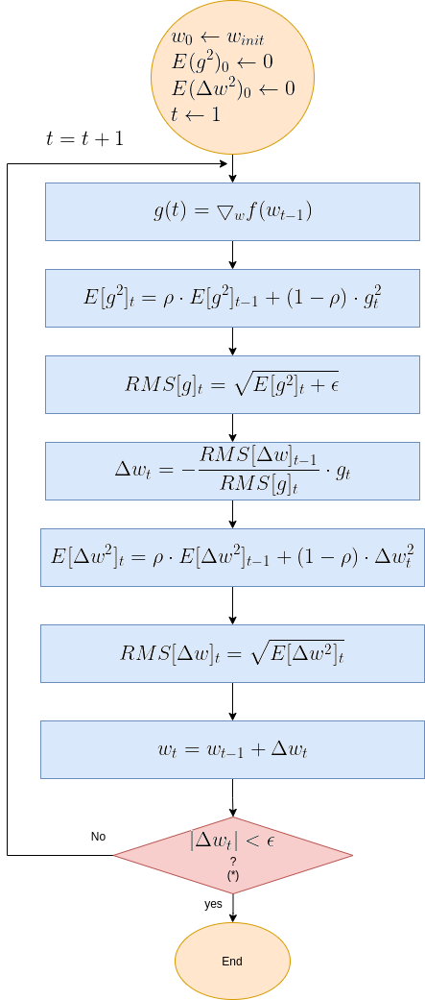

# Introduction

**Gradient Descent** Gradient Descent is the most popular optimization algorithm used to find the optimized set of weights in Deep Neural Networks. The optimization algorithm is activated on the cost function J, during the training phase, searching for the sets of weights which minimizes the cost function. (cost function is a function which expresses the error between the expected DNN output and the model's predicted output). 

Diagram below presents DNN's functionality during training phase: The Gradient Descent module, (located on top-right),  is fed with 
\\( \bigtriangledown_w J\\) , the cost function gradient, according to which it calculates the updated \\(w_t\\).

**Figure 0: Deep Neural Network Block Diagram - Training Phase

Next chapters of this post are:

- Gradient Descent Prinicipals
- Illustrative Examples
- Review of Gradient Descent Variants:

- Momentum Basic Algorithms
- 
**Momentum**
**Nesterov momentum**
Adaptive Learning Rate:

**Adagrad**
**Adadelta**
**RMSprop**
**Adam**
**Adamax**
**FTR**
**NAdam*

# Gradient Descent Principals

Gradient Descent finds a minimum of either a function or a set of data points, by striding along the gradient's opposite direction, untill it reaches the point where gradient is  - this where the minima is.

Gradient Descent is an iterative algorithm, at which the output at each iteration equals the output of the previous iteration, minus an update, as shown in Eq. 1

### Eq. 1: Gradient Descent Equation 

A new \\(w_t\\) is calculated based on \\(w_{t-1}\\): 

\\(w_t = w_{t-1}-\alpha \cdot \bigtriangledown f(w_{t-1} \\)

**Where**:
**t** is the iteration step index, 0<t.

\\(w is the parameter (or vector of parameters) searched for.

\\(\alpha\\) is a hyperparameter known as the "learning rate".

The Gradient Decsent iterative algorithm runs as follows:

### Gradient Descent Flow Diagram

The termination criteria can vary between implementations: In  the above, the update step size is compared to a an absolute threshold value. Criteria can be number of iterations, variation of update size wrt to previous updates, etc.

**Illustrative Examples**

To illustrate Gradient Desent graphically, let's take \\(f(w) = (w-w_1) ^2 \\) .  Figure 1 illustrates gradient descent convergence for this single variable function, for which the gradient's dimenssion is 1, so the update formula here is:

\\(x_{t} = x_{t-1}-\alpha \cdot \frac{d}{dx}f(x) \\)

**Figure 1: Gradient Descent 1D

Figure 2 is a contour graph which illustrates gradient descent convergence for a 2 variable function of the type \\(f(x) = a \cdot (x-w_1)^2 + b \cdot (x-w_1)^2\\)

**Figure 2: Gradient Descent 2D - Easy Convergence

Now look at Figure 3, which is similar to Figure 2, except that the gradient is steepper in w2 direction. The resultant step size in the w2 direction at the begining is too large, which leads to some overshoots, but the algorithm converges eventually.

**Figure 3: Gradient Descent - Slight Oscilations

 

Figure 4 however, presents an even steepper gradient in w2 direction. Now we get oscilations in w2 direction, which never converge. 

**Figure 4: Gradient Descent - Oscilations

A smaller learning rate would solve this, make the algorithm smoothly converge. A smaller learning rate would have slowed down convergance in all scenarios. This is a tradeoff. Chosing alpha is one of the chalenges of Gradient Descent, and it normally requires some trial and error iterations to find a suitable value. Overshoot is a one of the Gradient Descent performance issues, between them are:
- ***Overshooting***: As depicted by Figures 3 and 4, high curvutures may lead to overshooting. Overshooting is a result of moving too fast along the gradient direction, while it changes signs. 

- ***Local Minimun trap***: Getting trapped in a local minimum, not reaching the global minima.

- ***Oscillations***: this phenomenon can occure not only when gradient changes significantly in high curvuturs as depicted by Figure 4, but also when no matter the direction it  navigating in a plateau, where gradient is negligible but still may have slight differences which lead to oscliations

This post reviews some of the most popular Gradient Descent variants which aim to answer Gradient Descent issues.

The next paragraphs describe the principles of the various Gradient Descent algoritms. Following that are graphical illustrations of these algorithms when applied on a 3 "cost functions" presented above, i.e. "easy convergence, "slightly oscilated" and "oscilated".

# Momentum

## Ref:
Polyak, B.T. Some methods of speeding up the convergence of iteration methods. USSR Computational Mathematics and Mathematical Physics, 4(5):1–17, 1964
Goodfellow, Bengio, Courville, Deep Learning

The idea of Momentum algorithm is to accelerate convergence of Gradient Descent by allowing a faster move when in a low gradient zone, and decrease otherwise, i.e. when gradient changes directions. 

This is achieved by depending the update step size not only on the current gradient, but also an an average of past iterations' gradients - see shown in the momentum formula:

### Eq. 2: Momentum

Eq. 2a: \\( v_t =\beta \cdot v_{t-1} - \alpha \cdot \bigtriangledown_w f(w_{t-1}) \\)

Eq. 2b: \\( w_t = w_{t-1}+v_t \\)

Eq. 2a presents the new term denoted by \\( v_t \\), which accumulates weighted past iterations updates, \\( v_{t-1}\\) with currecnt iteration update  \\(\alpha \cdot \bigtriangledown_w f(w_{t-1}) \\). The hyperparameter \\( \beta \\), determines the past updates' decay rate - the larger it is comparing to \\(\alpha\\), the more weight is given to past updates to affect the direction and magnitue of the current iteration's update. 

To illustrate the momentum's effect, let's examine the case where the gradient observed \\(g\\)is constant - same magnitude and direction, for all successive iterations. In this case, the update rate converges to a constant rate equals to: 

\\(\Delta w_t = \frac{\alpha \cdot g}{1-\beta}\\) 

(this is the formula of a converging geometric series - see mathematical developement below. (*))

In this case, plugging the typical \\(\beta=0.9\\) to the equation above, the update size of the momentum algorithm is 10 times larger than the plain Gradient Descent.

### Momentum Gradient Descent Flow Diagram

Where:

- Learning rate \\( \alpha \epsilon(0,1) \\) 
- \\( \beta \\) is usually set to 0.9.

Just to note:
The reason for naming it momentum, is the analogy to Newtonian motion model: \\(v(t) = v(t-1) + a \cdot \Delta T,\;\Delta T=1\\), where the velocity \\(v_t \\) at time t, equals to the sum of velocity at \\({t-1})\\ and accelaration term . In Eq 2, the averaged step size is analogous to velocity,while the gradient is analogous to the acceleration. In the Newtonian physics (mechanics), the momentum is the product of velocity and mass (denoted by m), so assume m=1.

\\(w_t=w_{t-1}-\frac{\alpha}{RMS[g]_{t-1} }\cdot g_t\\)

 (*) Here's the mathematical development which show the update rate for the constant gradient scenario:
 
 We assume \\(\triangledown f(w_t)\\) is the same for all t. Let's follow the update steps from the first iteration on:
 

\\(\Delta w_1=\alpha\cdot\triangledown f(w)\\) 

\\(\Delta w_2=\beta \cdot \alpha\cdot\triangledown f(w) + \alpha\cdot\triangledown f(w)\\) 

\\(\Delta w_3=\beta^2 \cdot \alpha\cdot\triangledown f(w) +\beta \cdot \alpha\cdot\triangledown f(w) + \alpha\cdot\triangledown f(w)\\) 

.
.
.

\\(\Delta w_t=\beta^{t-1} \cdot \alpha\cdot\triangledown f(w) +\beta^{t-2} \cdot \alpha\cdot\triangledown f(w) + ... \beta \cdot \alpha\cdot\triangledown f(w) +\alpha\cdot\triangledown f(w)\\) 
 

The expression for \\(\Delta w_t\\) is a sum of converging geometric series with \\(a_1=\alpha \cdot \triangledown f(w)\\) and \\(q=\beta,\;\beta<1\\) 

Accordingly:

\\(\Delta w_t = \frac{\alpha \cdot g}{1-\beta}\\)

### Q.E.D

# Nesterov momentum

## Ref:
On the importance of initialization and momentum in deep learning, Proceedings of the 30 th International Conference on Ma-
chine Learning, 2013, Sutskever et al

Nesterov momentum algorithm (aka NAG) is a variation of the momentum algorithm, with a slight algorithmic modification in the gradient formula: 

In the plain momentum algorithm, the  gradient at step t is calculated as shown in Eq. 2a, i.e.:

 #### Normal Gradient's formula
 
 \\(g_t = \bigtriangledown f(w_{t-1})\\)
 
Nesterov modifies that to, calculating the gradient not for \\(f(w_{t-1})\\) but applying a momentum correction factor, which in the plain momentum was supposed to be applied only in next iteration. Here it is:

 #### Nesterov Gradient's formula

 \\(g_t = \bigtriangledown f(w_{t-1}+\beta \cdot v_{t-1})\\)

So here is the Nesterov Momentum update formula, followed by a flow diagram of the Nesterov Momentum algorithm.

### Eq. 3: Nesterov momentum

#### 3.a: \\(v_t=\beta \cdot v_{t-1} - \alpha \cdot \bigtriangledown f(w_{t-1} + \beta \cdot v_{t-1} ) \\)

#### 3.b: \\(w_{t}=w_{t-1}+ v_t \\)

### Nesterov Momentum Flow Diagram

# Adagrad

## Ref:
Duchi et. al., "Adaptive Subgradient Methods for Onlie Learning and Stochastic Optimization, Journal Of Machine Learning Reaserch 12 (2011)

Adagrad (Adaptive Gradient) algorithm implements an adaptive learning rate. To achieve this feature, Adagrad divides the constant learning rate coefficient, by the root sum squared of past gradients, as shown if Eq. 4. 
Adagrad adaptive mechanism aims to resul with a lower learning rates for higher gradients, and higher rates for more moderate data changes. 

The Adagrad update formula is:

### Eq. 4: Adagrad

\\(w_{t}=w_{t-1}-\frac{\alpha}{\sqrt{g(t) \odot g(t)}+ \epsilon  }\cdot g_t \\)

***Where:***

-\\(\alpha \\) is the "Global Learning Rate".

-\\(g(t)=\bigtriangledown_w J(w_t) \\)

- \\(\odot\\) stands for "elementwise multiplication".

-\\(\epsilon \\) is a small constant used to maintain stability, commonly set to \\(10^{-7} \\).

### Adagrad Flow Diagram

Still, Adagrad has 2 drawbacks:
- The algorithm still requires a manual selection of the "Global Learning Rate", denoted by \\(\alpha\\).
- The adaptive learning rate continuously and excessively shrinks as training continues. as the squared gradients sum is growing with no limit over all time.

AdaDelta aims to answer these 2 challenges.

# AdaDelta

## Ref: 
Zeiler, ADADELTA: An Adaptive Learning Rate Method

AdaDelta aims to improve the 2 Adagrad's drawbacks: 
1. The continual decay of learning rate. 
2. The need to select a global learning rate.

AdaDelta replaces AdaGrad's denominator, which accumulates the squared gradients over all time, by a windowed root sum squared, as shown in the equations which follow:

1. Exponentionally decaying sum squared past gradients: 
\\(E(g^2)_t=\\)

\\(\sqrt{\gamma E(g^2)_{t-1}+(1-\gamma)g^2_t}\\)

2. Taking the square root:

\\(RMS[g]_t = \sqrt{E[g^{2}]_t + \epsilon} \\)

**where**:

-\\(\gamma\\) is a exponential decay constant.

-\\(g^2_{t} = g_{t} \odot g_{t} \\) , i.e. an element-wise square. 

-\\(\epsilon\\) is a small constant used to maintain stability, commonly set to \\(10^{-7} \\). 

AdaDelta's numerator is windowed root squared of past deltas, i.e. past root sum squared updates as presented in the next equations:

#### 1. Exponentially decaying sum of squared past updates

\\(E[\Delta w^2]_{t} = \\)

\\(\rho E[\Delta w^2]_{t-1}+(1-\rho)\Delta w_t^2\\)

#### 2. Exponentially decaying root sum squared past updates

\\(RMS[\Delta w]_t=\sqrt{E[\Delta w^{2}]_t + \epsilon}\\)

**where:**

-\\(\rho\\) is a constant controlling the decay of the average.

-\\( \Delta w{_t}{^2} = \Delta w_t \odot \Delta w_t \\) , i.e. an element-wise square. 

-\\(\epsilon\\) is a small constant used to start first iteration where \\(\Delta w^2=0\\), and ensures progress continue even if previous updates become small. commonly set to \\(10^{-7} \\). 

-Note: Algorithm uses \\(RMS[\Delta w]_{t-1}\\) for the calculation of \\(\Delta w_t\\). 

Having the numerator and denominator RMS expressions, here is the iteration update formula, followed by AdaDelta's flow diagram.

### Eq. 5: Adadelta

\\(\Delta w_t=\frac{(RMS[\Delta w]_{t-1}}{RMS[g]_t}\\)

\\(\w_t=w_{t-1} + \Delta w_t\\)

The numerator acts as an acceleration term, just as in momentum. The denominator regulates the learning rate.  

An interesting side effect which results from the numerator \\(RMS[\Delta w]_{t-1}\\) one update step lag behind the denominator \\({RMS[g]_t}\\): this lag makes the algorithm more robust to sudden gradients, which increase the denominator thus reduce learning rate, before the lagging numerator reacts.

Zeiler reported tests set the hyperparameters to \\(\rho=0.95\\) and \\(\epsilon=1e{-6}\\)

Keras defaults are \\(\rho=0.95\\) and \\(\epsilon=1e{-7}\\)

**+ Note:** Keras AdaDelta API does include a learning_rate parameter, with a default value ***learning_rate=0.001**. This contradicts the AdaDelta algorithm! However that, this is just a result of unifying ptimizers apis, while learning_rate is not effective in keras AdaDelta code.

### Adadelta Flow Diagram

# RMSprop

## Ref: 
Hinton , Unpublished, RMSprop was presented in a Coursera course lecture.
Hinton with Srivastava & Swersky, 2012, Lecture University of Toronto, Overview of mini-batch gradient descent

RMSprop (RMS Propagation)like AdaDelta, is an improvement of AdaGrad. It aims to solve AdaGrad drwaback regarding the continual decay of learning rate. It does so by replacing the denominator of AdaGrad (Eq. 4), by an exponentially decaying average of squared gradients \\(E(g^2) \\), exactly as done by AdaDelta. Unlike AdaDelta, RMSprop leaves AdaGrad's global learning rate coefficient in place, so the updating formula becomes:

### Eq. 6: RMSprop
E(g^2)_t = \rho \cdot E(g^2)_{t-1} + (1-\rho) \cdot g^2_{t}

\\(w_{t}= w_{t-1}-\\)

\\(\frac{\alpha}{\sqrt{E(g^2)_t + \epsilon}} \cdot g_t\\)

Where:

-\\(g_t = \bigtriangledown f(w_{t-1}) \\) (Note that like in most of optimizers, the gradient is expected to be averaged over a mini batch)

-\\(g^2_{t} = g_{t} \odot g_{t} \\) , i.e. an elementwise square. 

-\\(\epsilon\\) is a small constant used to maintain stability, commonly set to \\(10^{-6}\;or\;10^{-7} \\). 

Recommended values for the global learning rate \\(\alpha \\) and the decay constant \\(\gamma \\) hyperparameters are 0.001 and 0.9 respectively.

### RmsProp Flow Diagram

# Adam

ADAM: A METHOD FOR STOCHASTIC OPTIMIZATION, ICLR 2015, Kingma and Ba

Adam (Adaptive Moment Estimation) was designed to combine the advantages of AdaGrad and RmsProp. It incorporates exponential decay moving averages of past gradients, aka moment (aka first raw moment), denoted by \\(m_t\\), and root squared sum of gradients, (aka second raw moment aka uncentered variance), denoted by \\(v_t \\). Adam also incorporates initialization bias correction, to compensate the moments' bias to zero at early iterations. 
Adam's update step size is upper bounded -  for common scenarios, upper bound is the learning rate coefficient, i.e. \\( \left | \Delta w_t  \right | \leq \alpha\\) 

The step size is also invariant to scaling of the gradient.

Let's see all that!

Adam incorporates a moment estimation, calculated as an exponantial decay moving average of past gradients, as follows:

##### moment estimate 

\\(m_t=\beta_1 \cdot m_{t-1} + (1-\beta_1) \cdot g_{t} \\)

where:

-\\( g_t = \bigtriangledown f(w_t) \\)

-\\(\beta_1 \epsilon [0,1) \\) is the exponential decay rate.

Adam's denominator incorporates an exponantial decay root sum squared of past gradients, denoted by \\(v_t\\):

##### Second raw moment estimate

\\(v_t=\beta_2 \cdot v_{t-1} + (1-\beta_2) \cdot g_t^2 \\)

where:

-\\( g_t = g_t \odot g_t\\) is an elementwise square.

-\\(\beta_2 \epsilon \left [0,1 \right ) \\) is the exponential decay rate.

###  initialization bias Correction

The initializations of \\(m_0 \leftarrow 0\\) and \\(v_t\leftarrow 0\\) lead  \\(m_t \\) and  \\(v_t \\) to bias towards zero, especially in early iterations. To compensate that, Adam sets a bias correction factor of the form \\(frac{1}{1-\beta^t}\\), with \\(0.9 \le \beta < 1\\). This factor is large for small, and approaches 1 as  \\(t \rightarrow \infty \\)

Bias corrected values are denoted by  \\(\hat{m_t} \\) and \\(hat{v_t} \\). Here are the equations:

##### Bias corrected moment estimate 

\\(\hat{m}_t=\frac{m_t}{1-\beta_1^t} \\)

##### Bias corrected second raw moment estimate 

\\(\hat{v}_t=\frac{v_t}{1-\beta_2^t} \\)

Finally Adam's update forula is:

### Eq. 7: Adam  

\\(w_{t}= w_{t-1}-\frac{\alpha \cdot \hat{m}_t}{\sqrt(\hat{v}_t)+\epsilon} \\)

Where proposed hyperparameter values are:

\\(\alpha=0.001 \\),\\(\beta_1=0.9 \\),\\(\beta_2=0.999 \\),\\(\epsilon=10^{-8} \\)

#### Inspection of updates bounderies and behavior.

In this section we'll find bounderies for update step size. We will show bounderies for 2 types of scenarios: 
1. A completely sparsey scenario, where gradient has been 0 for all timesteps except the current time step. 
2. The most common scenarios, for which we will get a tighter boundery.

Let's start simplifying the expression for \\(\Delta w_t\\). Starting with step update - see Eq. 7:

######  #1 \\(\Delta w_t = -\frac{\alpha \cdot \hat{m}_t}{\sqrt(\hat{v}_t)+\epsilon}\\)

Neglecting \\(\epsilon\\), it reduces to:

######  #2 \\(\Delta w_t \leq \left |\frac{\alpha \cdot \hat{m}_t}{\sqrt(\hat{v}_t)} \right|\\)

Unrolling the bias correction factors:

######  #3 \\(\Delta_t \leq \left |\frac{\sqrt{1-\beta_2^t} \cdot \alpha \cdot m_t}{(1-\beta_1^t)\sqrt{v_t}} \right|\\)

Assuming \\(\beta_2,\beta_2<1\\) and \\(\beta_2 >\beta_2<1\\) then the bias correction factors quotient is bounded by 1:

######  #4 \\(\frac{\sqrt{1-\beta_2^t}}{1-\beta_1^t} \leq 1\\)

so we'll plug expression #4 as 1 into #3,m and get (actually cancel it):

######  #5 \\(\Delta_t \leq \left |\frac{ \alpha \cdot m_t}{\sqrt{v_t}} \right|\\)

Now let's examine bounderis in 2 cases:
1. Completely sparsey scenario, i.e. gradient is always zero, till iteration t.
2. A normal non-sparsey scenatio

######  Scenario 1: A Boundery for the completely sparsey scenario

First, we recall that:

\\(m_t=\beta_1 \cdot m_{t-1} + (1-\beta_1) \cdot g_t \\)

and 

\\(v_t=\beta_2 \cdot v_{t-1} + (1-\beta_2) \cdot g_t^2 \\)

Plugging the above into 5 we get:

######  a.1 \\(\Delta_t \leq \left |\frac{\sqrt{1-\beta_2^t} \cdot \alpha \cdot (\beta_1 \cdot m_{t-1}+(1-\beta_1) g_t)}{(1-\beta_1^t)\sqrt{\beta_2 v_{t-1}+(1-\beta_2)g_t^2)}} \right|\\)

In the completely sparsey scenario, gradients have been 0 for all timesteps except the current time step, so a.1 reduces to:

######  a.2 \\(\Delta_t \leq \left | \frac{\alpha (1-\beta_1) g_t}{\sqrt{(1-\beta_2)g_t^2} } \right|\\)

Which leads to the boundery:
######  a.3 \\(\Delta_t \leq \left | \frac{\alpha (1-\beta_1)}{\sqrt{(1-\beta_2)} } \right|\\)

######  A Boundery for the most common scenarios

Back to #5, let's examine the quotient \\( \left |\frac{ m_t}{\sqrt{v_t}} \right|\\).

Variance is never negative, so: \\( E(g^2)-E(g)^2 \geq 0\\). 

Swappings sides we get:  
######  b.1 \\( \left |\frac{E(g)}{\sqrt{E(g^2)}} \right| \leq 1\\) 

Similarly, we assume the same for the estimated \\(m_t\\) and \\(v_t\\) values, so accordingly:
######  b.2 \\(\left |\frac{ m_t}{\sqrt{v_t}}  \leq 1 \right|\\)
 
Finally, plugging b.2 into #5 we get:

##### Update step size boundery

\\(\Delta_t \leq \alpha \\)

# Adamax

ADAM: A METHOD FOR STOCHASTIC OPTIMIZATION, ICLR 2015, Kingma and Ba

A variant of Adam, proposed in same paper, suggests to replace Adam's  second raw moment \\( v_t \\) , by \\( u_t \\), an :

\\( u_t = max(\beta_2 \cdot  u_{t-1}, \left | g_t \right | \\)

Bias correction is not needed for \\( u_t \\) anymore. The numerator is same as in Adam. Consequently, the Aadamax update formula is:

### Eq. 8: Adamax

\\( w_{t+1}= w_t-\frac{\alpha \cdot {m}_t}{(1-\beta_1^t) \cdot u_t} \\)

Where proposed hyperparameter values are:

\\(\alpha=0.002 \\)

\\(\beta_1=0.9 \\)

\\(\beta_2=0.999 \\)

# NAdam
INCORPORATING NESTEROV MOMENTUM INTO ADAM, ICLR 2016, Timothy Dozat

The NAdam (Nesterov-accelerated Adaptive Moment Estimation) extends Adam algorithm, incorporating the Nesterov momentum principal into it. The prinicipal is of using a next step update, already in current iteration. According to this principal, Nesterov formula for gradient was this:

##### Nesterov Gradient Calculation Formula

\\(g_t=\bigtriangledown f(w_{t-1} - \beta \cdot m_{t-1})\\)

compairing to the conventional formula:

##### Common Gradient Calculation Formula

\\(g_t=\bigtriangledown f(w_{t-1})\\)

Adopting this formula, NAdam modified Adam's formula as presented below. The modification wrt conventional Adam is only in one of the equations (#4)

****Nadam Formula's equation set:****

1. \\(g_t=\bigtriangledown f(w_{t-1})\\)

2. \\(m_t=\mu \cdot m_{t-1}+(1-\mu) \cdot g_t\\)

3. \\(n_t=\nu \cdot n_{t-1}  + (1-\nu) g_t^2\\)

4. \\(\hat{m} = \frac{\mu \cdot m_t}{1-\mu^{t+1}} + \frac{(1-\mu) \cdot g_t}{1-\mu^t}\\)

5. \\(\hat{n}=\frac{\nu \cdot n_t}{1-\nu^t}\\)

6. \\(w_t = w_{t-1} - \frac{\alpha \cdot \hat{m_t}}{\sqrt{\hat{n_t}}+\epsilon}\\)

Where:
\\(\mu\\) and \\(\nu\\) are the exponentially decaying coefficients

Here is Adam's oroginal equation for the biased corrected momentum:

****Adam's Original Formula:****

4. \\(\hat{m} = \frac{m_t}{1-\mu^{t+1}} \\)

 Nadam replaced usage of current \\({m_t}\\) by a "look ahead" \\(\mu\\).

