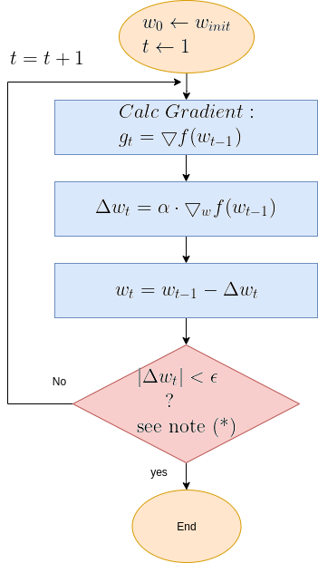
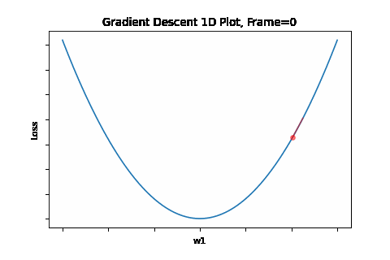
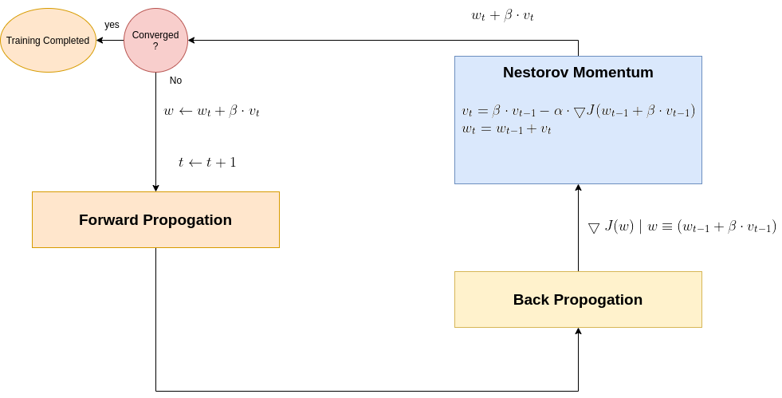
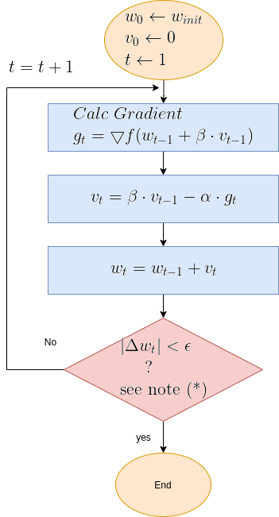
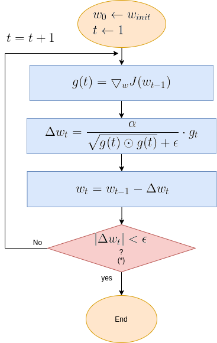
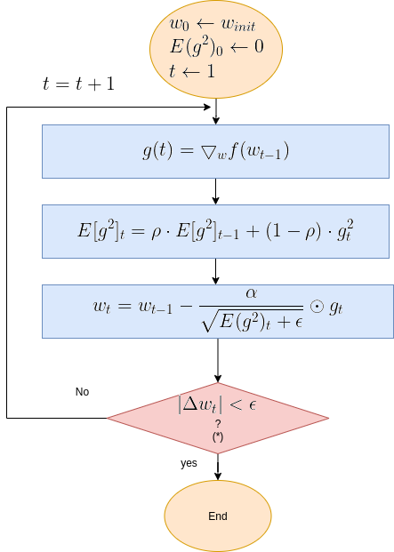
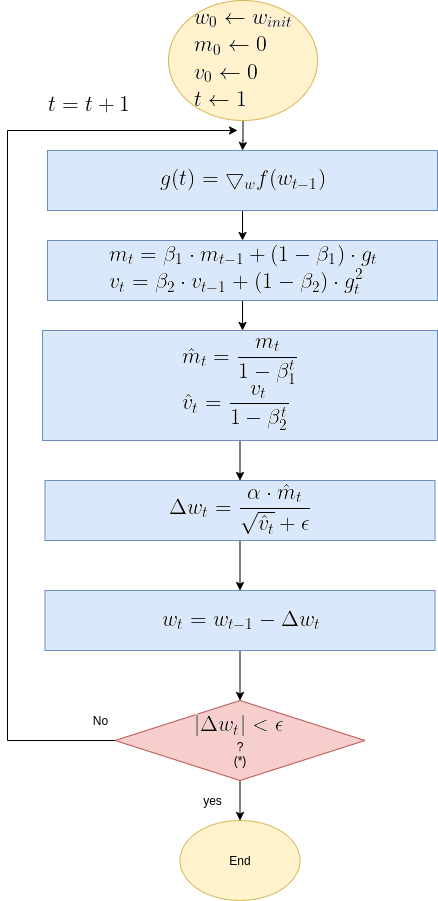
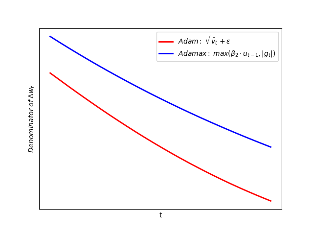
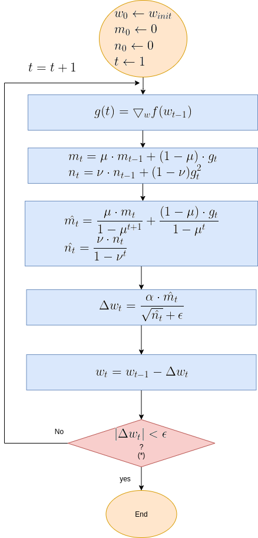

# Optimization Algorithms - An overview of Gradient Descent and its variants

## Introduction

**introduction to Gradient Descent** 

Gradient Descent is an optimization algorithm. In the context of Deep Neural Networks - it is the most popular algorithm used to find the optimized set of network's weights. 
This optimization is part of the training phase functionality, where the selected optimized set of weights is the one which minimizes the cost function. (cost function is a function which expresses the error between the expected DNN output and the modeled predicted output). 

The block diagram which follows, presents the DNN modules, as they are arranged during the training phase. The 3 main modules in this setup arrangement are:

-**Forwad Propogation**

-**Back Propogation** 

-**Gradient Descent** 

### Figure 0: Deep Neural Network Block Diagram - Training Phase

As depicted by the diagram, the following occurs at each update cycle:
1. **Forwad Propogation**,  based on the new set of updated coefficients (=weights), produces a new set of predicted output.
2. **Back Propogation**, based on the new predicted output, generates a new set of gradients.
3. **Gradient Descent** based on the new gardients. a new set of weights

That was a brief description on what Geadient Descent is, and how it is utilized in the context of DNNs. The rest of this post post presents the Gradient Descent algorithm, along with other Gradient Descent variants, which aim to improve optimization convergence.

(**Forwad Propogation** and **Back Propogation** are covered to details in dedicated posts.)

**Table of Contents**

1. [Gradient Descent Overview](#gradient-descent-overview): A brief overview on Gradient Descent algorithm with a graphgical illustrative examples.
2. [Review of Gradient Descent Variants](#review-of-gradient-descent-variants): An overview of gradient descent variants + animated demos. The review covers the following algorithms:
  
  a. [Momentum](#momentum)
  
  b. [Nesterov momentum](#nesterov-momentum)
  
  c. [Adagrad](#adagrad)
  
  d. [Adadelta](#adadelta)
  
  e. [RMSprop](#rmsprop)
  
  f. [Adam](#adam)
  
  g. [Adamax](#adamax)
  
  h. [NAdam](#nadam)
 
  

## Gradient Descent Overview

**Gradient Descent** works iteratively in a loop of update steps. While stepping along the gradient's opposite direction, each update step generates a new set of calculated optimized weights, denoted by \\(W_t \\), where t is the step index. 
This iterative loop is terminated when the minimum is found, i.e. the point where gradient is zero.

Eq. 1 present Gradient Descent update equation. It is followed by a flow diagram that details the algorithm's functional steps.

### Eq. 1: Gradient Descent Equation 

\\(w_t = w_{t-1}-\alpha \cdot \bigtriangledown_w f(w_{t-1}) \\)

**Where**:

\\(\textbf{t}\\) is step index

\\(\mathbf{w_t}\\) is the optimized parameter at step t.

\\(\mathbf{\alpha}\\) is the "learning rate".

\\(\mathbf{\bigtriangledown_w f(w_{t-1})}\\) is the gradient of f(w) with respect to w, evaluated by plugging in the most current w, i.e. \\(w=w_{t-1}\\).

To provide a clearer picture of Gradient Descent functionality, here below is the algorithm's flow diagram, followed by illustrative graphical animations Gradient Descent executed over various test cases.

### Gradient Descent Flow Diagram

**Note** (*): The termination criteria in the above diagram is \\(|\Delta w_t| < \epsilon\\), where \\(\epsilon\\) is a small constant. Sometimes the termination is the number of update step, or a combination of both. 

### An Illustrative 1D Examples

To illustrate Gradient Desent graphically, we take a quadratic equation of the type: 

\\(\mathbf{f(w) = (w-w1) ^2} \\)

This quadratic equation mimics a DNN's (Deep Neural Network) loss function. Having that, it is required to find the set of parameters {w}, (In this 1D example, it's a single parameter), which minimizes the cost function, thus optimizing the DNN.

To do that, the iterative flow described in the above flow diagram should be implemented on the give quadratic equation, till convergence is achieved. 
So we did:  the below **Figure 1** illustrates gradient descent convergence based on our given quadratic equation.

### Figure 1: Gradient Descent 1D. Convergence is at \\(w=w1\\)

 BTW, since it's a 1D equation - it has a single variable - the gradient degenerates to a simple derivative like so:

\\(x_{t} = x_{t-1}-\alpha \cdot \frac{d}{dx}f(x) \\)

### The Gradient Descent Challenges

Below is a list of Gradient Descent convergence challenge

***Local Minimun trap***: 

The algorithm may be trapped in a local minimum, missing the global minimum. However that, following researches, it is commonly claimed that the intuition behind "local minimum", which is valid for low dimenssions problems, is misleading for high dimensional topologies: highly none-linear networks are seem to not be affected by local minimum. So we assume only saddle points and global minimum. I may get deeper on that in a later post - TBD. 

***Saddle Point***: 

Saddle points are points where gradient is 0, though are not minimum. The algorithm may get stuck here. Algorithm with a momentum capabilities  may answer this challenge - we'll see such algorithms later on.

***Overshooting***: 

Overshooting is the phenomena of passing over the desired convergence point, as a result of a too large steps along the gradient direction. Reason for that large step is a too large learning rate for the given topology. The problem could be prevented by selecting an as small as desired learning rate. But here's te trade-off - that would be on the expese of convergence speed. We will get to that later on, and present solutions for this issue. Anyway, overshoots may lead to back and forth oscliations - like in the illustration animation above, depending on the topology.

***Oscillations***: 

This phenomenon can occure not only when gradient changes significantly in high curvaturs as depicted by Figure 4, but in a plateau, where gradient is negligible, but still may have slight sporadic differences which lead to oscliations. The attached animation is of none converging oscilations.

Throughout the rest of this post, the challenges will be graphically illustrated for both Gradient Descent, and the other presented Gradient Descent variants, which aim to solve some of the challengs.

Anyway, let's start examining Gradient Descent under easy to converge conditions, and also various convergence challenged conditions.

### Illustrative Examples of 2D Gradient Descent Varoius Scenarios

Let's take now a more complicated example - a quadratic function with **2** variables like so:

\\(\mathbf{f(w) = a \cdot (w^1-w1)^2 + b \cdot (w^2-w1)^2}\\)

It is required to find a set of parameters \\([w^1, w^2]\\) which minimizes the function, with Gradeint Descent according to Eq. 1, as described in the above flow diagram.

Gradient Descent was executed on the above function, for 3 test case scenarios, to illustrate typical Grand Descent patterns of behavior:

1. **Easy Convergence** - the algorithm is smoothly converged.
2. **Slightly Oscliative** - the output is slightly oscilative, but eventually converges.
3. **Oscliative** - the output is very oscilative, and does not converge.

Each of the 3 test cases is depicted by a set of animated plots attached below, which includes a 2D contour plot and a 3D surface plot with shots taken from 3 camera positions.

 
### Figure 2: Gradient Descent - Easy Convergence

#### 2a: 2D Contour

#### 2b: 3D Surface (camera position: azumuth 0, elevation:0)

#### 2c: 3D Surface (camera position: azumuth 30, elevation:0)

#### 2d: 3D Surface (camera position: azumuth 30, elevation:90)

Now look at Figure 3, which is similar to Figure 2, except that the gradient is steepper in w2 direction. The resultant step size in the w2 direction at the begining is too large, which leads to some overshoots, but the algorithm converges eventually.

### Figure 3: Gradient Descent - Slightly Oscilative

#### 3a: 2D Contour

 

#### 3b: 3D Surface (camera position: azumuth 0, elevation:0)

#### 3c: 3D Surface (camera position: azumuth 30, elevation:0)

#### 3d: 3D Surface (camera position: azumuth 30, elevation:90)

Figure 4 however, presents an even steepper gradient in w2 direction. Now we get oscilations in w2 direction, which never converge. 

### Figure 4: Gradient Descent - Oscilative

#### 4a: 2D Contour

#### 4b: 3D Surface (camera position: azumuth 0, elevation:0)

#### 4c: 3D Surface (camera position: azumuth 30, elevation:0)

#### 4d: 3D Surface (camera position: azumuth 30, elevation:90)

**Some Conclusions**:

No doubt a smaller learning rate would have solved the overshoots and oscilations, making the algorithm smoothly converge. However, a smaller learning rate would have slowed down convergence. This is a tradeoff. So how smallshould the learning rate be? Chosing learning rate for Gradient Descent is one of the chalenges of Gradient Descent, and it normally requires some trial and error iterations to tune. But situation is not that bad! There are more variants of plain Gradient Descent which improve accelerate convergence and, most importantly, dynamically adapt the learning rate thus providing a stabilized and converging functionality.

## Review of Gradient Descent Variants - Preface

This post reviews some of the most popular Gradient Descent variantsת which aim to improve Gradient Descent behavior. It's hard to compare between all those algorithms, and decide on the best. Results are very much dependent on nature of the learning task, which implicates on the nature of the Loss function. Anyway, rougly speaking, the reviewed algorithm can be divided into 2 categories:

**Momentum algorithms**

With momentum category algorithms, updates are incremented over plain Gradient Descent if gradient direction is consistent over a series of update iterations, or decremented, in case gradient direction changes. Algorithms of this category may sometimes show less stability, though can sometimes be very fast, all depends on the specific application and also the various related parameters.

Reviewed algorithms of this category:

[Momentum](#momentum)
  
[Nesterov momentum](#nesterov-momentum)
  

 
**Adaptive learning rate algorithms**

In this categoryg, the learning rate is adapted mostly accrding to the root sum squared past gradients, but not always. Those algorithms are considerably more stable. Some of these algorithms incorporate momentum as well, to accelerate convergence. In this category we have

[Adagrad](#adagrad)
  
[Adadelta](#adadelta)
  
[RMSprop](#rmsprop)
 
[Adam](#adam)
  
[Adamax](#adamax)
  
[NAdam](#nadam)

The algorithms' reviews follow.

## Momentum

**Ref**:
**Polyak, B.T. Some methods of speeding up the convergence of iteration methods. USSR Computational Mathematics and Mathematical Physics, 4(5):1–17, 1964**

**Goodfellow, Bengio, Courville, Deep Learning**

The Momentum algorithm modifies the formula for updating the parameters, wrt plain Gradient Descent: Rather than depending on the current gradient, Momentum makes the updates depend not only on current gradient, but also on a weighted average of past updates, as shown in Eq. 2 below.

### Eq. 2: Momentum Update Formula 

Eq. 2a: \\( v_t =\beta \cdot v_{t-1} - \alpha \cdot \bigtriangledown_w f(w_{t-1}) \\)

Eq. 2b: \\( w_t = w_{t-1}+v_t \\)

Eq. 2a presents a new term denoted by \\( v_t \\), which accumulates weighted past iterations updates. The hyperparameter \\( \beta \\), determines the decay rate of past updates' - the larger  \\( \beta \\) is comparing to \\(\alpha\\), the more weight given to past updates.

With the effect of momentum, update steps are  increamented in case direction of current gradient is the same as that of past averaged updates, and decremented  in case it is in the oposite direction. This effect aims to provide learning acceleration for consistent direction curvatures - high, low, and also noisey. It aims to provide a damping effect when direction changes, e.g. to decrease overshoots. Practically, its behavior should be carefully examined for high curvatures, where step size increment might lead to overshoots.

In the effort to understand the momentum behaior, let's examine the special test case where the gradient \\(g\\) is constant - same magnitude and direction, for all successive iterations. It is easy to show - (the full proof, is given at the end of this paragraph), the in that case, after gaining acceleration. the update rate converges to a constant rate equals to: 

\\(\mathbf{\Delta w_t = \frac{\alpha \cdot g}{1-\beta}}\\) 

So this may be taken as a thumb rule for the effect of momentum in a constant gradient toplology. 
Plugging the typical \\(\beta=0.9\\) to the equation above, the update size of the momentum algorithm is 10 times larger than the plain Gradient Descent.

for whoever is interested in the proof for the ubove listed constat update rate formula - here it is:

 
We assume \\(\triangledown f(w_t)\\) is the same for all t. Let's follow the update steps from the first iteration on:
 

\\(\Delta w_1=\alpha\cdot\triangledown f(w)\\) 

\\(\Delta w_2=\beta \cdot \alpha\cdot\triangledown f(w) + \alpha\cdot\triangledown f(w)\\) 

\\(\Delta w_3=\beta^2 \cdot \alpha\cdot\triangledown f(w) +\beta \cdot \alpha\cdot\triangledown f(w) + \alpha\cdot\triangledown f(w)\\) 

.
.
.

\\(\Delta w_t=\beta^{t-1} \cdot \alpha\cdot\triangledown f(w) +\beta^{t-2} \cdot \alpha\cdot\triangledown f(w) + ... \beta \cdot \alpha\cdot\triangledown f(w) +\alpha\cdot\triangledown f(w)\\) 
 

The expression for \\(\Delta w_t\\) is a sum of converging geometric series with \\(a_1=\alpha \cdot \triangledown f(w)\\) and \\(q=\beta,\;\beta<1\\) 

Accordingly:

\\(\Delta w_t = \frac{\alpha \cdot g}{1-\beta}\\)

#### Q.E.D

### Momentum Gradient Descent Flow Diagram

Where:

- Learning rate \\( \alpha \epsilon(0,1) \\) 
- \\( \beta \\) is usually set to 0.9.

Just to note:
The reason for naming it momentum, is the analogy to Newtonian motion model: \\(v(t) = v(t-1) + a \cdot \Delta T,\;\Delta T=1\\), where the velocity \\(v_t \\) at time t, equals to the sum of velocity at \\({t-1})\\ and accelaration term . In Eq 2, the averaged step size is analogous to velocity,while the gradient is analogous to the acceleration. In the Newtonian physics (mechanics), the momentum is the product of velocity and mass (denoted by m), so assume m=1.

\\(w_t=w_{t-1}-\frac{\alpha}{RMS[g]_{t-1} }\cdot g_t\\)

## Demo - Momentum over various Loss Function scenarios

Plots here below present optimization execution results for 3 2D Loss functions, with weights \\(w = [w_1, w_2] \\):

1. Moderate gradient: \\(J(w)=\frac{1}{2} \cdot (w_1^2+w_2^2)\\)

2. Steeper gradient: \\(J(w)=\frac{1}{2} \cdot (w_1^2+15 \cdot w_2^2)\\)

3. More steeper gradient: \\(J(w)=\frac{1}{2} \cdot (w_1^2+20 \cdot w_2^2)\\)

### Moderate gradient \\(J(w)=\frac{1}{2} \cdot (w_1^2+w_2^2)\\)

Here, in the begining,  momentum runs much faster than the reference SGD, but then, due to the excessive speed which was not regulated fastly enough, it suffers from oscilative overshooting arround the minimum, till it coverges eventually.

#### SGD 2D Contour (reference)

#### Momentum Moderate gradient: 2D Contour 

#### Momentum Moderate gradient, 3D surface  (camera position: azimuth 0 elevation 0)

#### Momentum Moderate gradient, 3D Surface  (camera position: azimuth 30 elevation 0)

#### Momentum Moderate gradient, 3D surface (camera position: azimuth 30 elevation 90)

### Steeper gradient: \\(J(w)=\frac{1}{2} \cdot (w1^2+15 \cdot w2^2)\\)

Now, with the steeper gradient, momentum algorithm diverges quite chaoticly in the beginning, making some wrong direction updates, i.e. with a postive sign. Eventually, after some overshoots and oscilations, the algorithm coverges. though SGD does clearly better in this scenario. Clearly, the learning rate is much too large for momentum in this setup.

#### SGD 2D Contour (reference)

#### Momentum Steeper gradient: 2D Contour 

#### Momentum Steeper gradient, 3D surface (camera position: azimuth 0 elevation 0)

#### Momentum Steeper gradient, 3D surface (camera position: azimuth 30 elevation 0)

#### Momentum Steeper gradient, 3D surface (camera position: azimuth 30 elevation 90)

### More steeper gradient: \\(J(w)=\frac{1}{2} \cdot (w1^2+20 \cdot w2^2)\\)

Similar to the less steep gradient scenario, momentum algorithm diverges quite chaoticly in the begining, and making some wrong direction updates, i.e. with a postive sign. Eventually, after some overshoots and oscilations,  the algorithm coverges. though SGD does clearly better in this scenario. Clearly, the learning rate is much too large for momentum in this setup.

#### SGD 2D Contour (reference)

#### Momentum More Steeper gradient: 2D Contour 

#### Momentum More Steeper gradient, 3D surface (camera position:  azimuth 0 elevation 0)

#### Momentum More Steeper gradient, 3D surface (camera position: azimuth 30 elevation 0)

#### Momentum More Steeper gradient, 3D surface (camera position:azimuth 30 elevation 90)

## Nesterov Momentum

**Ref:**
**On the importance of initialization and momentum in deep learning, Proceedings of the 30 th International Conference on Ma-
chine Learning, 2013, Sutskever et al**

Nesterov momentum algorithm (aka NAG) is a variation of the momentum algorithm, with a slight algorithmic modification, not in the update formula bt in the gradient calculation, as sown in Eq. 3.

### Eq. 3: Nesterov momentum

#### 3.a: \\(v_t=\beta \cdot v_{t-1} - \alpha \cdot \bigtriangledown f(w_{t-1} + \beta \cdot v_{t-1} ) \\)

#### 3.b: \\(w_{t}=w_{t-1} + v_t \\)

Nesterov equations (Eq. 3) are quite alike Momentum (Eq. 2), actually the same. The difference is just within the gradient calculation. The 2 diagrams below, are assumed to crystallize Nesterov functionality vs Momentum's in the wider DNN context. 

###Momentum functionality in the wider DNN context

###Nesterov functionality in the wider DNN context

### Nesterov Momentum Flow Diagram

## Demo - Nesterov over various Loss Function scenarios

Plots here below present optimization execution results for 3 2D Loss functions, with weights \\(w = [w_1, w_2] \\):

1. Moderate gradient: \\(J(w)=\frac{1}{2} \cdot (w_1^2+w_2^2)\\)

2. Steeper gradient: \\(J(w)=\frac{1}{2} \cdot (w_1^2+15 \cdot w_2^2)\\)

3. More steeper gradient: \\(J(w)=\frac{1}{2} \cdot (w_1^2+20 \cdot w_2^2)\\)

### Moderate gradient \\(J(w)=\frac{1}{2} \cdot (w_1^2+w_2^2)\\)

Here, in the begining, Nesterove runs much faster than the reference SGD, but then, due to the excessive speed which was not regulated fastly enough, it suffers from oscilative overshooting arround the minimum. It converges faster than Nesterov in same conditions, but there is no gain over plain SGD, which converges more or less in the same time, but runs much more smoothly and stable.

#### SGD 2D Contour (reference)

#### Nesterov Moderate gradient: 2D Contour 

#### Nesterov Moderate gradient, 3D surface (camera position: azimuth 0 elevation 0)

#### Momentum Moderate gradient, 3D surface (camera position: azimuth 30 elevation 0)

#### Nesterov Moderate gradient, 3D surface (camera position: azimuth 30 elevation 90)

### Steeper gradient: \\(J(w)=\frac{1}{2} \cdot (w1^2+15 \cdot w2^2)\\)

In this scenario, Nesterov is not stable and it never converges. Clearly, the learning rate is much too large for Nesterov in this setup. Clearly, plain SGD is superior here.

#### SGD 2D Contour (reference)

#### Nesterov Steeper gradient: 2D Contour 

### More steeper gradient: \\(J(w)=\frac{1}{2} \cdot (w1^2+20 \cdot w2^2)\\)

Similar to previous scenario, Nesterov is not stable and it doesn't  converge. Clearly, the learning rate is much too large for Nesterov in this setup. Clearly, plain SGD is superior here.

#### SGD 2D Contour (reference)

#### Nesterov More Steeper gradient: 2D Contour 

## AdaGrad

**Ref:**
**Duchi et. al., "Adaptive Subgradient Methods for Onlie Learning and Stochastic Optimization, Journal Of Machine Learning Reaserch 12 (2011)**

Adagrad (Adaptive Gradient) algorithm implements an adaptive learning rate. To achieve this feature, Adagrad divides the constant learning rate coefficient, by the root sum squared of past gradients, as shown if Eq. 4. 
Adagrad adaptive mechanism aims to resul with a lower learning rates for higher gradients, and higher rates for more moderate data changes. 

The Adagrad update formula is:

### Eq. 4: Adagrad

\\(w_{t}=w_{t-1}-\frac{\alpha}{\sqrt{g(t) \odot g(t)}+ \epsilon  }\cdot g_t \\)

***Where:***

-\\(\alpha \\) is the "Global Learning Rate".

-\\(g(t)=\bigtriangledown_w J(w_{t-1}) \\)

- \\(\odot\\) stands for "elementwise multiplication".

-\\(\epsilon \\) is a small constant used to maintain stability, commonly set to \\(10^{-7} \\).

### Adagrad Flow Diagram

Still, Adagrad has 2 drawbacks:
- The algorithm still requires a manual selection of the "Global Learning Rate", denoted by \\(\alpha\\).
- The adaptive learning rate continuously and excessively shrinks as training continues. as the squared gradients sum is growing with no limit over all time.

AdaDelta aims to answer these 2 challenges.

## Demo - AdaGrad over various Loss Function scenarios

Plots here below present optimization execution results for 3 2D Loss functions, with weights \\(w = [w_1, w_2] \\):

1. Moderate gradient: \\(J(w)=\frac{1}{2} \cdot (w_1^2+w_2^2)\\)

2. Steeper gradient: \\(J(w)=\frac{1}{2} \cdot (w_1^2+15 \cdot w_2^2)\\)

3. More steeper gradient: \\(J(w)=\frac{1}{2} \cdot (w_1^2+20 \cdot w_2^2)\\)

### Moderate gradient \\(J(w)=\frac{1}{2} \cdot (w_1^2+w_2^2)\\)

AdaGrad is the first in the adaptive learning rate algorithms category list. It shows here much stability on one and, but it is excetionally slow, due to the contimuesly growing denominator. As the plot shows, even after 180 frames it is still far from reaching convergence point, while plain SGD is completed within less than 40 frames.

#### SGD 2D Contour (reference)

#### AdaGrad Moderate gradient: 2D Contour 

#### AdaGrad Moderate gradient, 3D surface (camera position: azimuth 0 elevation 0)

#### AdaGrad Moderate gradient, (camera position: 3D  azimuth 30 elevation 0 )

#### AdaGrad Moderate gradient, (camera position: 3D  azimuth 30 elevation 90)

### Steeper gradient: \\(J(w)=\frac{1}{2} \cdot (w1^2+15 \cdot w2^2)\\)

Similar to the previous Adagrad test case, due to the well known continuesly growing denominator issue, learning rate is slow, and becomes slower in later iterations.  

#### SGD 2D Contour (reference)

#### AdaGrad Steeper gradient: 2D Contour 

#### AdaGrad Steeper gradient, 3D surface (camera position: azimuth 0 elevation 0)

#### AdaGrad Steeper gradient, 3D surface (camera position: azimuth 30 elevation 0)

#### AdaGrad Steeper gradient, 3D surface (camera position: azimuth 30 elevation 90)

### More steeper gradient: \\(J(w)=\frac{1}{2} \cdot (w1^2+20 \cdot w2^2)\\)

Similar to the previous Adagrad test cases, due to the well known continuesly growing denominator issue, learning rate is slow, and becomes slower in later iterations.  Here, due to larger gradients, it seems to be even slower.

#### SGD 2D Contour (reference)

#### AdaGrad More Steeper gradient: 2D Contour 

#### AdaGrad More Steeper gradient, 3D surace (camera position: azimuth 0 elevation 0)

#### AdaGrad More Steeper gradient, 3D surface (camera position: azimuth 30 elevation 0)

#### AdaGrad More Steeper gradient, 3D surface (camera position: azimuth 30 elevation 90)

## AdaDelta

**Ref:**
**Zeiler, ADADELTA: An Adaptive Learning Rate Method**

AdaDelta aims to improve the 2 Adagrad's drawbacks: 
1. The continual decay of learning rate. 
2. The need to select a global learning rate.

AdaDelta replaces AdaGrad's denominator, which accumulates the squared gradients over all time, by a windowed root sum squared, as shown in the equations which follow:

1. Exponentionally decaying sum squared past gradients: 
\\(E(g^2)_t=\\)

\\(\sqrt{\gamma E(g^2)_{t-1}+(1-\gamma)g^2_t}\\)

2. Taking the square root:

\\(RMS[g]_t = \sqrt{E[g^{2}]_t + \epsilon} \\)

**where**:

-\\(\gamma\\) is a exponential decay constant.

-\\(g^2_{t} = g_{t} \odot g_{t} \\) , i.e. an element-wise square. 

-\\(\epsilon\\) is a small constant used to maintain stability, commonly set to \\(10^{-7} \\). 

AdaDelta's numerator is windowed root squared of past deltas, i.e. past root sum squared updates as presented in the next equations:

#### 1. Exponentially decaying sum of squared past updates

\\(E[\Delta w^2]_{t} = \\)

\\(\rho E[\Delta w^2]_{t-1}+(1-\rho)\Delta w_t^2\\)

#### 2. Exponentially decaying root sum squared past updates

\\(RMS[\Delta w]_t=\sqrt{E[\Delta w^{2}]_t + \epsilon}\\)

**where:**

-\\(\rho\\) is a constant controlling the decay of the average.

-\\( \Delta w{_t}{^2} = \Delta w_t \odot \Delta w_t \\) , i.e. an element-wise square. 

-\\(\epsilon\\) is a small constant used to start first iteration where \\(\Delta w^2=0\\), and ensures progress continue even if previous updates become small. commonly set to \\(10^{-7} \\). 

-Note: Algorithm uses \\(RMS[\Delta w]_{t-1}\\) for the calculation of \\(\Delta w_t\\). 

Having the numerator and denominator RMS expressions, here is the iteration update formula, followed by AdaDelta's flow diagram.

### Eq. 5: Adadelta

\\(\Delta w_t=\frac{(RMS[\Delta w]_{t-1}}{RMS[g]_t}\\)

\\(w_t=w_{t-1} + \Delta w_t\\)

The numerator acts as an acceleration term, just as in momentum. The denominator regulates the learning rate.  

An interesting side effect which results from the numerator \\(RMS[\Delta w]_{t-1}\\) one update step lag behind the denominator \\({RMS[g]_t}\\): this lag makes the algorithm more robust to sudden gradients, which increase the denominator thus reduce learning rate, before the lagging numerator reacts.

Zeiler reported tests set the hyperparameters to \\(\rho=0.95\\) and \\(\epsilon=1e{-6}\\)

### Adadelta Flow Diagram

## Note on Keras AdaDelta API

Trying to run AdaDelta with Keras, i found exceptionally long convergence time. Furthermore, Keras AdaDelta API does include a learning_rate parameter, with a default value ***learning_rate=0.001**. This contradicts the AdaDelta algorithm! Setting a very large learning_rate indeed effects the learning rate, make it much faster, though not fast enough. 
Following this, I don't attach AdaDelta plots.

TBD - Need to review the code

## RMSprop

**Ref:** 
**Hinton , Unpublished, RMSprop was presented in a Coursera course lecture.**
**Hinton with Srivastava & Swersky, 2012, Lecture University of Toronto, Overview of mini-batch gradient descent**

RMSprop (RMS Propagation)like AdaDelta, is an improvement of AdaGrad. It aims to solve AdaGrad drwaback regarding the continual decay of learning rate. It does so by replacing the denominator of AdaGrad (Eq. 4), by an exponentially decaying average of squared gradients \\(E(g^2) \\), exactly as done by AdaDelta. Unlike AdaDelta, RMSprop leaves AdaGrad's global learning rate coefficient in place, so the updating formula becomes:

### Eq. 6: RMSprop
E(g^2)_t = \rho \cdot E(g^2)_{t-1} + (1-\rho) \cdot g^2_{t}

\\(w_{t}= w_{t-1}-\\)

\\(\frac{\alpha}{\sqrt{E(g^2)_t + \epsilon}} \cdot g_t\\)

Where:

-\\(g_t = \bigtriangledown f(w_{t-1}) \\) (Note that like in most of optimizers, the gradient is expected to be averaged over a mini batch)

-\\(g^2_{t} = g_{t} \odot g_{t} \\) , i.e. an elementwise square. 

-\\(\epsilon\\) is a small constant used to maintain stability, commonly set to \\(10^{-6}\;or\;10^{-7} \\). 

Recommended values for the global learning rate \\(\alpha \\) and the decay constant \\(\gamma \\) hyperparameters are 0.001 and 0.9 respectively.

### RmsProp Flow Diagram

## Demo - RMSprop over various Loss Function scenarios

Plots here below present optimization execution results for 3 2D Loss functions, with weights \\(w = [w_1, w_2] \\):

1. Moderate gradient: \\(J(w)=\frac{1}{2} \cdot (w_1^2+w_2^2)\\)

2. Steeper gradient: \\(J(w)=\frac{1}{2} \cdot (w_1^2+15 \cdot w_2^2)\\)

3. More steeper gradient: \\(J(w)=\frac{1}{2} \cdot (w_1^2+20 \cdot w_2^2)\\)

### Moderate gradient \\(J(w)=\frac{1}{2} \cdot (w_1^2+w_2^2)\\)

RMSprop is a member of the adaptive learning rate algorithms category. As such, it is solidly stable, even in case of steep gradients. As can be expected, it runs slower than plain SGD, but keeps the speed and stability in all scenarios examined.

#### SGD 2D Contour (reference)

#### RMSprop Moderate gradient: 2D Contour 

#### RMSprop Moderate gradient, 3D surface (camera position: azimuth 0 elevation 0)

#### RMSprop Moderate gradient, 3D surface (camera position: azimuth 30 elevation 0)

#### RMSprop Moderate gradient, 3D surface (camera position: azimuth 30 elevation 90)

### Steeper gradient: \\(J(w)=\frac{1}{2} \cdot (w1^2+15 \cdot w2^2)\\)

As depicted by next plots, RMSprop shows invariance to gradient changes. Performance is much the same in all examined scenarios.

#### SGD 2D Contour (reference)

#### RMSprop Steeper gradient: 2D Contour 

#### RMSprop Steeper gradient, 3D surface (camera position: azimuth 0 elevation 0)

#### RMSprop Steeper gradient, 3D surface (camera position: azimuth 30 elevation 0 )

#### RMSprop Steeper gradient, 3D surface (camera position: azimuth 30 elevation 90)

### More steeper gradient: \\(J(w)=\frac{1}{2} \cdot (w1^2+20 \cdot w2^2)\\)

Even in the more steeper gradient, plot shows similar convergence like in the 2 previous cases.

#### SGD 2D Contour (reference)

#### RMSprop More Steeper gradient: 2D Contour 

#### RMSprop More Steeper gradient, 3D surface (camera position:  azimuth 0 elevation 0)

#### RMSprop More Steeper gradient, 3D surface (camera position:  azimuth 30 elevation 0)

#### RMSprop More Steeper gradient, 3D surface (camera position: azimuth 30 elevation 90)

## Adam

**Ref:**
**ADAM: A METHOD FOR STOCHASTIC OPTIMIZATION, ICLR 2015, Kingma and Ba**

Adam (Adaptive Moment Estimation) was designed to combine the advantages of AdaGrad and RmsProp. It incorporates exponential decay moving averages of past gradients, aka moment (aka first raw moment), denoted by \\(m_t\\), and root squared sum of gradients, (aka second raw moment aka uncentered variance), denoted by \\(v_t \\). Adam also incorporates initialization bias correction, to compensate the moments' bias to zero at early iterations. 
Adam's update step size is upper bounded -  for common scenarios, upper bound is the learning rate coefficient, i.e. \\( \left | \Delta w_t  \right | \leq \alpha\\) 

The step size is also invariant to scaling of the gradient.

Let's see all that!

Adam incorporates a moment estimation, calculated as an exponantial decay moving average of past gradients, as follows:

##### moment estimate 

\\(m_t=\beta_1 \cdot m_{t-1} + (1-\beta_1) \cdot g_{t} \\)

where:

-\\( g_t = \bigtriangledown f(w_{t-1}) \\)

-\\(\beta_1 \epsilon [0,1) \\) is the exponential decay rate.

Adam's denominator incorporates an exponantial decay root sum squared of past gradients, denoted by \\(v_t\\):

##### Second raw moment estimate

\\(v_t=\beta_2 \cdot v_{t-1} + (1-\beta_2) \cdot g_t^2 \\)

where:

-\\( g_t = g_t \odot g_t\\) is an elementwise square.

-\\(\beta_2 \epsilon \left [0,1 \right ) \\) is the exponential decay rate.

###  initialization bias Correction

The initializations of \\(m_0 \leftarrow 0\\) and \\(v_t\leftarrow 0\\) lead  \\(m_t \\) and  \\(v_t \\) to bias towards zero, especially in early iterations. To compensate that, Adam sets a bias correction factor of the form \\(frac{1}{1-\beta^t}\\), with \\(0.9 \le \beta < 1\\). This factor is large for small, and approaches 1 as  \\(t \rightarrow \infty \\)

Bias corrected values are denoted by  \\(\hat{m_t} \\) and \\(hat{v_t} \\). Here are the equations:

##### Bias corrected moment estimate 

\\(\hat{m}_t=\frac{m_t}{1-\beta_1^t} \\)

##### Bias corrected second raw moment estimate 

\\(\hat{v}_t=\frac{v_t}{1-\beta_2^t} \\)

Finally Adam's update forula is:

### Eq. 7: Adam  

\\(w_{t}= w_{t-1}-\frac{\alpha \cdot \hat{m}_t}{\sqrt{\hat{v}_t}+\epsilon} \\)

Where proposed hyperparameter values are:

\\(\alpha=0.001 \\),\\(\beta_1=0.9 \\),\\(\beta_2=0.999 \\),\\(\epsilon=10^{-8} \\)

### Adam Flow Diagram

#### Inspection of updates bounderies and behavior.

In this section we'll find bounderies for update step size. We will show bounderies for 2 types of scenarios: 
1. A completely sparsey scenario, where gradient has been 0 for all timesteps except the current time step. 
2. The most common scenarios, for which we will get a tighter boundery.

Let's start simplifying the expression for \\(\Delta w_t\\). Starting with step update - see Eq. 7:

######  #1 \\(\Delta w_t = -\frac{\alpha \cdot \hat{m}_t}{\sqrt(\hat{v}_t)+\epsilon}\\)

Neglecting \\(\epsilon\\), it reduces to:

######  #2 \\(\Delta w_t \leq \left |\frac{\alpha \cdot \hat{m}_t}{\sqrt(\hat{v}_t)} \right|\\)

Unrolling the bias correction factors:

######  #3 \\(\Delta_t \leq \left |\frac{\sqrt{1-\beta_2^t} \cdot \alpha \cdot m_t}{(1-\beta_1^t)\sqrt{v_t}} \right|\\)

Assuming \\(\beta_2,\beta_2<1\\) and \\(\beta_2 >\beta_2<1\\) then the bias correction factors quotient is bounded by 1:

######  #4 \\(\frac{\sqrt{1-\beta_2^t}}{1-\beta_1^t} \leq 1\\)

so we'll plug expression #4 as 1 into #3,m and get (actually cancel it):

######  #5 \\(\Delta_t \leq \left |\frac{ \alpha \cdot m_t}{\sqrt{v_t}} \right|\\)

Now let's examine bounderis in 2 cases:
1. Completely sparsey scenario, i.e. gradient is always zero, till iteration t.
2. A normal non-sparsey scenatio

######  Scenario 1: A Boundery for the completely sparsey scenario

First, we recall that:

\\(m_t=\beta_1 \cdot m_{t-1} + (1-\beta_1) \cdot g_t \\)

and 

\\(v_t=\beta_2 \cdot v_{t-1} + (1-\beta_2) \cdot g_t^2 \\)

Plugging the above into 5 we get:

######  a.1 \\(\Delta_t \leq \left |\frac{\sqrt{1-\beta_2^t} \cdot \alpha \cdot (\beta_1 \cdot m_{t-1}+(1-\beta_1) g_t)}{(1-\beta_1^t)\sqrt{\beta_2 v_{t-1}+(1-\beta_2)g_t^2)}} \right|\\)

In the completely sparsey scenario, gradients have been 0 for all timesteps except the current time step, so a.1 reduces to:

######  a.2 \\(\Delta_t \leq \left | \frac{\alpha (1-\beta_1) g_t}{\sqrt{(1-\beta_2)g_t^2} } \right|\\)

Which leads to the boundery:
######  a.3 \\(\Delta_t \leq \left | \frac{\alpha (1-\beta_1)}{\sqrt{(1-\beta_2)} } \right|\\)

######  A Boundery for the most common scenarios

Back to #5, let's examine the quotient \\( \left |\frac{ m_t}{\sqrt{v_t}} \right|\\).

Variance is never negative, so: \\( E(g^2)-E(g)^2 \geq 0\\). 

Swappings sides we get:  
######  b.1 \\( \left |\frac{E(g)}{\sqrt{E(g^2)}} \right| \leq 1\\) 

Similarly, we assume the same for the estimated \\(m_t\\) and \\(v_t\\) values, so accordingly:
######  b.2 \\(\left |\frac{ m_t}{\sqrt{v_t}}  \leq 1 \right|\\)
 
Finally, plugging b.2 into #5 we get:

##### Update step size boundery

\\(\Delta_t \leq \alpha \\)

## Demo - Adam over various Loss Function scenarios

Plots here below present optimization execution results for 3 2D Loss functions, with weights \\(w = [w_1, w_2] \\):

1. Moderate gradient: \\(J(w)=\frac{1}{2} \cdot (w_1^2+w_2^2)\\)

2. Steeper gradient: \\(J(w)=\frac{1}{2} \cdot (w_1^2+15 \cdot w_2^2)\\)

3. More steeper gradient: \\(J(w)=\frac{1}{2} \cdot (w_1^2+20 \cdot w_2^2)\\)

### Moderate gradient \\(J(w)=\frac{1}{2} \cdot (w_1^2+w_2^2)\\)

Adam is a member of the adaptive learning rate algorithms category. Still, it differs from RMSprop mainly by the momentum component it deploys. In this moderate gradient scenario, the contribution of the momentum is not evident, but in the more steeper scenarios which follow it certainly is.

#### SGD 2D Contour (reference)

#### Adam Moderate gradient: 2D Contour 

#### Adam Moderate gradient, 3D surface (camera position:azimuth 0 elevation 0)

#### Adam Moderate gradient, 3D surface (camera position: azimuth 30 elevation 0)

#### Adam Moderate gradient, 3D surface (camera position: azimuth 30 elevation 90)

### Steeper gradient: \\(J(w)=\frac{1}{2} \cdot (w1^2+15 \cdot w2^2)\\)

Here Adam's mementum effect is evident. The algorithm runs fastly towards the minimum, but then overshoots a little.

#### SGD 2D Contour (reference)

#### Adam Steeper gradient: 2D Contour 

#### Adam Steeper gradient, 3D surface (camera position: azimuth 0 elevation 0)

#### Adam Steeper gradient, 3D surface (camera position: azimuth 30 elevation 0)

#### Adam Steeper gradient,  3D surface (camera position:  azimuth 30 elevation 90)

### More steeper gradient: \\(J(w)=\frac{1}{2} \cdot (w1^2+20 \cdot w2^2)\\)

Same as in the previous case, the algorithm runs fastly towards the minimum, suffers from an overshoot  which is then corrected.

#### SGD 2D Contour (reference)

#### Adam More Steeper gradient: 2D Contour 

#### Adam More Steeper gradient, 3D surface (camera position:azimuth 0 elevation 0 )

#### Adam More Steeper gradient, 3D surface (camera position: azimuth 30 elevation 0)

#### Adam More Steeper gradient, 3D surface (camera position: azimuth 30 elevation 90)

## Adamax

**Ref:**
**Kingma and Ba, ADAM: A METHOD FOR STOCHASTIC OPTIMIZATION, ICLR 2015,**

A variant of Adam, proposed in same paper, suggests to replace Adam's second raw moment \\( v_t \\) , by \\( u_t \\):

\\( u_t = max(\beta_2 \cdot  u_{t-1}, \left | g_t \right |) \\)

Bias correction is not needed for \\( u_t \\) anymore. The numerator is same as in Adam. Consequently, the Aadamax update formula is:

### Eq. 8: Adamax

\\( w_{t+1}= w_t-\frac{\alpha \cdot {m}_t}{(1-\beta_1^t) \cdot u_t} \\)

Where proposed hyperparameter values are:

\\(\alpha=0.002 \\)

\\(\beta_1=0.9 \\)

\\(\beta_2=0.999 \\)

Here below is a plot of Adamax \\(L_{\infty}\\) denominator vs Adam  \\(L2_\\) denominator, with a quadratic loss function. According to the plot, Adamax updates would run slower, for quadratic loss functions :

### Adam vs Adamax \\(\Delta w_t \\) denominators for quadratic loss function:

### Adamax Flow Diagram

## Demo - Adamax over various Loss Function scenarios

Plots here below present optimization execution results for 3 2D Loss functions, with weights \\(w = [w_1, w_2] \\):

1. Moderate gradient: \\(J(w)=\frac{1}{2} \cdot (w_1^2+w_2^2)\\)

2. Steeper gradient: \\(J(w)=\frac{1}{2} \cdot (w_1^2+15 \cdot w_2^2)\\)

3. More steeper gradient: \\(J(w)=\frac{1}{2} \cdot (w_1^2+20 \cdot w_2^2)\\)

### Moderate gradient \\(J(w)=\frac{1}{2} \cdot (w_1^2+w_2^2)\\)

Adamax convergence is slower than Adam's in the same setup. Difference between the algorithms is in the learning rate regulation component where Adam uses an \\(L2_\\) norm while Adamx uses an \\(L_{\infty}\\) norm. For the demonstrated quadratic loss function, the later decreases slower.

#### SGD 2D Contour (reference)

#### Adamax Moderate gradient: 2D Contour 

#### Adamax Moderate gradient, 3D surface (camera position:azimuth 0 elevation 0)

#### Adamax Moderate gradient, 3D surface (camera position:  azimuth 30 elevation 0)

#### Adamax Moderate gradient, 3D surface (camera position: azimuth 30 elevation 90)

### Steeper gradient: \\(J(w)=\frac{1}{2} \cdot (w1^2+15 \cdot w2^2)\\)

Similarly to what noted in the moderate gradient case, Adamax proves to be slow but highly stable. 

#### SGD 2D Contour (reference)

#### Adamax Steeper gradient: 2D Contour 

#### Adamax Steeper gradient, 3D surface (camera position: azimuth 0 elevation 0)

#### Adamax Steeper gradient, 3D surface (camera position: azimuth 30 elevation 0)

#### Adamax Steeper gradient, 3D surface (camera position: azimuth 30 elevation 90)

### More steeper gradient: \\(J(w)=\frac{1}{2} \cdot (w1^2+20 \cdot w2^2)\\)

Still in this test case, Adamax is slower than Adam. but is highly stable, we no overshoot near the minimum.

#### SGD 2D Contour (reference)

#### Adamax More Steeper gradient: 2D Contour 

#### Adamax More Steeper gradient, 3D surface (camera position: azimuth 0 elevation 0)

#### Adamax More Steeper gradient, 3D surface (camera position: azimuth 30 elevation 0)

#### Adamax More Steeper gradient, 3D surface (camera position: azimuth 30 elevation 90)

## NAdam

**Ref**:
**Timothy Dozat, INCORPORATING NESTEROV MOMENTUM INTO ADAM, ICLR 2016**

The NAdam (Nesterov-accelerated Adaptive Moment Estimation) extends Adam algorithm, incorporating the Nesterov momentum principal into it. The prinicipal is of using a next step update, already in current iteration. According to this principal, Nesterov formula for gradient was this:

##### Nesterov Gradient Calculation Formula

\\(g_t=\bigtriangledown f(w_{t-1} - \beta \cdot m_{t-1})\\)

compairing to the conventional formula:

##### Common Gradient Calculation Formula

\\(g_t=\bigtriangledown f(w_{t-1})\\)

Adopting this formula, NAdam modified Adam's formula as presented below. The modification wrt conventional Adam is only in one of the equations (#4)

****Nadam Formula's equation set:****

1. \\(g_t=\bigtriangledown f(w_{t-1})\\)

2. \\(m_t=\mu \cdot m_{t-1}+(1-\mu) \cdot g_t\\)

3. \\(n_t=\nu \cdot n_{t-1}  + (1-\nu) g_t^2\\)

4. (*) \\(\hat{m_t} = \frac{\mu \cdot m_t}{1-\mu^{t+1}} + \frac{(1-\mu) \cdot g_t}{1-\mu^t}\\)

5. (*) \\(\hat{n_t}=\frac{\nu \cdot n_t}{1-\nu^t}\\)

6. \\(w_t = w_{t-1} - \frac{\alpha \cdot \hat{m_t}}{\sqrt{\hat{n_t}}+\epsilon}\\)

**Where**:

\\(\mu\\) and \\(\nu\\) are the exponentially decaying coefficients, relate to \\(\beta_1\\) and \\(\beta_2\\) respectively. Typicaly \\(\mu=0.975\\) and \\(\mu=0.999\\)

(*) NAdam and Adam differ in equations #4 and #5 for \\(\hat{m_t}\\) and \\(\hatnm_t}\\), where NAdam utilizes "look ahead" factors for both.

****Adam's Original Formulas:****

\\(\hat{m_t} = \frac{m_t}{1-\beta_1^{t+1}} \\)

\\(\hat{v_t}=\frac{v_t}{1-\beta_2^t}\\)

 

### NAdam Flow Diagram

## Demo - NAdam over various Loss Function scenarios

Plots here below present optimization execution results for 3 2D Loss functions, with weights \\(w = [w_1, w_2] \\):

1. Moderate gradient: \\(J(w)=\frac{1}{2} \cdot (w_1^2+w_2^2)\\)

2. Steeper gradient: \\(J(w)=\frac{1}{2} \cdot (w_1^2+15 \cdot w_2^2)\\)

3. More steeper gradient: \\(J(w)=\frac{1}{2} \cdot (w_1^2+20 \cdot w_2^2)\\)

### Moderate gradient \\(J(w)=\frac{1}{2} \cdot (w_1^2+w_2^2)\\)

For the steeper scenarios tested, NAdam shows a faster convergence with smaller overshoots.

#### SGD 2D Contour (reference)

#### NAdam Moderate gradient: 2D Contour 

#### NAdam Moderate gradient, 3D surface (camera position: azimuth 0 elevation 0)

#### NAdam Moderate gradient, 3D surface (camera position: azimuth 30 elevation 0)

#### NAdam Moderate gradient, 3D surface (camera position: azimuth 30 elevation 90)

### Steeper gradient: \\(J(w)=\frac{1}{2} \cdot (w1^2+15 \cdot w2^2)\\)

#### SGD 2D Contour (reference)

#### NAdam Steeper gradient: 2D Contour 

#### NAdam Steeper gradient, 3D surface (camera position: azimuth 0 elevation 0)

#### NAdam Steeper gradient, 3D surface (camera position: azimuth 30 elevation 0)

#### NAdam Steeper gradient, 3D surface (camera position: azimuth 30 elevation 90)

### More steeper gradient: \\(J(w)=\frac{1}{2} \cdot (w1^2+20 \cdot w2^2)\\)

#### SGD 2D Contour (reference)

#### NAdam More Steeper gradient: 2D Contour 

#### NAdam More Steeper gradient, 3D surface (camera position: azimuth 0 elevation 0)

#### NAdam More Steeper gradient, 3D surface (camera position: azimuth 30 elevation 0)

#### NAdam More Steeper gradient, 3D surface (camera position: azimuth 30 elevation 90)

