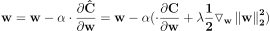
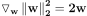
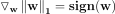
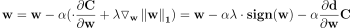

# Regularization

## Background: Overfitting
Overfiting is one of the most common prediction problems in deep learning systems. An overfitted model fits well for the training sequence, but shows bad performance for validation data not seen in the training set. This behavior is a result of fitting to the model to the details of a particular set of training data. Reasons for overfitting may be a too complex prediction model (e.g. too many nodes or layers), and a too short training sequence. 

Figure 1 illustrates underfitting rightfitting and overfitting of a 1D model. Figure 1a shows underfitting. Common reason for underfitting is a too simple model. Anyway, this post is about a set of algorithms used to avoid overfitting, named Regularization.

### Figure 1a: Underfitting

 
### Figure 1b: Goodfitting

  
### Figure 1c: Overfitting

## Regularization Algorithms

As mentioned above, Regularization applies to a set of algorithms which aim to prevent overfitting, by either simplify the system or increase the size of training system. The regularization algorithms presented here are:

- L2 Regularization
- L1 Regularization
- Dropout
- Early Stopping
- Data Augmentation

## L2 Regularization

L1 and L2 Regularizations are both similar methods, which aim to prevent overfitting by effectively simplify the system. We'll see that.

The cost function is incremented by a regularization coefficient as shown by Eq. 1. BTW, to be more precise, L2 Regularization is actually L2 Squared Regularization.

### Eq. 1: L2 Regulated Cost Function

The regularaizd cost function (Eq. 1), effects the Gradient Descent formula :

### Eq. 2: Gradient Descent Iterative Formula

\\(\mathbf{w=w-\alpha \cdot\frac{\partial C}{\partial w}}\\)

Let's plug the L2 regulated cost function (Eq. 1), to the Gradient Descent formula (Eq. 2), and get an L2 Regularized Gradient Descent Equation.

#### Eq. 3: L2 Regularized Gradient Descent (not final)

Let's calculate the Gradient of the regularizing L2 norm. To find that, let's derivate the L2 norm with respect to \\(w_{ij}\\):

### Eq. 4: Derivative of L2 norm with respect to \\(w_{ij}\\)

According to this, the L2 norm Gradient expression is given in Eq. 5.

#### Eq. 5:  L2 norm Gradient

Plugging the L2 gradient back to the Regularized Gradient Descent equation(Eq. 3) we get:

#### Eq. 6:  L2 Regularized Gradient Descent

\\(\mathbf{w=w(1-\alpha \cdot \lambda)-\alpha \frac{\partial d }{\partial w}C}\\)

/////////////
## L1 Regularization

The cost function is regulated by a L1 norm as shown by Eq. 7.

### Eq. 7: L1 Regulated Cost Function

The regularaizd cost function effects the Gradient Descent formula. Let's plug the L1 regulated cost function (Eq. 7), to the Gradient Descent formula (Eq. 2) and get:

### Eq. 8: L1 L2 Regularized Gradient Descent (not final)

Let's calculate the Gradient of the regularizing L1 norm. To find that, let's derivate the L1 norm with respect to \\(w_{ij}\\):

### Eq. 9: Derivative of L1 norm with respect to \\(w_{ij}\\) (Not final)

Which can be expressed as:

### Eq. 10: Derivative of L1 norm with respect to \\(w_{ij}\\)

According to this, the L1 norm Gradient expression is given in Eq. 10.

#### Eq. 10:  L1 norm Gradient

Noticing that the gradient of the L1 norm is:

#### Eq. 5:  L1 norm Gradient

Which can be expressed as the weights signs:

Plugging the gradient back to the Gradient Descent equation we get:

So we reached the formula, as expressed in Eq. 3:

### Eq. 3: Gradient Descent with L1 Regularization

\\(\mathbf{\mathbf{w=w-\alpha \cdot \lambda \cdot sign(w)-\alpha \cdot \frac{\partial d }{\partial w}C}}\\)

